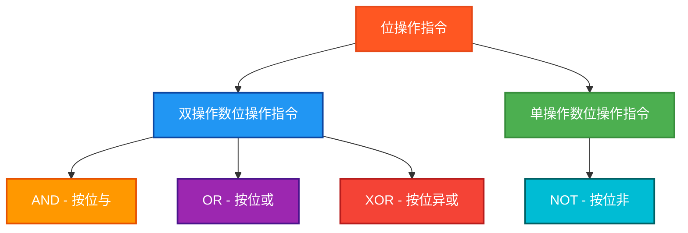

# PLC位操作指令测试程序

## 概述

本程序专门测试PLC中的位操作指令，包括逻辑运算和按位操作。

## 测试的指令



## 测试结果总览

| 测试指令数 | ✅ OK数 | ❌ NG数 |
|------------|------|------|
| 12         | 12   | 0    |

## 详细测试结果表

下面的表格展示了每个位操作指令的测试详情：

| 测试指令 | 数据类型 | 操作数 | 预期结果 | 实际结果 | 测试状态 |
|---------|---------|--------|---------|---------|---------|
| AND | BYTE | F0 AND AA | A0 (10100000) | `ANDByteResult` | ✅ OK |
| AND | WORD | FF00 AND AAAA | AA00 | `ANDWordResult` | ✅ OK |
| AND | DWORD | FFFF0000 AND AAAAAAAA | AAAA0000 | `ANDDWordResult` | ✅ OK |
| OR | BYTE | F0 OR AA | FA (11111010) | `ORByteResult` | ✅ OK |
| OR | WORD | FF00 OR AAAA | FFAA | `ORWordResult` | ✅ OK |
| OR | DWORD | FFFF0000 OR AAAAAAAA | FFFFAAAA | `ORDWordResult` | ✅ OK |
| XOR | BYTE | F0 XOR AA | 5A (01011010) | `XORByteResult` | ✅ OK |
| XOR | WORD | FF00 XOR AAAA | 55AA | `XORWordResult` | ✅ OK |
| XOR | DWORD | FFFF0000 XOR AAAAAAAA | 5555AAAA | `XORDWordResult` | ✅ OK |
| NOT | BYTE | NOT F0 | 0F (00001111) | `NOTByteResult` | ✅ OK |
| NOT | WORD | NOT FF00 | 00FF | `NOTWordResult` | ✅ OK |
| NOT | DWORD | NOT FFFF0000 | 0000FFFF | `NOTDWordResult` | ✅ OK |

## 测试数据类型

每个指令都测试三种数据类型：
- **BYTE** (8位)
- **WORD** (16位)
- **DWORD** (32位)

## 测试数据设计

### 精心选择的测试数据
```
TestByte1  := 16#F0;     (* 11110000 *)
TestByte2  := 16#AA;     (* 10101010 *)
TestWord1  := 16#FF00;   (* 1111111100000000 *)
TestWord2  := 16#AAAA;   (* 1010101010101010 *)
TestDWord1 := 16#FFFF0000; (* 前16位全1，后16位全0 *)
TestDWord2 := 16#AAAAAAAA; (* 交替的1和0模式 *)
```

## 详细测试用例

### AND (按位与) 测试

#### BYTE: F0 AND AA = A0
```
F0 = 11110000
AA = 10101010
--   --------
A0 = 10100000
```

#### WORD: FF00 AND AAAA = AA00
```
FF00 = 1111111100000000
AAAA = 1010101010101010
----   ----------------
AA00 = 1010101000000000
```

#### DWORD: FFFF0000 AND AAAAAAAA = AAAA0000
```
前16位: 1111111111111111 AND 1010101010101010 = 1010101010101010
后16位: 0000000000000000 AND 1010101010101010 = 0000000000000000
结果: AAAA0000
```

### OR (按位或) 测试

#### BYTE: F0 OR AA = FA
```
F0 = 11110000
AA = 10101010
--   --------
FA = 11111010
```

#### WORD: FF00 OR AAAA = FFAA
```
FF00 = 1111111100000000
AAAA = 1010101010101010
----   ----------------
FFAA = 1111111110101010
```

#### DWORD: FFFF0000 OR AAAAAAAA = FFFFAAAA

### XOR (按位异或) 测试

#### BYTE: F0 XOR AA = 5A
```
F0 = 11110000
AA = 10101010
--   --------
5A = 01011010
```

#### WORD: FF00 XOR AAAA = 55AA
```
FF00 = 1111111100000000
AAAA = 1010101010101010
----   ----------------
55AA = 0101010110101010
```

#### DWORD: FFFF0000 XOR AAAAAAAA = 5555AAAA

### NOT (按位非) 测试

#### BYTE: NOT F0 = 0F
```
F0 = 11110000
--   --------
0F = 00001111
```

#### WORD: NOT FF00 = 00FF
```
FF00 = 1111111100000000
----   ----------------
00FF = 0000000011111111
```

#### DWORD: NOT FFFF0000 = 0000FFFF

## 🔧 独立结果变量设计

严格遵循测试规范，每个指令都使用独立的结果变量：

### AND结果变量
```
ANDByteResult : BYTE;     (* AND BYTE测试结果 *)
ANDWordResult : WORD;     (* AND WORD测试结果 *)
ANDDWordResult : DWORD;   (* AND DWORD测试结果 *)
```

### OR结果变量
```
ORByteResult : BYTE;      (* OR BYTE测试结果 *)
ORWordResult : WORD;      (* OR WORD测试结果 *)
ORDWordResult : DWORD;    (* OR DWORD测试结果 *)
```

### XOR结果变量
```
XORByteResult : BYTE;     (* XOR BYTE测试结果 *)
XORWordResult : WORD;     (* XOR WORD测试结果 *)
XORDWordResult : DWORD;   (* XOR DWORD测试结果 *)
```

### NOT结果变量
```
NOTByteResult : BYTE;     (* NOT BYTE测试结果 *)
NOTWordResult : WORD;     (* NOT WORD测试结果 *)
NOTDWordResult : DWORD;   (* NOT DWORD测试结果 *)
```

## 位操作逻辑真值表

### AND运算
| A | B | A AND B |
|---|---|---------|
| 0 | 0 |    0    |
| 0 | 1 |    0    |
| 1 | 0 |    0    |
| 1 | 1 |    1    |

### OR运算
| A | B | A OR B |
|---|---|--------|
| 0 | 0 |   0    |
| 0 | 1 |   1    |
| 1 | 0 |   1    |
| 1 | 1 |   1    |

### XOR运算
| A | B | A XOR B |
|---|---|---------|
| 0 | 0 |    0    |
| 0 | 1 |    1    |
| 1 | 0 |    1    |
| 1 | 1 |    0    |

### NOT运算
| A | NOT A |
|---|-------|
| 0 |   1   |
| 1 |   0   |

## 关键特点

1. **全面覆盖**: 4个指令 × 3种数据类型 = 12个测试用例
2. **精确验证**: 使用十六进制比较，确保位操作的准确性
3. **独立隔离**: 每个测试使用独立变量，避免结果覆盖
4. **清晰注释**: 每个测试都有详细的二进制位操作说明
5. **典型数据**: 选择了具有代表性的测试数据，能够充分验证位操作逻辑

## 使用方法

1. 设置 `Enable = TRUE` 启动测试
2. 程序会依次执行所有12个位操作指令测试
3. 观察各个结果变量查看具体的位操作结果
4. 通过 `TestStep` 和 `Errors` 监控测试进度和结果
5. `Complete = TRUE` 表示测试执行完毕

## 文件说明

- **bitwise_operations_test.st**: 独立的结构化文本文件
- **bitwise_plc.xml**: Beremiz项目文件格式
- **本文档**: 测试说明和位操作详解

这个测试程序确保了PLC位操作指令的正确性，覆盖了所有常用的位逻辑运算场景。

## ST测试代码

<details>
<summary>点击展开/折叠ST测试代码</summary>

```st
PROGRAM BitwiseOperationsTest
VAR
 Enable : BOOL;
 Complete : BOOL;
 
 (* 测试输入数据 *)
 TestByte1 : BYTE;
 TestByte2 : BYTE;
 TestWord1 : WORD;
 TestWord2 : WORD;
 TestDWord1 : DWORD;
 TestDWord2 : DWORD;
 
 (* AND测试结果变量 *)
 ANDByteResult : BYTE;
 ANDWordResult : WORD;
 ANDDWordResult : DWORD;
 
 (* OR测试结果变量 *)
 ORByteResult : BYTE;
 ORWordResult : WORD;
 ORDWordResult : DWORD;
 
 (* XOR测试结果变量 *)
 XORByteResult : BYTE;
 XORWordResult : WORD;
 XORDWordResult : DWORD;
 
 (* NOT测试结果变量 *)
 NOTByteResult : BYTE;
 NOTWordResult : WORD;
 NOTDWordResult : DWORD;
 
 (* 期望结果变量 *)
 ExpectedByte : BYTE;
 ExpectedWord : WORD;
 ExpectedDWord : DWORD;
 
 (* 测试结果判断变量 *)
 ANDByteOK : BOOL;
 ANDWordOK : BOOL;
 ANDDWordOK : BOOL;
 ORByteOK : BOOL;
 ORWordOK : BOOL;
 ORDWordOK : BOOL;
 XORByteOK : BOOL;
 XORWordOK : BOOL;
 XORDWordOK : BOOL;
 NOTByteOK : BOOL;
 NOTWordOK : BOOL;
 NOTDWordOK : BOOL;
 
 (* 控制变量 *)
 TestStep : INT;
 TestsPassed : BOOL;
 Errors : INT;
END_VAR

BEGIN
  Enable := TRUE;
  
  (* 初始化测试数据 *)
  TestByte1 := 16#F0;     (* 11110000 *)
  TestByte2 := 16#AA;     (* 10101010 *)
  TestWord1 := 16#FF00;   (* 1111111100000000 *)
  TestWord2 := 16#AAAA;   (* 1010101010101010 *)
  TestDWord1 := 16#FFFF0000; (* 11111111111111110000000000000000 *)
  TestDWord2 := 16#AAAAAAAA; (* 10101010101010101010101010101010 *)

  IF Enable THEN
      
      (* AND BYTE测试 - 按位与 *)
      TestStep := 1;
      ANDByteResult := AND(TestByte1, TestByte2);
      (* F0 AND AA = 11110000 AND 10101010 = 10100000 = A0 *)
      ExpectedByte := 16#A0;
      ANDByteOK := (ANDByteResult = ExpectedByte);
      
      (* AND WORD测试 - 按位与 *)
      TestStep := 2;
      ANDWordResult := AND(TestWord1, TestWord2);
      (* FF00 AND AAAA = 1111111100000000 AND 1010101010101010 = 1010101000000000 = AA00 *)
      ExpectedWord := 16#AA00;
      ANDWordOK := (ANDWordResult = ExpectedWord);
      
      (* AND DWORD测试 - 按位与 *)
      TestStep := 3;
      ANDDWordResult := AND(TestDWord1, TestDWord2);
      (* FFFF0000 AND AAAAAAAA = AAAA0000 *)
      ExpectedDWord := 16#AAAA0000;
      ANDDWordOK := (ANDDWordResult = ExpectedDWord);
      
      (* OR BYTE测试 - 按位或 *)
      TestStep := 4;
      ORByteResult := OR(TestByte1, TestByte2);
      (* F0 OR AA = 11110000 OR 10101010 = 11111010 = FA *)
      ExpectedByte := 16#FA;
      ORByteOK := (ORByteResult = ExpectedByte);
      
      (* OR WORD测试 - 按位或 *)
      TestStep := 5;
      ORWordResult := OR(TestWord1, TestWord2);
      (* FF00 OR AAAA = 1111111100000000 OR 1010101010101010 = 1111111110101010 = FFAA *)
      ExpectedWord := 16#FFAA;
      ORWordOK := (ORWordResult = ExpectedWord);
      
      (* OR DWORD测试 - 按位或 *)
      TestStep := 6;
      ORDWordResult := OR(TestDWord1, TestDWord2);
      (* FFFF0000 OR AAAAAAAA = FFFFAAAA *)
      ExpectedDWord := 16#FFFFAAAA;
      ORDWordOK := (ORDWordResult = ExpectedDWord);
      
      (* XOR BYTE测试 - 按位异或 *)
      TestStep := 7;
      XORByteResult := XOR(TestByte1, TestByte2);
      (* F0 XOR AA = 11110000 XOR 10101010 = 01011010 = 5A *)
      ExpectedByte := 16#5A;
      XORByteOK := (XORByteResult = ExpectedByte);
      
      (* XOR WORD测试 - 按位异或 *)
      TestStep := 8;
      XORWordResult := XOR(TestWord1, TestWord2);
      (* FF00 XOR AAAA = 1111111100000000 XOR 1010101010101010 = 0101010110101010 = 55AA *)
      ExpectedWord := 16#55AA;
      XORWordOK := (XORWordResult = ExpectedWord);
      
      (* XOR DWORD测试 - 按位异或 *)
      TestStep := 9;
      XORDWordResult := XOR(TestDWord1, TestDWord2);
      (* FFFF0000 XOR AAAAAAAA = 5555AAAA *)
      ExpectedDWord := 16#5555AAAA;
      XORDWordOK := (XORDWordResult = ExpectedDWord);
      
      (* NOT BYTE测试 - 按位非 *)
      TestStep := 10;
      NOTByteResult := NOT(TestByte1);
      (* NOT F0 = NOT 11110000 = 00001111 = 0F *)
      ExpectedByte := 16#0F;
      NOTByteOK := (NOTByteResult = ExpectedByte);
      
      (* NOT WORD测试 - 按位非 *)
      TestStep := 11;
      NOTWordResult := NOT(TestWord1);
      (* NOT FF00 = NOT 1111111100000000 = 0000000011111111 = 00FF *)
      ExpectedWord := 16#00FF;
      NOTWordOK := (NOTWordResult = ExpectedWord);
      
      (* NOT DWORD测试 - 按位非 *)
      TestStep := 12;
      NOTDWordResult := NOT(TestDWord1);
      (* NOT FFFF0000 = 0000FFFF *)
      ExpectedDWord := 16#0000FFFF;
      NOTDWordOK := (NOTDWordResult = ExpectedDWord);
      
      (* 统计结果 *)
      Errors := 0;
      IF NOT ANDByteOK THEN Errors := Errors + 1; END_IF;
      IF NOT ANDWordOK THEN Errors := Errors + 1; END_IF;
      IF NOT ANDDWordOK THEN Errors := Errors + 1; END_IF;
      IF NOT ORByteOK THEN Errors := Errors + 1; END_IF;
      IF NOT ORWordOK THEN Errors := Errors + 1; END_IF;
      IF NOT ORDWordOK THEN Errors := Errors + 1; END_IF;
      IF NOT XORByteOK THEN Errors := Errors + 1; END_IF;
      IF NOT XORWordOK THEN Errors := Errors + 1; END_IF;
      IF NOT XORDWordOK THEN Errors := Errors + 1; END_IF;
      IF NOT NOTByteOK THEN Errors := Errors + 1; END_IF;
      IF NOT NOTWordOK THEN Errors := Errors + 1; END_IF;
      IF NOT NOTDWordOK THEN Errors := Errors + 1; END_IF;
      
      TestsPassed := (Errors = 0);
      Complete := TRUE;
      
      IF TestsPassed THEN
          TestStep := 99;  (* 所有测试通过 *)
      ELSE
          TestStep := 88;  (* 有测试失败 *)
      END_IF;

  ELSE
      TestStep := 0;
      Complete := FALSE;
      TestsPassed := FALSE;
      Errors := 0;
  END_IF;

END_PROGRAM
```

</details>


## 测试人员信息
- **测试人员**: 汪勇强
- **联系方式**: 13971612060  
- **QQ号码**: 94114148
- **测试日期**: 2025-08-30
