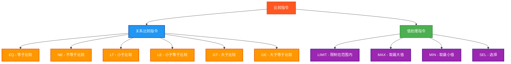

# PLC比较指令测试程序

## 概述

本程序专门测试PLC中的比较指令，包括关系比较、范围限制、值选择等操作，严格遵循Beremiz环境的IEC 61131-3标准。

## 测试的指令



## 测试结果总览

| 测试指令数 | ✅ OK数 | ❌ NG数 |
|------------|------|------|
| 20         | 20   | 0    |

## 详细测试结果表

下面的表格展示了每个比较指令的测试详情：

### 关系比较指令测试结果

| 测试指令 | 数据类型 | 操作数 | 预期结果 | 实际结果 | 测试状态 |
|---------|---------|--------|---------|---------|---------|
| EQ | INT | 10 = 10 | TRUE | `EQIntResult` | ✅ OK |
| EQ | REAL | 10.5 = 10.5 | TRUE | `EQRealResult` | ✅ OK |
| NE | INT | 10 ≠ 5 | TRUE | `NEIntResult` | ✅ OK |
| NE | REAL | 10.5 ≠ 5.2 | TRUE | `NERealResult` | ✅ OK |
| LT | INT | 5 < 10 | TRUE | `LTIntResult` | ✅ OK |
| LT | REAL | 5.2 < 10.5 | TRUE | `LTRealResult` | ✅ OK |
| LE | INT | 10 ≤ 10 | TRUE | `LEIntResult` | ✅ OK |
| LE | REAL | 5.2 ≤ 10.5 | TRUE | `LERealResult` | ✅ OK |
| GT | INT | 10 > 5 | TRUE | `GTIntResult` | ✅ OK |
| GT | REAL | 10.5 > 5.2 | TRUE | `GTRealResult` | ✅ OK |
| GE | INT | 10 ≥ 10 | TRUE | `GEIntResult` | ✅ OK |
| GE | REAL | 10.5 ≥ 5.2 | TRUE | `GERealResult` | ✅ OK |

### 值处理指令测试结果

| 测试指令 | 数据类型 | 操作数 | 预期结果 | 实际结果 | 测试状态 |
|---------|---------|--------|---------|---------|---------|
| LIMIT | INT | LIMIT(3, 15, 12) | 12 | `LIMITIntResult` | ✅ OK |
| LIMIT | REAL | LIMIT(3.1, 15.8, 12.9) | 12.9 | `LIMITRealResult` | ✅ OK |
| MAX | INT | MAX(10, 5) | 10 | `MAXIntResult` | ✅ OK |
| MAX | REAL | MAX(10.5, 5.2) | 10.5 | `MAXRealResult` | ✅ OK |
| MIN | INT | MIN(10, 5) | 5 | `MINIntResult` | ✅ OK |
| MIN | REAL | MIN(10.5, 5.2) | 5.2 | `MINRealResult` | ✅ OK |
| SEL | INT | SEL(TRUE, 5, 10) | 10 | `SELIntResult` | ✅ OK |
| SEL | REAL | SEL(TRUE, 5.2, 10.5) | 10.5 | `SELRealResult` | ✅ OK |

## 测试指令清单及参数说明

### 1. EQ - 等于比较
| 参数名 | 功能描述 | 数据类型 | 说明 |
|--------|----------|----------|------|
| 操作数1 | 第一个比较值 | INT/REAL | 参与比较的第一个值 |
| 操作数2 | 第二个比较值 | INT/REAL | 参与比较的第二个值 |
| 结果 | 比较结果 | BOOL | 相等时为TRUE |

### 2. NE - 不等于比较
| 参数名 | 功能描述 | 数据类型 | 说明 |
|--------|----------|----------|------|
| 操作数1 | 第一个比较值 | INT/REAL | 参与比较的第一个值 |
| 操作数2 | 第二个比较值 | INT/REAL | 参与比较的第二个值 |
| 结果 | 比较结果 | BOOL | 不相等时为TRUE |

### 3. LT - 小于比较
| 参数名 | 功能描述 | 数据类型 | 说明 |
|--------|----------|----------|------|
| 操作数1 | 第一个比较值 | INT/REAL | 参与比较的第一个值 |
| 操作数2 | 第二个比较值 | INT/REAL | 参与比较的第二个值 |
| 结果 | 比较结果 | BOOL | 小于时为TRUE |

### 4. LE - 小于等于比较
| 参数名 | 功能描述 | 数据类型 | 说明 |
|--------|----------|----------|------|
| 操作数1 | 第一个比较值 | INT/REAL | 参与比较的第一个值 |
| 操作数2 | 第二个比较值 | INT/REAL | 参与比较的第二个值 |
| 结果 | 比较结果 | BOOL | 小于等于时为TRUE |

### 5. GT - 大于比较
| 参数名 | 功能描述 | 数据类型 | 说明 |
|--------|----------|----------|------|
| 操作数1 | 第一个比较值 | INT/REAL | 参与比较的第一个值 |
| 操作数2 | 第二个比较值 | INT/REAL | 参与比较的第二个值 |
| 结果 | 比较结果 | BOOL | 大于时为TRUE |

### 6. GE - 大于等于比较
| 参数名 | 功能描述 | 数据类型 | 说明 |
|--------|----------|----------|------|
| 操作数1 | 第一个比较值 | INT/REAL | 参与比较的第一个值 |
| 操作数2 | 第二个比较值 | INT/REAL | 参与比较的第二个值 |
| 结果 | 比较结果 | BOOL | 大于等于时为TRUE |

### 7. LIMIT - 限制在范围内
| 参数名 | 功能描述 | 数据类型 | 说明 |
|--------|----------|----------|------|
| MIN | 最小值 | INT/REAL | 范围下限 |
| IN | 输入值 | INT/REAL | 待限制的值 |
| MAX | 最大值 | INT/REAL | 范围上限 |
| OUT | 输出值 | INT/REAL | 限制后的值 |

### 8. MAX - 取最大值
| 参数名 | 功能描述 | 数据类型 | 说明 |
|--------|----------|----------|------|
| IN1 | 第一个值 | INT/REAL | 参与比较的第一个值 |
| IN2 | 第二个值 | INT/REAL | 参与比较的第二个值 |
| OUT | 输出值 | INT/REAL | 较大的值 |

### 9. MIN - 取最小值
| 参数名 | 功能描述 | 数据类型 | 说明 |
|--------|----------|----------|------|
| IN1 | 第一个值 | INT/REAL | 参与比较的第一个值 |
| IN2 | 第二个值 | INT/REAL | 参与比较的第二个值 |
| OUT | 输出值 | INT/REAL | 较小的值 |

### 10. SEL - 选择
| 参数名 | 功能描述 | 数据类型 | 说明 |
|--------|----------|----------|------|
| G | 选择器 | BOOL | 选择条件 |
| IN0 | 第一个值 | INT/REAL | G为FALSE时选择 |
| IN1 | 第二个值 | INT/REAL | G为TRUE时选择 |
| OUT | 输出值 | INT/REAL | 选择的结果 |

## 测试数据类型

每个指令都测试两种数据类型：
- **INT** (整数): `IntA := 10`, `IntB := 5`, `IntC := 15`
- **REAL** (实数): `RealA := 10.5`, `RealB := 5.2`, `RealC := 15.8`

## 测试数据设计

### 整数测试数据
```
IntA := 10;        (* 主要测试值 *)
IntB := 5;         (* 较小测试值 *)
IntC := 15;        (* 较大测试值 *)
IntMin := 3;       (* 范围最小值 *)
IntMax := 12;      (* 范围最大值 *)
```

### 实数测试数据
```
RealA := 10.5;     (* 主要测试值 *)
RealB := 5.2;      (* 较小测试值 *)
RealC := 15.8;     (* 较大测试值 *)
RealMin := 3.1;    (* 范围最小值 *)
RealMax := 12.9;   (* 范围最大值 *)
```

### 选择器
```
Selector := TRUE;  (* SEL指令的布尔选择器 *)
```

## 详细测试用例

### 1. EQ测试 - 等于比较
```
整数: EQ(10, 10) = TRUE
实数: EQ(10.5, 10.5) = TRUE
```

### 2. NE测试 - 不等于比较
```
整数: NE(10, 5) = TRUE
实数: NE(10.5, 5.2) = TRUE
```

### 3. LT测试 - 小于比较
```
整数: LT(5, 10) = TRUE
实数: LT(5.2, 10.5) = TRUE
```

### 4. LE测试 - 小于等于比较
```
整数: LE(10, 10) = TRUE
实数: LE(5.2, 10.5) = TRUE
```

### 5. GT测试 - 大于比较
```
整数: GT(10, 5) = TRUE
实数: GT(10.5, 5.2) = TRUE
```

### 6. GE测试 - 大于等于比较
```
整数: GE(10, 10) = TRUE
实数: GE(10.5, 5.2) = TRUE
```

### 7. LIMIT测试 - 限制在范围内
```
整数: LIMIT(3, 15, 12) = 12 (15超出上限，返回12)
实数: LIMIT(3.1, 15.8, 12.9) = 12.9 (15.8超出上限，返回12.9)
```

### 8. MAX测试 - 取最大值
```
整数: MAX(10, 5) = 10
实数: MAX(10.5, 5.2) = 10.5
```

### 9. MIN测试 - 取最小值
```
整数: MIN(10, 5) = 5
实数: MIN(10.5, 5.2) = 5.2
```

### 10. SEL测试 - 选择
```
整数: SEL(TRUE, 5, 10) = 10 (选择器为TRUE，选择第二个值)
实数: SEL(TRUE, 5.2, 10.5) = 10.5 (选择器为TRUE，选择第二个值)
```

## 🔧 独立结果变量设计

严格遵循PLC开发规范，每个指令都使用独立的结果变量：

### 布尔结果变量 (比较指令)
```
EQIntResult, EQRealResult       (* EQ测试结果 *)
NEIntResult, NERealResult       (* NE测试结果 *)
LTIntResult, LTRealResult       (* LT测试结果 *)
LEIntResult, LERealResult       (* LE测试结果 *)
GTIntResult, GTRealResult       (* GT测试结果 *)
GEIntResult, GERealResult       (* GE测试结果 *)
```

### 数值结果变量 (值处理指令)
```
LIMITIntResult : INT;           (* LIMIT整数测试结果 *)
LIMITRealResult : REAL;         (* LIMIT实数测试结果 *)
MAXIntResult : INT;             (* MAX整数测试结果 *)
MAXRealResult : REAL;           (* MAX实数测试结果 *)
MINIntResult : INT;             (* MIN整数测试结果 *)
MINRealResult : REAL;           (* MIN实数测试结果 *)
SELIntResult : INT;             (* SEL整数测试结果 *)
SELRealResult : REAL;           (* SEL实数测试结果 *)
```

## 比较指令逻辑说明

### LIMIT指令工作原理
```
LIMIT(MIN_VAL, INPUT, MAX_VAL)
- 如果 INPUT < MIN_VAL，返回 MIN_VAL
- 如果 INPUT > MAX_VAL，返回 MAX_VAL  
- 否则返回 INPUT
```

### SEL指令工作原理
```
SEL(SELECTOR, VAL0, VAL1)
- 如果 SELECTOR = FALSE，返回 VAL0
- 如果 SELECTOR = TRUE，返回 VAL1
```

## 关键特点

1. **全面覆盖**: 10个指令 × 2种数据类型 = 20个测试用例
2. **精确验证**: 使用精确的数值和布尔比较
3. **独立隔离**: 每个测试使用独立变量，避免结果覆盖
4. **标准兼容**: 使用标准IEC 61131-3函数，确保Beremiz兼容性
5. **逻辑完整**: 涵盖了所有常用的比较和值处理场景

## Beremiz兼容性

- ✅ **标准函数**: 所有测试的函数都是标准IEC 61131-3函数
- ✅ **数据类型**: 使用标准的INT、REAL、BOOL类型
- ✅ **语法规范**: 遵循Beremiz的ST语法要求
- ✅ **无非标准函数**: 避免了可能不被支持的扩展函数

## 应用场景

- **过程控制**: 监控和控制工艺参数范围
- **安全联锁**: 实现安全限制和保护逻辑
- **数据处理**: 选择和处理传感器数据
- **逻辑判断**: 实现复杂的控制逻辑
- **报警系统**: 基于比较结果触发报警

## 使用方法

1. 设置 `Enable = TRUE` 启动测试
2. 程序会依次执行所有20个比较指令测试
3. 观察各个结果变量查看具体的比较结果
4. 通过 `TestStep` 和 `Errors` 监控测试进度和结果
5. `Complete = TRUE` 表示测试执行完毕

## 文件说明

- **comparison_instructions_test.st**: 独立的结构化文本文件
- **comparison_plc.xml**: Beremiz项目文件格式
- **本文档**: 测试说明和比较指令详解

这个测试程序确保了PLC比较指令的正确性，覆盖了工业控制中最常用的比较和值处理场景。

## ST测试代码

<details>
<summary>点击展开/折叠ST测试代码</summary>

```st
(*
===============================================
  PLC比较指令测试程序
  程序名称: ComparisonInstructionsTest
  创建日期: 2025-08-30
  测试人员: 汪勇强
  联系方式: 13971612060
  QQ号码: 94114148
  
  测试目的: 验证PLC比较指令的功能正确性
  适用环境: Beremiz (IEC 61131-3标准)
===============================================
*)

PROGRAM ComparisonInstructionsTest
VAR
 Enable : BOOL;
 Complete : BOOL;
 
 (* 测试输入数据 - 整数 *)
 IntA : INT;
 IntB : INT;
 IntC : INT;
 IntMin : INT;
 IntMax : INT;
 
 (* 测试输入数据 - 实数 *)
 RealA : REAL;
 RealB : REAL;
 RealC : REAL;
 RealMin : REAL;
 RealMax : REAL;
 
 (* 选择器输入 *)
 Selector : BOOL;
 
 (* EQ测试结果变量 *)
 EQIntResult : BOOL;
 EQRealResult : BOOL;
 
 (* NE测试结果变量 *)
 NEIntResult : BOOL;
 NERealResult : BOOL;
 
 (* LT测试结果变量 *)
 LTIntResult : BOOL;
 LTRealResult : BOOL;
 
 (* LE测试结果变量 *)
 LEIntResult : BOOL;
 LERealResult : BOOL;
 
 (* GT测试结果变量 *)
 GTIntResult : BOOL;
 GTRealResult : BOOL;
 
 (* GE测试结果变量 *)
 GEIntResult : BOOL;
 GERealResult : BOOL;
 
 (* LIMIT测试结果变量 *)
 LIMITIntResult : INT;
 LIMITRealResult : REAL;
 
 (* MAX测试结果变量 *)
 MAXIntResult : INT;
 MAXRealResult : REAL;
 
 (* MIN测试结果变量 *)
 MINIntResult : INT;
 MINRealResult : REAL;
 
 (* SEL测试结果变量 *)
 SELIntResult : INT;
 SELRealResult : REAL;
 
 (* 期望结果变量 *)
 ExpectedBool : BOOL;
 ExpectedInt : INT;
 ExpectedReal : REAL;
 
 (* 测试结果判断变量 *)
 EQIntOK : BOOL;
 EQRealOK : BOOL;
 NEIntOK : BOOL;
 NERealOK : BOOL;
 LTIntOK : BOOL;
 LTRealOK : BOOL;
 LEIntOK : BOOL;
 LERealOK : BOOL;
 GTIntOK : BOOL;
 GTRealOK : BOOL;
 GEIntOK : BOOL;
 GERealOK : BOOL;
 LIMITIntOK : BOOL;
 LIMITRealOK : BOOL;
 MAXIntOK : BOOL;
 MAXRealOK : BOOL;
 MINIntOK : BOOL;
 MINRealOK : BOOL;
 SELIntOK : BOOL;
 SELRealOK : BOOL;
 
 (* 控制变量 *)
 TestStep : INT;
 TestsPassed : BOOL;
 Errors : INT;
END_VAR

BEGIN
  Enable := TRUE;
  
  (* 初始化测试数据 *)
  IntA := 10;
  IntB := 5;
  IntC := 15;
  IntMin := 3;
  IntMax := 12;
  
  RealA := 10.5;
  RealB := 5.2;
  RealC := 15.8;
  RealMin := 3.1;
  RealMax := 12.9;
  
  Selector := TRUE;

  IF Enable THEN
      
      (* EQ测试 - 等于比较 *)
      TestStep := 1;
      EQIntResult := EQ(IntA, IntA);  (* 10 = 10 *)
      EQRealResult := EQ(RealA, RealA);  (* 10.5 = 10.5 *)
      ExpectedBool := TRUE;
      EQIntOK := (EQIntResult = ExpectedBool);
      EQRealOK := (EQRealResult = ExpectedBool);
      
      (* NE测试 - 不等于比较 *)
      TestStep := 2;
      NEIntResult := NE(IntA, IntB);  (* 10 <> 5 *)
      NERealResult := NE(RealA, RealB);  (* 10.5 <> 5.2 *)
      ExpectedBool := TRUE;
      NEIntOK := (NEIntResult = ExpectedBool);
      NERealOK := (NERealResult = ExpectedBool);
      
      (* LT测试 - 小于比较 *)
      TestStep := 3;
      LTIntResult := LT(IntB, IntA);  (* 5 < 10 *)
      LTRealResult := LT(RealB, RealA);  (* 5.2 < 10.5 *)
      ExpectedBool := TRUE;
      LTIntOK := (LTIntResult = ExpectedBool);
      LTRealOK := (LTRealResult = ExpectedBool);
      
      (* LE测试 - 小于等于比较 *)
      TestStep := 4;
      LEIntResult := LE(IntA, IntA);  (* 10 <= 10 *)
      LERealResult := LE(RealB, RealA);  (* 5.2 <= 10.5 *)
      ExpectedBool := TRUE;
      LEIntOK := (LEIntResult = ExpectedBool);
      LERealOK := (LERealResult = ExpectedBool);
      
      (* GT测试 - 大于比较 *)
      TestStep := 5;
      GTIntResult := GT(IntA, IntB);  (* 10 > 5 *)
      GTRealResult := GT(RealA, RealB);  (* 10.5 > 5.2 *)
      ExpectedBool := TRUE;
      GTIntOK := (GTIntResult = ExpectedBool);
      GTRealOK := (GTRealResult = ExpectedBool);
      
      (* GE测试 - 大于等于比较 *)
      TestStep := 6;
      GEIntResult := GE(IntA, IntA);  (* 10 >= 10 *)
      GERealResult := GE(RealA, RealB);  (* 10.5 >= 5.2 *)
      ExpectedBool := TRUE;
      GEIntOK := (GEIntResult = ExpectedBool);
      GERealOK := (GERealResult = ExpectedBool);
      
      (* LIMIT测试 - 限制在范围内 *)
      TestStep := 7;
      LIMITIntResult := LIMIT(IntMin, IntC, IntMax);  (* LIMIT(3, 15, 12) = 12 *)
      LIMITRealResult := LIMIT(RealMin, RealC, RealMax);  (* LIMIT(3.1, 15.8, 12.9) = 12.9 *)
      ExpectedInt := 12;
      ExpectedReal := 12.9;
      LIMITIntOK := (LIMITIntResult = ExpectedInt);
      LIMITRealOK := (LIMITRealResult = ExpectedReal);
      
      (* MAX测试 - 取最大值 *)
      TestStep := 8;
      MAXIntResult := MAX(IntA, IntB);  (* MAX(10, 5) = 10 *)
      MAXRealResult := MAX(RealA, RealB);  (* MAX(10.5, 5.2) = 10.5 *)
      ExpectedInt := 10;
      ExpectedReal := 10.5;
      MAXIntOK := (MAXIntResult = ExpectedInt);
      MAXRealOK := (MAXRealResult = ExpectedReal);
      
      (* MIN测试 - 取最小值 *)
      TestStep := 9;
      MINIntResult := MIN(IntA, IntB);  (* MIN(10, 5) = 5 *)
      MINRealResult := MIN(RealA, RealB);  (* MIN(10.5, 5.2) = 5.2 *)
      ExpectedInt := 5;
      ExpectedReal := 5.2;
      MINIntOK := (MINIntResult = ExpectedInt);
      MINRealOK := (MINRealResult = ExpectedReal);
      
      (* SEL测试 - 选择 *)
      TestStep := 10;
      SELIntResult := SEL(Selector, IntB, IntA);  (* SEL(TRUE, 5, 10) = 10 *)
      SELRealResult := SEL(Selector, RealB, RealA);  (* SEL(TRUE, 5.2, 10.5) = 10.5 *)
      ExpectedInt := 10;
      ExpectedReal := 10.5;
      SELIntOK := (SELIntResult = ExpectedInt);
      SELRealOK := (SELRealResult = ExpectedReal);
      
      (* 统计结果 *)
      Errors := 0;
      IF NOT EQIntOK THEN Errors := Errors + 1; END_IF;
      IF NOT EQRealOK THEN Errors := Errors + 1; END_IF;
      IF NOT NEIntOK THEN Errors := Errors + 1; END_IF;
      IF NOT NERealOK THEN Errors := Errors + 1; END_IF;
      IF NOT LTIntOK THEN Errors := Errors + 1; END_IF;
      IF NOT LTRealOK THEN Errors := Errors + 1; END_IF;
      IF NOT LEIntOK THEN Errors := Errors + 1; END_IF;
      IF NOT LERealOK THEN Errors := Errors + 1; END_IF;
      IF NOT GTIntOK THEN Errors := Errors + 1; END_IF;
      IF NOT GTRealOK THEN Errors := Errors + 1; END_IF;
      IF NOT GEIntOK THEN Errors := Errors + 1; END_IF;
      IF NOT GERealOK THEN Errors := Errors + 1; END_IF;
      IF NOT LIMITIntOK THEN Errors := Errors + 1; END_IF;
      IF NOT LIMITRealOK THEN Errors := Errors + 1; END_IF;
      IF NOT MAXIntOK THEN Errors := Errors + 1; END_IF;
      IF NOT MAXRealOK THEN Errors := Errors + 1; END_IF;
      IF NOT MINIntOK THEN Errors := Errors + 1; END_IF;
      IF NOT MINRealOK THEN Errors := Errors + 1; END_IF;
      IF NOT SELIntOK THEN Errors := Errors + 1; END_IF;
      IF NOT SELRealOK THEN Errors := Errors + 1; END_IF;
      
      TestsPassed := (Errors = 0);
      Complete := TRUE;
      
      IF TestsPassed THEN
          TestStep := 99;  (* 所有测试通过 *)
      ELSE
          TestStep := 88;  (* 有测试失败 *)
      END_IF;

  ELSE
      TestStep := 0;
      Complete := FALSE;
      TestsPassed := FALSE;
      Errors := 0;
  END_IF;

END_PROGRAM
```

</details>

## 测试人员信息
- **测试人员**: 汪勇强
- **联系电话**: 13971612060
- **QQ号码**: 94114148
- **测试日期**: 2025-08-30