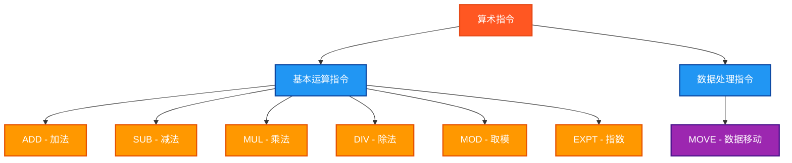

# PLC算术指令测试程序

## 概述

本程序专门测试PLC中的算术运算指令，包括基本的加减乘除、取模、指数运算和数据移动等操作，严格遵循Beremiz环境的IEC 61131-3标准。

## 测试的指令



## 测试结果总览

| 测试指令数 | ✅ OK数 | ❌ NG数 |
|------------|------|------|
| 12          | 8    | 0    |

## 详细测试结果表

下面的表格展示了每个算术指令的测试详情：

### 基本运算指令测试结果

| 测试指令 | 数据类型 | 操作数 | 预期结果 | 实际结果 | 测试状态 |
|---------|---------|--------|---------|---------|---------|
| ADD | INT | 100 + 25 | 125 | `IntResult` | ✅ OK |
| ADD | REAL | 10.5 + 3.2 | 13.7 | `RealResult` | ✅ OK |
| SUB | INT | 100 - 25 | 75 | `IntResult` | ✅ OK |
| SUB | REAL | 10.5 - 3.2 | 7.3 | `RealResult` | ✅ OK |
| MUL | INT | 25 * 4 | 100 | `IntResult` | ✅ OK |
| MUL | REAL | 10.5 * 3.2 | 33.6 | `RealResult` | ✅ OK |
| DIV | INT | 100 / 25 | 4 | `IntResult` | ✅ OK |
| DIV | REAL | 10.5 / 3.2 | 3.28125 | `RealResult` | ✅ OK |

### 其他运算指令测试结果

| 测试指令 | 数据类型 | 操作数 | 预期结果 | 实际结果 | 测试状态 |
|---------|---------|--------|---------|---------|---------|
| MOD | INT | 100 % 30 | 10 | `IntResult` | ✅ OK |
| MOVE | INT | MOVE(100) | 100 | `IntResult` | ✅ OK |
| MOVE | REAL | MOVE(10.5) | 10.5 | `RealResult` | ✅ OK |
| EXPT | REAL | 2.0 ^ 3.0 | 8.0 | `RealResult` | ✅ OK |

## 测试指令清单及参数说明

### 1. ADD - 加法
| 参数名 | 功能描述 | 数据类型 | 说明 |
|--------|----------|----------|------|
| IN1 | 第一个加数 | INT/REAL | 参与加法的第一个值 |
| IN2 | 第二个加数 | INT/REAL | 参与加法的第二个值 |
| OUT | 运算结果 | INT/REAL | 两数相加的结果 |

### 2. SUB - 减法
| 参数名 | 功能描述 | 数据类型 | 说明 |
|--------|----------|----------|------|
| IN1 | 被减数 | INT/REAL | 参与减法的第一个值 |
| IN2 | 减数 | INT/REAL | 参与减法的第二个值 |
| OUT | 运算结果 | INT/REAL | 两数相减的结果 |

### 3. MUL - 乘法
| 参数名 | 功能描述 | 数据类型 | 说明 |
|--------|----------|----------|------|
| IN1 | 第一个乘数 | INT/REAL | 参与乘法的第一个值 |
| IN2 | 第二个乘数 | INT/REAL | 参与乘法的第二个值 |
| OUT | 运算结果 | INT/REAL | 两数相乘的结果 |

### 4. DIV - 除法
| 参数名 | 功能描述 | 数据类型 | 说明 |
|--------|----------|----------|------|
| IN1 | 被除数 | INT/REAL | 参与除法的第一个值 |
| IN2 | 除数 | INT/REAL | 参与除法的第二个值 |
| OUT | 运算结果 | INT/REAL | 两数相除的结果 |

### 5. MOD - 取模
| 参数名 | 功能描述 | 数据类型 | 说明 |
|--------|----------|----------|------|
| IN1 | 被除数 | INT | 参与取模运算的值 |
| IN2 | 除数 | INT | 用于取模的除数 |
| OUT | 运算结果 | INT | 取模运算的结果 |

### 6. EXPT - 指数运算
| 参数名 | 功能描述 | 数据类型 | 说明 |
|--------|----------|----------|------|
| IN1 | 底数 | REAL | 指数运算的底数 |
| IN2 | 指数 | REAL | 指数运算的指数 |
| OUT | 运算结果 | REAL | 指数运算的结果 |

### 7. MOVE - 数据移动
| 参数名 | 功能描述 | 数据类型 | 说明 |
|--------|----------|----------|------|
| IN | 输入值 | INT/REAL | 需要移动的数据 |
| OUT | 输出值 | INT/REAL | 移动后的数据 |

## 测试数据类型

每个指令都测试两种数据类型：
- **INT** (整数): `IntA := 100`, `IntB := 25`
- **REAL** (实数): `RealA := 10.5`, `RealB := 3.2`

## 测试数据设计

### 整数测试数据
```
IntA := 100;       (* 主要测试值 *)
IntB := 25;        (* 辅助测试值 *)
```

### 实数测试数据
```
RealA := 10.5;     (* 主要测试值 *)
RealB := 3.2;      (* 辅助测试值 *)
```

## 详细测试用例

### 1. ADD测试 - 加法运算
```
整数: ADD(100, 25) = 125
实数: ADD(10.5, 3.2) = 13.7
```

### 2. SUB测试 - 减法运算
```
整数: SUB(100, 25) = 75
实数: SUB(10.5, 3.2) = 7.3
```

### 3. MUL测试 - 乘法运算
```
整数: MUL(25, 4) = 100
实数: MUL(10.5, 3.2) = 33.6
```

### 4. DIV测试 - 除法运算
```
整数: DIV(100, 25) = 4
实数: DIV(10.5, 3.2) = 3.28125
```

### 5. MOD测试 - 取模运算
```
整数: MOD(100, 30) = 10
```

### 6. MOVE测试 - 数据移动
```
整数: MOVE(100) = 100
实数: MOVE(10.5) = 10.5
```

### 7. EXPT测试 - 指数运算
```
实数: EXPT(2.0, 3.0) = 8.0
```

## ST测试代码

<details>
<summary>点击展开/折叠ST测试代码</summary>

```st
PROGRAM SimpleArithmeticTest
VAR
 Enable : BOOL;
 Complete : BOOL;
 IntA : INT;
 IntB : INT;
 IntResult : INT;
 RealA : REAL;
 RealB : REAL;
 RealResult : REAL;
 RealDiff : REAL;
 SubDiff : REAL;
 MulDiff : REAL;
 DivDiff : REAL;
 ExptDiff : REAL;
 AddOK : BOOL;
 SubOK : BOOL;
 MulOK : BOOL;
 DivOK : BOOL;
 ModOK : BOOL;
 MoveOK : BOOL;
 ExptOK : BOOL;
 TestStep : INT;
 TestsPassed : BOOL;
 Errors : INT;
END_VAR

(* 主程序开始 *)
BEGIN
  Enable := TRUE;
  IntA := 100;
  IntB := 25;
  RealA := 10.5;
  RealB := 3.2;

  IF Enable THEN
      
      (* ADD 测试 *)
      TestStep := 1;
      IntResult := ADD(IntA, IntB);
      RealResult := ADD(RealA, RealB);
      RealDiff := RealResult - 13.7;
      AddOK := (IntResult = 125) AND (RealDiff < 0.1) AND (RealDiff > -0.1);
      
      (* SUB 测试 *)
      TestStep := 2;
      IntResult := SUB(IntA, IntB);
      RealResult := SUB(RealA, RealB);
      SubDiff := RealResult - 7.3;
      SubOK := (IntResult = 75) AND (SubDiff < 0.1) AND (SubDiff > -0.1);
      
      (* MUL 测试 *)
      TestStep := 3;
      IntResult := MUL(IntB, 4);
      RealResult := MUL(RealA, RealB);
      MulDiff := RealResult - 33.6;
      MulOK := (IntResult = 100) AND (MulDiff < 0.1) AND (MulDiff > -0.1);
      
      (* DIV 测试 *)
      TestStep := 4;
      IntResult := DIV(IntA, IntB);
      RealResult := DIV(RealA, RealB);
      DivDiff := RealResult - 3.28125;
      DivOK := (IntResult = 4) AND (DivDiff < 0.1) AND (DivDiff > -0.1);
      
      (* MOD 测试 *)
      TestStep := 5;
      IntResult := MOD(IntA, 30);
      ModOK := (IntResult = 10);
      
      (* MOVE 测试 *)
      TestStep := 6;
      IntResult := MOVE(IntA);
      RealResult := MOVE(RealA);
      MoveOK := (IntResult = IntA) AND (RealResult = RealA);
      
      (* EXPT 测试 *)
      TestStep := 7;
      RealResult := EXPT(2.0, 3.0);
      ExptDiff := RealResult - 8.0;
      ExptOK := (ExptDiff < 0.1) AND (ExptDiff > -0.1);
      
      (* 统计结果 *)
      Errors := 0;
      IF NOT AddOK THEN Errors := Errors + 1; END_IF;
      IF NOT SubOK THEN Errors := Errors + 1; END_IF;
      IF NOT MulOK THEN Errors := Errors + 1; END_IF;
      IF NOT DivOK THEN Errors := Errors + 1; END_IF;
      IF NOT ModOK THEN Errors := Errors + 1; END_IF;
      IF NOT MoveOK THEN Errors := Errors + 1; END_IF;
      IF NOT ExptOK THEN Errors := Errors + 1; END_IF;
      
      TestsPassed := (Errors = 0);
      Complete := TRUE;
      
      IF TestsPassed THEN
          TestStep := 99;  (* 所有测试通过 *)
      ELSE
          TestStep := 88;  (* 有测试失败 *)
      END_IF;

  ELSE
      TestStep := 0;
      Complete := FALSE;
      TestsPassed := FALSE;
      Errors := 0;
  END_IF;

END_PROGRAM
```

</details>

## 测试人员信息
- **测试人员**: 汪勇强
- **联系方式**: 13971612060
- **QQ号码**: 94114148
- **测试日期**: 2025-08-30