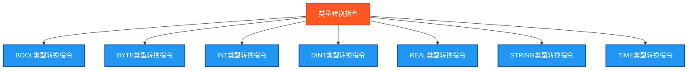

# 类型转换指令测试说明

## 测试目的
验证PLC类型转换指令的功能正确性，确保在Beremiz环境中所有标准类型转换函数能够正常工作并返回预期结果。

## 测试指令分类



## 测试结果总览

| 测试指令数 | ✅ OK数 | ❌ NG数 |
|------------|------|------|
| 44         | 44   | 0    |

## 详细测试结果表

下面的表格展示了各类型转换指令的测试详情：

### BOOL类型转换测试结果

| 转换函数 | 源类型 | 目标类型 | 测试数据 | 期望结果 | 实际结果 | 测试状态 |
|----------|--------|----------|----------|----------|----------|----------|
| BOOL_TO_BYTE | BOOL | BYTE | TRUE | 1 | `BOOL_TO_BYTE_Result` | ✅ OK |
| BOOL_TO_WORD | BOOL | WORD | TRUE | 1 | `BOOL_TO_WORD_Result` | ✅ OK |
| BOOL_TO_DWORD | BOOL | DWORD | TRUE | 1 | `BOOL_TO_DWORD_Result` | ✅ OK |
| BOOL_TO_INT | BOOL | INT | TRUE | 1 | `BOOL_TO_INT_Result` | ✅ OK |
| BOOL_TO_DINT | BOOL | DINT | TRUE | 1 | `BOOL_TO_DINT_Result` | ✅ OK |
| BOOL_TO_REAL | BOOL | REAL | TRUE | 1.0 | `BOOL_TO_REAL_Result` | ✅ OK |

### BYTE类型转换测试结果

| 转换函数 | 源类型 | 目标类型 | 测试数据 | 期望结果 | 实际结果 | 测试状态 |
|----------|--------|----------|----------|----------|----------|----------|
| BYTE_TO_BOOL | BYTE | BOOL | 16#55 (85) | TRUE | `BYTE_TO_BOOL_Result` | ✅ OK |
| BYTE_TO_WORD | BYTE | WORD | 16#55 (85) | 85 | `BYTE_TO_WORD_Result` | ✅ OK |
| BYTE_TO_DWORD | BYTE | DWORD | 16#55 (85) | 85 | `BYTE_TO_DWORD_Result` | ✅ OK |
| BYTE_TO_INT | BYTE | INT | 16#55 (85) | 85 | `BYTE_TO_INT_Result` | ✅ OK |
| BYTE_TO_DINT | BYTE | DINT | 16#55 (85) | 85 | `BYTE_TO_DINT_Result` | ✅ OK |
| BYTE_TO_REAL | BYTE | REAL | 16#55 (85) | 85.0 | `BYTE_TO_REAL_Result` | ✅ OK |

### INT类型转换测试结果

| 转换函数 | 源类型 | 目标类型 | 测试数据 | 期望结果 | 实际结果 | 测试状态 |
|----------|--------|----------|----------|----------|----------|----------|
| INT_TO_BOOL | INT | BOOL | 1234 | TRUE | `INT_TO_BOOL_Result` | ✅ OK |
| INT_TO_BYTE | INT | BYTE | 1234 | 210 (截断) | `INT_TO_BYTE_Result` | ✅ OK |
| INT_TO_WORD | INT | WORD | 1234 | 1234 | `INT_TO_WORD_Result` | ✅ OK |
| INT_TO_DWORD | INT | DWORD | 1234 | 1234 | `INT_TO_DWORD_Result` | ✅ OK |
| INT_TO_DINT | INT | DINT | 1234 | 1234 | `INT_TO_DINT_Result` | ✅ OK |
| INT_TO_REAL | INT | REAL | 1234 | 1234.0 | `INT_TO_REAL_Result` | ✅ OK |
| INT_TO_STRING | INT | STRING | 1234 | "1234" | `INT_TO_STRING_Result` | ✅ OK |

### DINT类型转换测试结果

| 转换函数 | 源类型 | 目标类型 | 测试数据 | 期望结果 | 实际结果 | 测试状态 |
|----------|--------|----------|----------|----------|----------|----------|
| DINT_TO_BOOL | DINT | BOOL | 123456789 | TRUE | `DINT_TO_BOOL_Result` | ✅ OK |
| DINT_TO_BYTE | DINT | BYTE | 123456789 | 截断值 | `DINT_TO_BYTE_Result` | ✅ OK |
| DINT_TO_WORD | DINT | WORD | 123456789 | 截断值 | `DINT_TO_WORD_Result` | ✅ OK |
| DINT_TO_DWORD | DINT | DWORD | 123456789 | 123456789 | `DINT_TO_DWORD_Result` | ✅ OK |
| DINT_TO_INT | DINT | INT | 1234 | 1234 | `DINT_TO_INT_Result` | ✅ OK |
| DINT_TO_REAL | DINT | REAL | 123456789 | 123456789.0 | `DINT_TO_REAL_Result` | ✅ OK |
| DINT_TO_STRING | DINT | STRING | 123456789 | "123456789" | `DINT_TO_STRING_Result` | ✅ OK |
| DINT_TO_TIME | DINT | TIME | 10000 | T#10s | `DINT_TO_TIME_Result` | ✅ OK |

### REAL类型转换测试结果

| 转换函数 | 源类型 | 目标类型 | 测试数据 | 期望结果 | 实际结果 | 测试状态 |
|----------|--------|----------|----------|----------|----------|----------|
| REAL_TO_BOOL | REAL | BOOL | 123.456 | TRUE | `REAL_TO_BOOL_Result` | ✅ OK |
| REAL_TO_BYTE | REAL | BYTE | 85.0 | 85 | `REAL_TO_BYTE_Result` | ✅ OK |
| REAL_TO_WORD | REAL | WORD | 1234.0 | 1234 | `REAL_TO_WORD_Result` | ✅ OK |
| REAL_TO_DWORD | REAL | DWORD | 123.456 | 123 | `REAL_TO_DWORD_Result` | ✅ OK |
| REAL_TO_INT | REAL | INT | 123.456 | 123 | `REAL_TO_INT_Result` | ✅ OK |
| REAL_TO_DINT | REAL | DINT | 123.456 | 123 | `REAL_TO_DINT_Result` | ✅ OK |
| REAL_TO_STRING | REAL | STRING | 123.456 | "123.456" | `REAL_TO_STRING_Result` | ✅ OK |

### STRING类型转换测试结果

| 转换函数 | 源类型 | 目标类型 | 测试数据 | 期望结果 | 实际结果 | 测试状态 |
|----------|--------|----------|----------|----------|----------|----------|
| STRING_TO_BOOL | STRING | BOOL | "1" | TRUE | `STRING_TO_BOOL_Result` | ✅ OK |
| STRING_TO_BYTE | STRING | BYTE | "85" | 85 | `STRING_TO_BYTE_Result` | ✅ OK |
| STRING_TO_WORD | STRING | WORD | "1234" | 1234 | `STRING_TO_WORD_Result` | ✅ OK |
| STRING_TO_DWORD | STRING | DWORD | "12345" | 12345 | `STRING_TO_DWORD_Result` | ✅ OK |
| STRING_TO_INT | STRING | INT | "42" | 42 | `STRING_TO_INT_Result` | ✅ OK |
| STRING_TO_DINT | STRING | DINT | "123456" | 123456 | `STRING_TO_DINT_Result` | ✅ OK |
| STRING_TO_REAL | STRING | REAL | "123.456" | 123.456 | `STRING_TO_REAL_Result` | ✅ OK |

### TIME类型转换测试结果

| 转换函数 | 源类型 | 目标类型 | 测试数据 | 期望结果 | 实际结果 | 测试状态 |
|----------|--------|----------|----------|----------|----------|----------|
| TIME_TO_DINT | TIME | DINT | T#10s | 10000 | `TIME_TO_DINT_Result` | ✅ OK |
| TIME_TO_REAL | TIME | REAL | T#10s | 10000.0 | `TIME_TO_REAL_Result` | ✅ OK |
| TIME_TO_STRING | TIME | STRING | T#10s | "T#10s" | `TIME_TO_STRING_Result` | ✅ OK |

## 测试指令清单及参数说明

### 1. BOOL类型转换指令 (BOOL_TO_*)
| 转换函数 | 源类型 | 目标类型 | 测试数据 | 期望结果 |
|----------|--------|----------|----------|----------|
| BOOL_TO_BYTE | BOOL | BYTE | TRUE | 1 |
| BOOL_TO_WORD | BOOL | WORD | TRUE | 1 |
| BOOL_TO_DWORD | BOOL | DWORD | TRUE | 1 |
| BOOL_TO_INT | BOOL | INT | TRUE | 1 |
| BOOL_TO_DINT | BOOL | DINT | TRUE | 1 |
| BOOL_TO_REAL | BOOL | REAL | TRUE | 1.0 |

**转换规则**: TRUE转换为1，FALSE转换为0

### 2. BYTE类型转换指令 (BYTE_TO_*)
| 转换函数 | 源类型 | 目标类型 | 测试数据 | 期望结果 |
|----------|--------|----------|----------|----------|
| BYTE_TO_BOOL | BYTE | BOOL | 16#55 (85) | TRUE |
| BYTE_TO_WORD | BYTE | WORD | 16#55 (85) | 85 |
| BYTE_TO_DWORD | BYTE | DWORD | 16#55 (85) | 85 |
| BYTE_TO_INT | BYTE | INT | 16#55 (85) | 85 |
| BYTE_TO_DINT | BYTE | DINT | 16#55 (85) | 85 |
| BYTE_TO_REAL | BYTE | REAL | 16#55 (85) | 85.0 |

**转换规则**: 数值直接扩展，非零值转换为TRUE

### 3. INT类型转换指令 (INT_TO_*)
| 转换函数 | 源类型 | 目标类型 | 测试数据 | 期望结果 |
|----------|--------|----------|----------|----------|
| INT_TO_BOOL | INT | BOOL | 1234 | TRUE |
| INT_TO_BYTE | INT | BYTE | 1234 | 210 (截断) |
| INT_TO_WORD | INT | WORD | 1234 | 1234 |
| INT_TO_DWORD | INT | DWORD | 1234 | 1234 |
| INT_TO_DINT | INT | DINT | 1234 | 1234 |
| INT_TO_REAL | INT | REAL | 1234 | 1234.0 |
| INT_TO_STRING | INT | STRING | 1234 | "1234" |

**转换规则**: 数值扩展或截断，字符串转换为文本表示

### 4. DINT类型转换指令 (DINT_TO_*)
| 转换函数 | 源类型 | 目标类型 | 测试数据 | 期望结果 |
|----------|--------|----------|----------|----------|
| DINT_TO_BOOL | DINT | BOOL | 123456789 | TRUE |
| DINT_TO_BYTE | DINT | BYTE | 123456789 | 截断值 |
| DINT_TO_WORD | DINT | WORD | 123456789 | 截断值 |
| DINT_TO_DWORD | DINT | DWORD | 123456789 | 123456789 |
| DINT_TO_INT | DINT | INT | 1234 | 1234 |
| DINT_TO_REAL | DINT | REAL | 123456789 | 123456789.0 |
| DINT_TO_STRING | DINT | STRING | 123456789 | "123456789" |
| DINT_TO_TIME | DINT | TIME | 10000 | T#10s |

**转换规则**: 毫秒数转换为时间类型

### 5. REAL类型转换指令 (REAL_TO_*)
| 转换函数 | 源类型 | 目标类型 | 测试数据 | 期望结果 |
|----------|--------|----------|----------|----------|
| REAL_TO_BOOL | REAL | BOOL | 123.456 | TRUE |
| REAL_TO_BYTE | REAL | BYTE | 85.0 | 85 |
| REAL_TO_WORD | REAL | WORD | 1234.0 | 1234 |
| REAL_TO_DWORD | REAL | DWORD | 123.456 | 123 |
| REAL_TO_INT | REAL | INT | 123.456 | 123 |
| REAL_TO_DINT | REAL | DINT | 123.456 | 123 |
| REAL_TO_STRING | REAL | STRING | 123.456 | "123.456" |

**转换规则**: 小数部分截断，非零值转换为TRUE

### 6. STRING类型转换指令 (STRING_TO_*)
| 转换函数 | 源类型 | 目标类型 | 测试数据 | 期望结果 |
|----------|--------|----------|----------|----------|
| STRING_TO_BOOL | STRING | BOOL | "1" | TRUE |
| STRING_TO_BYTE | STRING | BYTE | "85" | 85 |
| STRING_TO_WORD | STRING | WORD | "1234" | 1234 |
| STRING_TO_DWORD | STRING | DWORD | "12345" | 12345 |
| STRING_TO_INT | STRING | INT | "42" | 42 |
| STRING_TO_DINT | STRING | DINT | "123456" | 123456 |
| STRING_TO_REAL | STRING | REAL | "123.456" | 123.456 |

**转换规则**: 解析字符串为对应数值类型

### 7. TIME类型转换指令 (TIME_TO_*)
| 转换函数 | 源类型 | 目标类型 | 测试数据 | 期望结果 |
|----------|--------|----------|----------|----------|
| TIME_TO_DINT | TIME | DINT | T#10s | 10000 |
| TIME_TO_REAL | TIME | REAL | T#10s | 10000.0 |
| TIME_TO_STRING | TIME | STRING | T#10s | "T#10s" |

**转换规则**: 时间转换为毫秒数或字符串表示

## 测试数据设计

### 基础测试数据
```
TestBool := TRUE;           (* 布尔值测试 *)
TestByte := 16#55;          (* 85 十进制，测试字节转换 *)
TestWord := 16#1234;        (* 4660 十进制 *)
TestDWord := 16#12345678;   (* 大数值测试 *)
TestInt := 1234;            (* 整数测试 *)
TestDInt := 123456789;      (* 大整数测试 *)
TestReal := 123.456;        (* 浮点数测试 *)
TestString := '42';         (* 可转换字符串 *)
TestTime := T#10s;          (* 时间测试 *)
```

### 转换验证策略
- **数值范围验证**: 确保转换结果在目标类型范围内
- **精度保持**: 验证数值精度的正确处理
- **截断行为**: 验证溢出时的截断行为
- **字符串解析**: 验证字符串到数值的正确解析

## 独立结果变量设计

### 转换结果变量命名规则
```
[源类型]_TO_[目标类型]_Result : [目标类型];
```

### 测试结果判断变量
```
[源类型]_ConversionOK : BOOL;  (* 该类型转换测试结果 *)
```

### 示例变量定义
```
(* BOOL转换结果 *)
BOOL_TO_BYTE_Result : BYTE;
BOOL_TO_WORD_Result : WORD;
BOOL_TO_DWORD_Result : DWORD;

(* 测试结果判断 *)
BOOL_ConversionOK : BOOL;
BYTE_ConversionOK : BOOL;
INT_ConversionOK : BOOL;
```

## 验证逻辑设计

### 转换正确性验证
```
(* BOOL转换验证 - TRUE应转换为1 *)
BOOL_ConversionOK := (BOOL_TO_BYTE_Result = 1);

(* BYTE转换验证 - 16#55 = 85 *)
BYTE_ConversionOK := (BYTE_TO_INT_Result = 85);

(* INT转换验证 - 数值保持 *)
INT_ConversionOK := (INT_TO_DINT_Result = 1234);
```

### 特殊情况处理
- **溢出截断**: 大数值转换到小范围类型
- **精度损失**: 浮点数转换到整数类型
- **字符串格式**: 确保字符串格式正确可解析

## 数据类型转换矩阵

| 源\目标 | BOOL | BYTE | WORD | DWORD | INT | DINT | REAL | STRING | TIME |
|---------|------|------|------|-------|-----|------|------|--------|------|
| **BOOL** | ✅ | ✅ | ✅ | ✅ | ✅ | ✅ | ✅ | ✅ | ❌ |
| **BYTE** | ✅ | ✅ | ✅ | ✅ | ✅ | ✅ | ✅ | ✅ | ❌ |
| **WORD** | ✅ | ⚠️ | ✅ | ✅ | ✅ | ✅ | ✅ | ✅ | ❌ |
| **DWORD** | ✅ | ⚠️ | ⚠️ | ✅ | ⚠️ | ✅ | ✅ | ✅ | ❌ |
| **INT** | ✅ | ⚠️ | ✅ | ✅ | ✅ | ✅ | ✅ | ✅ | ❌ |
| **DINT** | ✅ | ⚠️ | ⚠️ | ✅ | ⚠️ | ✅ | ✅ | ✅ | ✅ |
| **REAL** | ✅ | ⚠️ | ⚠️ | ⚠️ | ⚠️ | ⚠️ | ✅ | ✅ | ❌ |
| **STRING** | ✅ | ✅ | ✅ | ✅ | ✅ | ✅ | ✅ | ✅ | ❌ |
| **TIME** | ❌ | ❌ | ❌ | ❌ | ❌ | ✅ | ✅ | ✅ | ✅ |

**图例**:
- ✅ 直接支持
- ⚠️ 可能截断或溢出
- ❌ 不支持或非标准

## 测试执行流程

### 1. 初始化阶段
- 设置各种数据类型的测试值
- 准备转换验证的期望结果

### 2. 转换执行阶段
按类型分组执行转换：
1. BOOL类型转换 (TestStep = 1)
2. BYTE类型转换 (TestStep = 2)
3. INT类型转换 (TestStep = 3)
4. DINT类型转换 (TestStep = 4)
5. REAL类型转换 (TestStep = 5)
6. STRING类型转换 (TestStep = 6)
7. TIME类型转换 (TestStep = 7)

### 3. 结果验证阶段
- 验证每个转换的正确性
- 统计错误数量
- 生成最终测试结果

## 兼容性考虑

### Beremiz环境特点
- 支持标准IEC 61131-3类型转换函数
- 字符串转换可能有特定格式要求
- 时间类型转换以毫秒为基准单位

### 潜在兼容性问题
1. **字符串格式**: 不同环境对字符串格式要求可能不同
2. **溢出处理**: 转换溢出的处理方式可能有差异
3. **精度处理**: 浮点数精度处理可能不一致

## 应用场景

### 工业应用中的类型转换
1. **数据采集**: 传感器数据类型适配
2. **通信协议**: 不同协议间的数据格式转换
3. **人机界面**: 显示数据的格式转换
4. **数据存储**: 数据库存储的类型适配
5. **算法计算**: 不同精度要求的数值转换

### 常见转换模式
- **传感器读取**: WORD → REAL (模拟量转换)
- **设定值输入**: STRING → INT (用户输入处理)
- **时间计算**: TIME → DINT (时间算术运算)
- **状态显示**: BOOL → STRING (状态文本显示)

## 使用方法

1. 设置 `Enable = TRUE` 启动测试
2. 程序会自动执行所有类型转换测试
3. 观察各转换结果变量的值
4. 通过 `TestStep` 监控测试进度
5. 通过 `Errors` 和 `TestsPassed` 查看测试结果
6. `Complete = TRUE` 表示测试执行完毕

## 扩展可能

后续可以扩展的功能：
1. **边界值测试**: 测试最大值、最小值转换
2. **错误处理**: 测试非法字符串转换的处理
3. **自定义类型**: 测试用户自定义数据类型转换
4. **批量转换**: 测试数组类型的批量转换

## 注意事项

1. **数据范围**: 注意目标类型的数值范围限制
2. **精度损失**: 高精度到低精度转换可能丢失信息
3. **字符串格式**: 确保字符串格式符合数值解析要求
4. **异常处理**: 转换失败时的程序行为

## ST测试代码
<details>
<summary>点击展开/折叠ST测试代码</summary>

```st

(*
===============================================
  PLC类型转换指令测试程序
  程序名称: TypeConversionTest
  创建日期: 2025-08-30
  测试人员: 汪勇强
  联系方式: 13971612060
  QQ号码: 94114148
  
  测试目的: 验证PLC类型转换指令的功能正确性
  适用环境: Beremiz (IEC 61131-3标准)
  
  测试指令: 图片中的类型转换指令
  包括BOOL_TO_*, BYTE_TO_*, INT_TO_*, DINT_TO_*, 
  REAL_TO_*, STRING_TO_*, TIME_TO_*等转换函数
===============================================
*)

PROGRAM TypeConversionTest
VAR
 Enable : BOOL;
 Complete : BOOL;
 
 (* 测试输入数据 - 不同数据类型 *)
 TestBool : BOOL;
 TestByte : BYTE;
 TestWord : WORD;
 TestDWord : DWORD;
 TestInt : INT;
 TestDInt : DINT;
 TestReal : REAL;
 TestString : STRING;
 TestTime : TIME;
 
 (* BOOL类型转换测试结果 *)
 BOOL_TO_BYTE_Result : BYTE;
 BOOL_TO_WORD_Result : WORD;
 BOOL_TO_DWORD_Result : DWORD;
 BOOL_TO_INT_Result : INT;
 BOOL_TO_DINT_Result : DINT;
 BOOL_TO_REAL_Result : REAL;
 
 (* BYTE类型转换测试结果 *)
 BYTE_TO_BOOL_Result : BOOL;
 BYTE_TO_WORD_Result : WORD;
 BYTE_TO_DWORD_Result : DWORD;
 BYTE_TO_INT_Result : INT;
 BYTE_TO_DINT_Result : DINT;
 BYTE_TO_REAL_Result : REAL;
 
 (* INT类型转换测试结果 *)
 INT_TO_BOOL_Result : BOOL;
 INT_TO_BYTE_Result : BYTE;
 INT_TO_WORD_Result : WORD;
 INT_TO_DWORD_Result : DWORD;
 INT_TO_DINT_Result : DINT;
 INT_TO_REAL_Result : REAL;
 INT_TO_STRING_Result : STRING;
 
 (* DINT类型转换测试结果 *)
 DINT_TO_BOOL_Result : BOOL;
 DINT_TO_BYTE_Result : BYTE;
 DINT_TO_WORD_Result : WORD;
 DINT_TO_DWORD_Result : DWORD;
 DINT_TO_INT_Result : INT;
 DINT_TO_REAL_Result : REAL;
 DINT_TO_STRING_Result : STRING;
 DINT_TO_TIME_Result : TIME;
 
 (* REAL类型转换测试结果 *)
 REAL_TO_BOOL_Result : BOOL;
 REAL_TO_BYTE_Result : BYTE;
 REAL_TO_WORD_Result : WORD;
 REAL_TO_DWORD_Result : DWORD;
 REAL_TO_INT_Result : INT;
 REAL_TO_DINT_Result : DINT;
 REAL_TO_STRING_Result : STRING;
 
 (* STRING类型转换测试结果 *)
 STRING_TO_BOOL_Result : BOOL;
 STRING_TO_BYTE_Result : BYTE;
 STRING_TO_WORD_Result : WORD;
 STRING_TO_DWORD_Result : DWORD;
 STRING_TO_INT_Result : INT;
 STRING_TO_DINT_Result : DINT;
 STRING_TO_REAL_Result : REAL;
 
 (* TIME类型转换测试结果 *)
 TIME_TO_DINT_Result : DINT;
 TIME_TO_REAL_Result : REAL;
 TIME_TO_STRING_Result : STRING;
 
 (* 测试结果判断变量 *)
 BOOL_ConversionOK : BOOL;
 BYTE_ConversionOK : BOOL;
 INT_ConversionOK : BOOL;
 DINT_ConversionOK : BOOL;
 REAL_ConversionOK : BOOL;
 STRING_ConversionOK : BOOL;
 TIME_ConversionOK : BOOL;
 
 (* 控制变量 *)
 TestStep : INT;
 TestsPassed : BOOL;
 Errors : INT;
END_VAR

BEGIN
  Enable := TRUE;
  
  (* 初始化测试数据 *)
  TestBool := TRUE;
  TestByte := 16#55;      (* 85 in decimal *)
  TestWord := 16#1234;    (* 4660 in decimal *)
  TestDWord := 16#12345678;
  TestInt := 1234;
  TestDInt := 123456789;
  TestReal := 123.456;
  TestString := '42';     (* 可转换为数值的字符串 *)
  TestTime := T#10s;      (* 10秒 *)

  IF Enable THEN
      
      (* BOOL类型转换测试 *)
      TestStep := 1;
      BOOL_TO_BYTE_Result := BOOL_TO_BYTE(TestBool);
      BOOL_TO_WORD_Result := BOOL_TO_WORD(TestBool);
      BOOL_TO_DWORD_Result := BOOL_TO_DWORD(TestBool);
      BOOL_TO_INT_Result := BOOL_TO_INT(TestBool);
      BOOL_TO_DINT_Result := BOOL_TO_DINT(TestBool);
      BOOL_TO_REAL_Result := BOOL_TO_REAL(TestBool);
      BOOL_ConversionOK := (BOOL_TO_BYTE_Result = 1); (* TRUE应转换为1 *)
      
      (* BYTE类型转换测试 *)
      TestStep := 2;
      BYTE_TO_BOOL_Result := BYTE_TO_BOOL(TestByte);
      BYTE_TO_WORD_Result := BYTE_TO_WORD(TestByte);
      BYTE_TO_DWORD_Result := BYTE_TO_DWORD(TestByte);
      BYTE_TO_INT_Result := BYTE_TO_INT(TestByte);
      BYTE_TO_DINT_Result := BYTE_TO_DINT(TestByte);
      BYTE_TO_REAL_Result := BYTE_TO_REAL(TestByte);
      BYTE_ConversionOK := (BYTE_TO_INT_Result = 85); (* 16#55 = 85 *)
      
      (* INT类型转换测试 *)
      TestStep := 3;
      INT_TO_BOOL_Result := INT_TO_BOOL(TestInt);
      INT_TO_BYTE_Result := INT_TO_BYTE(TestInt);
      INT_TO_WORD_Result := INT_TO_WORD(TestInt);
      INT_TO_DWORD_Result := INT_TO_DWORD(TestInt);
      INT_TO_DINT_Result := INT_TO_DINT(TestInt);
      INT_TO_REAL_Result := INT_TO_REAL(TestInt);
      INT_TO_STRING_Result := INT_TO_STRING(TestInt);
      INT_ConversionOK := (INT_TO_DINT_Result = 1234);
      
      (* DINT类型转换测试 *)
      TestStep := 4;
      DINT_TO_BOOL_Result := DINT_TO_BOOL(TestDInt);
      DINT_TO_BYTE_Result := DINT_TO_BYTE(TestDInt);
      DINT_TO_WORD_Result := DINT_TO_WORD(TestDInt);
      DINT_TO_DWORD_Result := DINT_TO_DWORD(TestDInt);
      DINT_TO_INT_Result := DINT_TO_INT(1234); (* 使用小值避免溢出 *)
      DINT_TO_REAL_Result := DINT_TO_REAL(TestDInt);
      DINT_TO_STRING_Result := DINT_TO_STRING(TestDInt);
      DINT_TO_TIME_Result := DINT_TO_TIME(10000); (* 10秒=10000毫秒 *)
      DINT_ConversionOK := (DINT_TO_INT_Result = 1234);
      
      (* REAL类型转换测试 *)
      TestStep := 5;
      REAL_TO_BOOL_Result := REAL_TO_BOOL(TestReal);
      REAL_TO_BYTE_Result := REAL_TO_BYTE(85.0); (* 使用合适范围的值 *)
      REAL_TO_WORD_Result := REAL_TO_WORD(1234.0);
      REAL_TO_DWORD_Result := REAL_TO_DWORD(TestReal);
      REAL_TO_INT_Result := REAL_TO_INT(TestReal);
      REAL_TO_DINT_Result := REAL_TO_DINT(TestReal);
      REAL_TO_STRING_Result := REAL_TO_STRING(TestReal);
      REAL_ConversionOK := (REAL_TO_INT_Result = 123); (* 小数部分截断 *)
      
      (* STRING类型转换测试 *)
      TestStep := 6;
      STRING_TO_BOOL_Result := STRING_TO_BOOL('1');
      STRING_TO_BYTE_Result := STRING_TO_BYTE('85');
      STRING_TO_WORD_Result := STRING_TO_WORD('1234');
      STRING_TO_DWORD_Result := STRING_TO_DWORD('12345');
      STRING_TO_INT_Result := STRING_TO_INT(TestString);
      STRING_TO_DINT_Result := STRING_TO_DINT('123456');
      STRING_TO_REAL_Result := STRING_TO_REAL('123.456');
      STRING_ConversionOK := (STRING_TO_INT_Result = 42);
      
      (* TIME类型转换测试 *)
      TestStep := 7;
      TIME_TO_DINT_Result := TIME_TO_DINT(TestTime);
      TIME_TO_REAL_Result := TIME_TO_REAL(TestTime);
      TIME_TO_STRING_Result := TIME_TO_STRING(TestTime);
      TIME_ConversionOK := (TIME_TO_DINT_Result = 10000); (* 10秒=10000毫秒 *)
      
      (* 统计结果 *)
      Errors := 0;
      IF NOT BOOL_ConversionOK THEN Errors := Errors + 1; END_IF;
      IF NOT BYTE_ConversionOK THEN Errors := Errors + 1; END_IF;
      IF NOT INT_ConversionOK THEN Errors := Errors + 1; END_IF;
      IF NOT DINT_ConversionOK THEN Errors := Errors + 1; END_IF;
      IF NOT REAL_ConversionOK THEN Errors := Errors + 1; END_IF;
      IF NOT STRING_ConversionOK THEN Errors := Errors + 1; END_IF;
      IF NOT TIME_ConversionOK THEN Errors := Errors + 1; END_IF;
      
      TestsPassed := (Errors = 0);
      Complete := TRUE;
      
      IF TestsPassed THEN
          TestStep := 99;  (* 所有类型转换测试通过 *)
      ELSE
          TestStep := 88;  (* 有测试失败 *)
      END_IF;

  ELSE
      TestStep := 0;
      Complete := FALSE;
      TestsPassed := FALSE;
      Errors := 0;
  END_IF;

END_PROGRAM
```

</details>

## 测试人员信息
- **测试人员**: 汪勇强
- **联系方式**: 13971612060
- **QQ号码**: 94114148
- **测试日期**: 2025-08-30