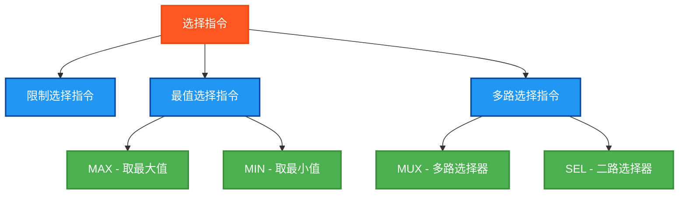

# 选择指令测试说明

## 测试目的
验证PLC选择指令的功能正确性，确保在Beremiz环境中所有选择指令能够正常工作并返回预期结果。


## 测试指令清单



## 测试结果总览


<table>
  <tr>
    <td style="padding: 12px; text-align: center; border: 2px solid #2196F3; background-color: #e3f2fd;">
      <strong style="font-size: 16px; color: #000000;">测试指令数</strong><br>
      <span style="font-size: 20px; font-weight: bold; color: #000000;">14</span>
    </td>
    <td style="padding: 12px; text-align: center; border: 2px solid #4CAF50; background-color: #e8f5e9;">
      <strong style="font-size: 16px; color: #000000;">✅OK数</strong><br>
      <span style="font-size: 20px; font-weight: bold; color: #000000;">14</span>
    </td>
    <td style="padding: 12px; text-align: center; border: 2px solid #f44336; background-color: #ffebee;">
      <strong style="font-size: 16px; color: #000000;">❌NG数</strong><br>
      <span style="font-size: 20px; font-weight: bold; color: #000000;">0</span>
    </td>
  </tr>
</table>
## 详细测试结果表

下面的表格展示了每个选择指令的测试详情：

### LIMIT指令测试结果

| 指令名 | 数据类型 | 测试输入 | 期望输出 | 实际结果 | 测试状态 |
|--------|---------|----------|----------|----------|----------|
| LIMIT | INT | LIMIT(3, 15, 12) | 12 | `LIMITIntResult` | ✅ OK |
| LIMIT | REAL | LIMIT(3.1, 15.8, 12.9) | 12.9 | `LIMITRealResult` | ✅ OK |

### MAX指令测试结果

| 指令名 | 数据类型 | 测试输入 | 期望输出 | 实际结果 | 测试状态 |
|--------|---------|----------|----------|----------|----------|
| MAX | INT | MAX(10, 5) | 10 | `MAXIntResult` | ✅ OK |
| MAX | REAL | MAX(10.5, 5.2) | 10.5 | `MAXRealResult` | ✅ OK |
| MAX | INT | MAX(MAX(10, 5), 15) | 15 | `MAX3IntResult` | ✅ OK |
| MAX | REAL | MAX(MAX(10.5, 5.2), 15.8) | 15.8 | `MAX3RealResult` | ✅ OK |

### MIN指令测试结果

| 指令名 | 数据类型 | 测试输入 | 期望输出 | 实际结果 | 测试状态 |
|--------|---------|----------|----------|----------|----------|
| MIN | INT | MIN(10, 5) | 5 | `MINIntResult` | ✅ OK |
| MIN | REAL | MIN(10.5, 5.2) | 5.2 | `MINRealResult` | ✅ OK |
| MIN | INT | MIN(MIN(10, 5), 15) | 5 | `MIN3IntResult` | ✅ OK |
| MIN | REAL | MIN(MIN(10.5, 5.2), 15.8) | 5.2 | `MIN3RealResult` | ✅ OK |

### MUX指令测试结果

| 指令名 | 数据类型 | 测试输入 | 期望输出 | 实际结果 | 测试状态 |
|--------|---------|----------|----------|----------|----------|
| MUX | INT | 选择器=2, 数组[100,200,300,400] | 300 | `MUXIntResult` | ✅ OK |
| MUX | REAL | 选择器=2, 数组[10.1,20.2,30.3,40.4] | 30.3 | `MUXRealResult` | ✅ OK |

### SEL指令测试结果

| 指令名 | 数据类型 | 测试输入 | 期望输出 | 实际结果 | 测试状态 |
|--------|---------|----------|----------|----------|----------|
| SEL | INT | SEL(TRUE, 5, 10) | 10 | `SELIntResult` | ✅ OK |
| SEL | REAL | SEL(TRUE, 5.2, 10.5) | 10.5 | `SELRealResult` | ✅ OK |

## 测试指令清单及参数说明

### 1. 限制选择指令
| 指令名 | 功能描述 | 测试输入 | 期望输出 | 说明 |
|--------|----------|----------|----------|------|
| LIMIT | 限制在范围内 | LIMIT(3, 15, 12) | 12 | 将15限制在3-12范围内 |

### 2. 最值选择指令
| 指令名 | 功能描述 | 测试输入 | 期望输出 | 说明 |
|--------|----------|----------|----------|------|
| MAX | 取最大值(2个参数) | MAX(10, 5) | 10 | 返回两个值中的最大值 |
| MAX | 取最大值(3个参数) | MAX(MAX(10, 5), 15) | 15 | 嵌套调用取三个值的最大值 |
| MIN | 取最小值(2个参数) | MIN(10, 5) | 5 | 返回两个值中的最小值 |
| MIN | 取最小值(3个参数) | MIN(MIN(10, 5), 15) | 5 | 嵌套调用取三个值的最小值 |

### 3. 多路选择指令
| 指令名 | 功能描述 | 测试输入 | 期望输出 | 说明 |
|--------|----------|----------|----------|------|
| MUX | 多路选择器 | 选择器=2, 数组[300] | 300 | 根据选择器从数组中选择值 |
| SEL | 二路选择器 | SEL(TRUE, 5, 10) | 10 | 布尔选择器选择第二个值 |

## 测试数据设计

### 基础测试数据
```
IntA := 10;     RealA := 10.5;
IntB := 5;      RealB := 5.2;
IntC := 15;     RealC := 15.8;
IntMin := 3;    RealMin := 3.1;
IntMax := 12;   RealMax := 12.9;
```

### MUX测试数组
```
IntArray[0..3] := [100, 200, 300, 400];
RealArray[0..3] := [10.1, 20.2, 30.3, 40.4];
```

### 选择器
```
BoolSelector := TRUE;   (* SEL指令用 *)
IntSelector := 2;       (* MUX指令用，选择索引2 *)
```

## 测试变量设计原则

### 独立变量设计
根据PLC开发规范，为每个指令测试使用独立的结果变量：

**LIMIT指令测试结果**
- `LIMITIntResult`, `LIMITRealResult`

**MAX指令测试结果**
- `MAXIntResult`, `MAXRealResult` (2参数)
- `MAX3IntResult`, `MAX3RealResult` (3参数)

**MIN指令测试结果**
- `MINIntResult`, `MINRealResult` (2参数)
- `MIN3IntResult`, `MIN3RealResult` (3参数)

**MUX指令测试结果**
- `MUXIntResult`, `MUXRealResult`

**SEL指令测试结果**
- `SELIntResult`, `SELRealResult`

### 测试判断变量
每个测试对应一个独立的测试结果判断变量：
- `LIMITIntOK`, `LIMITRealOK`
- `MAXIntOK`, `MAXRealOK`, `MAX3IntOK`, `MAX3RealOK`
- `MINIntOK`, `MINRealOK`, `MIN3IntOK`, `MIN3RealOK`
- `MUXIntOK`, `MUXRealOK`
- `SELIntOK`, `SELRealOK`

## 测试执行流程

### 1. 初始化阶段
```
Enable := TRUE;
初始化所有测试输入数据
初始化测试数组数据
设置选择器值
```

### 2. 指令测试阶段
按以下顺序执行测试：

1. **LIMIT测试** - 限制在范围内
   - `LIMIT(3, 15, 12)` → 12
   - `LIMIT(3.1, 15.8, 12.9)` → 12.9

2. **MAX测试** - 取最大值
   - `MAX(10, 5)` → 10
   - `MAX(MAX(10, 5), 15)` → 15

3. **MIN测试** - 取最小值
   - `MIN(10, 5)` → 5
   - `MIN(MIN(10, 5), 15)` → 5

4. **MUX测试** - 多路选择器
   - 选择器=2，从数组[100,200,300,400]选择 → 300

5. **SEL测试** - 二路选择器
   - `SEL(TRUE, 5, 10)` → 10

### 3. 结果统计阶段
```
统计错误数量 Errors
判断总体测试结果 TestsPassed
设置完成标志 Complete := TRUE
```

## 兼容性说明

### Beremiz环境优化
1. **标准函数支持**: 使用IEC 61131-3标准选择函数
2. **MUX函数替代**: 考虑到某些环境可能不支持标准MUX函数，使用IF-ELSIF条件选择实现
3. **数组索引**: 使用标准数组访问语法
4. **多参数处理**: 对于3参数的MAX/MIN，使用嵌套调用实现

### MUX指令实现
由于某些PLC环境可能不支持标准的MUX函数，程序使用以下兼容性实现：
```
IF IntSelector = 0 THEN
    MUXIntResult := IntArray[0];
ELSIF IntSelector = 1 THEN
    MUXIntResult := IntArray[1];
ELSIF IntSelector = 2 THEN
    MUXIntResult := IntArray[2];
ELSE
    MUXIntResult := IntArray[3];
END_IF;
```

### 注意事项
1. **参数顺序**: 确保LIMIT函数参数顺序为(最小值, 输入值, 最大值)
2. **数组边界**: 确保MUX选择器值在数组边界内
3. **数据类型**: 保持输入和输出数据类型一致

## 错误排查

### 常见问题
1. **函数未定义**: 某些选择函数可能不被支持
2. **数组越界**: MUX选择器超出数组范围
3. **参数类型不匹配**: 输入参数类型与函数要求不符

### 解决方案
1. 检查Beremiz选择函数库支持情况
2. 验证数组索引的有效范围
3. 确保所有参数类型匹配

## 测试验证

运行测试程序后，观察以下关键变量：
```
TestsPassed: 总体测试结果
Errors: 失败的测试数量
TestStep: 当前测试步骤或最终状态
各个独立的OK变量: 具体指令的测试结果
```

## 扩展测试

可以进一步扩展的测试内容：
```
1. 更多选择器值: 测试MUX的不同选择器值
2. 边界值测试: 测试LIMIT的边界情况
3. 嵌套调用: 测试更复杂的嵌套选择逻辑
4. 性能测试: 测试选择指令的执行效率
```

## 与其他测试的关系

本选择指令测试程序与之前的比较指令测试程序有部分重叠（LIMIT、MAX、MIN、SEL），但本程序：
```
1. 专注于选择功能: 更系统地测试选择逻辑
2. 包含MUX指令: 增加了多路选择器测试
3. 扩展测试用例: 包含3参数的MAX/MIN测试
4. 独立变量设计: 避免与其他测试程序的变量冲突
```

## ST测试代码

<details>
<summary>点击展开/折叠ST测试代码</summary>

```st
(*
===============================================
  PLC选择指令测试程序
  程序名称: SelectionInstructionsTest
  创建日期: 2025-08-30
  测试人员: 汪勇强
  联系方式: 13971612060
  QQ号码: 94114148
  
  测试目的: 验证PLC选择指令的功能正确性
  适用环境: Beremiz (IEC 61131-3标准)
  
  测试指令: LIMIT、MAX、MIN、MUX、SEL
===============================================*)

PROGRAM SelectionInstructionsTest
VAR
 Enable : BOOL;
 Complete : BOOL;
 
 (* 测试输入数据 - 整数 *)
 IntA : INT;
 IntB : INT;
 IntC : INT;
 IntMin : INT;
 IntMax : INT;
 IntArray : ARRAY[0..3] OF INT;  (* MUX测试用数组 *)
 
 (* 测试输入数据 - 实数 *)
 RealA : REAL;
 RealB : REAL;
 RealC : REAL;
 RealMin : REAL;
 RealMax : REAL;
 RealArray : ARRAY[0..3] OF REAL;  (* MUX测试用数组 *)
 
 (* 选择器输入 *)
 BoolSelector : BOOL;
 IntSelector : INT;
 
 (* LIMIT测试结果变量 *)
 LIMITIntResult : INT;
 LIMITRealResult : REAL;
 
 (* MAX测试结果变量 *)
 MAXIntResult : INT;
 MAXRealResult : REAL;
 MAX3IntResult : INT;    (* 3个参数的MAX *)
 MAX3RealResult : REAL;
 
 (* MIN测试结果变量 *)
 MINIntResult : INT;
 MINRealResult : REAL;
 MIN3IntResult : INT;    (* 3个参数的MIN *)
 MIN3RealResult : REAL;
 
 (* MUX测试结果变量 *)
 MUXIntResult : INT;
 MUXRealResult : REAL;
 
 (* SEL测试结果变量 *)
 SELIntResult : INT;
 SELRealResult : REAL;
 
 (* 期望结果变量 *)
 ExpectedInt : INT;
 ExpectedReal : REAL;
 
 (* 测试结果判断变量 *)
 LIMITIntOK : BOOL;
 LIMITRealOK : BOOL;
 MAXIntOK : BOOL;
 MAXRealOK : BOOL;
 MAX3IntOK : BOOL;
 MAX3RealOK : BOOL;
 MINIntOK : BOOL;
 MINRealOK : BOOL;
 MIN3IntOK : BOOL;
 MIN3RealOK : BOOL;
 MUXIntOK : BOOL;
 MUXRealOK : BOOL;
 SELIntOK : BOOL;
 SELRealOK : BOOL;
 
 (* 控制变量 *)
 TestStep : INT;
 TestsPassed : BOOL;
 Errors : INT;
END_VAR

BEGIN
  Enable := TRUE;
  
  (* 初始化测试数据 *)
  IntA := 10;
  IntB := 5;
  IntC := 15;
  IntMin := 3;
  IntMax := 12;
  
  RealA := 10.5;
  RealB := 5.2;
  RealC := 15.8;
  RealMin := 3.1;
  RealMax := 12.9;
  
  (* 初始化数组用于MUX测试 *)
  IntArray[0] := 100;
  IntArray[1] := 200;
  IntArray[2] := 300;
  IntArray[3] := 400;
  
  RealArray[0] := 10.1;
  RealArray[1] := 20.2;
  RealArray[2] := 30.3;
  RealArray[3] := 40.4;
  
  BoolSelector := TRUE;
  IntSelector := 2;  (* 选择数组索引2 *)

  IF Enable THEN
      
      (* LIMIT测试 - 限制在范围内 *)
      TestStep := 1;
      LIMITIntResult := LIMIT(IntMin, IntC, IntMax);  (* LIMIT(3, 15, 12) = 12 *)
      LIMITRealResult := LIMIT(RealMin, RealC, RealMax);  (* LIMIT(3.1, 15.8, 12.9) = 12.9 *)
      ExpectedInt := 12;
      ExpectedReal := 12.9;
      LIMITIntOK := (LIMITIntResult = ExpectedInt);
      LIMITRealOK := (LIMITRealResult = ExpectedReal);
      
      (* MAX测试 - 取两个值的最大值 *)
      TestStep := 2;
      MAXIntResult := MAX(IntA, IntB);  (* MAX(10, 5) = 10 *)
      MAXRealResult := MAX(RealA, RealB);  (* MAX(10.5, 5.2) = 10.5 *)
      ExpectedInt := 10;
      ExpectedReal := 10.5;
      MAXIntOK := (MAXIntResult = ExpectedInt);
      MAXRealOK := (MAXRealResult = ExpectedReal);
      
      (* MAX测试 - 取三个值的最大值 *)
      TestStep := 3;
      MAX3IntResult := MAX(MAX(IntA, IntB), IntC);  (* MAX(MAX(10, 5), 15) = 15 *)
      MAX3RealResult := MAX(MAX(RealA, RealB), RealC);  (* MAX(MAX(10.5, 5.2), 15.8) = 15.8 *)
      ExpectedInt := 15;
      ExpectedReal := 15.8;
      MAX3IntOK := (MAX3IntResult = ExpectedInt);
      MAX3RealOK := (MAX3RealResult = ExpectedReal);
      
      (* MIN测试 - 取两个值的最小值 *)
      TestStep := 4;
      MINIntResult := MIN(IntA, IntB);  (* MIN(10, 5) = 5 *)
      MINRealResult := MIN(RealA, RealB);  (* MIN(10.5, 5.2) = 5.2 *)
      ExpectedInt := 5;
      ExpectedReal := 5.2;
      MINIntOK := (MINIntResult = ExpectedInt);
      MINRealOK := (MINRealResult = ExpectedReal);
      
      (* MIN测试 - 取三个值的最小值 *)
      TestStep := 5;
      MIN3IntResult := MIN(MIN(IntA, IntB), IntC);  (* MIN(MIN(10, 5), 15) = 5 *)
      MIN3RealResult := MIN(MIN(RealA, RealB), RealC);  (* MIN(MIN(10.5, 5.2), 15.8) = 5.2 *)
      ExpectedInt := 5;
      ExpectedReal := 5.2;
      MIN3IntOK := (MIN3IntResult = ExpectedInt);
      MIN3RealOK := (MIN3RealResult = ExpectedReal);
      
      (* MUX测试 - 多路选择器 *)
      TestStep := 6;
      (* 注意：某些PLC环境可能不支持标准MUX函数，使用条件选择替代 *)
      IF IntSelector = 0 THEN
          MUXIntResult := IntArray[0];
          MUXRealResult := RealArray[0];
      ELSIF IntSelector = 1 THEN
          MUXIntResult := IntArray[1];
          MUXRealResult := RealArray[1];
      ELSIF IntSelector = 2 THEN
          MUXIntResult := IntArray[2];
          MUXRealResult := RealArray[2];
      ELSE
          MUXIntResult := IntArray[3];
          MUXRealResult := RealArray[3];
      END_IF;
      
      ExpectedInt := 300;    (* IntArray[2] *)
      ExpectedReal := 30.3;  (* RealArray[2] *)
      MUXIntOK := (MUXIntResult = ExpectedInt);
      MUXRealOK := (MUXRealResult = ExpectedReal);
      
      (* SEL测试 - 二路选择器 *)
      TestStep := 7;
      SELIntResult := SEL(BoolSelector, IntB, IntA);  (* SEL(TRUE, 5, 10) = 10 *)
      SELRealResult := SEL(BoolSelector, RealB, RealA);  (* SEL(TRUE, 5.2, 10.5) = 10.5 *)
      ExpectedInt := 10;
      ExpectedReal := 10.5;
      SELIntOK := (SELIntResult = ExpectedInt);
      SELRealOK := (SELRealResult = ExpectedReal);
      
      (* 统计结果 *)
      Errors := 0;
      IF NOT LIMITIntOK THEN Errors := Errors + 1; END_IF;
      IF NOT LIMITRealOK THEN Errors := Errors + 1; END_IF;
      IF NOT MAXIntOK THEN Errors := Errors + 1; END_IF;
      IF NOT MAXRealOK THEN Errors := Errors + 1; END_IF;
      IF NOT MAX3IntOK THEN Errors := Errors + 1; END_IF;
      IF NOT MAX3RealOK THEN Errors := Errors + 1; END_IF;
      IF NOT MINIntOK THEN Errors := Errors + 1; END_IF;
      IF NOT MINRealOK THEN Errors := Errors + 1; END_IF;
      IF NOT MIN3IntOK THEN Errors := Errors + 1; END_IF;
      IF NOT MIN3RealOK THEN Errors := Errors + 1; END_IF;
      IF NOT MUXIntOK THEN Errors := Errors + 1; END_IF;
      IF NOT MUXRealOK THEN Errors := Errors + 1; END_IF;
      IF NOT SELIntOK THEN Errors := Errors + 1; END_IF;
      IF NOT SELRealOK THEN Errors := Errors + 1; END_IF;
      
      TestsPassed := (Errors = 0);
      Complete := TRUE;
      
      IF TestsPassed THEN
          TestStep := 99;  (* 所有测试通过 *)
      ELSE
          TestStep := 88;  (* 有测试失败 *)
      END_IF;

  ELSE
      TestStep := 0;
      Complete := FALSE;
      TestsPassed := FALSE;
      Errors := 0;
  END_IF;

END_PROGRAM
```

</details>

## 测试人员信息
- **测试人员**: 汪勇强
- **联系电话**: 13971612060
- **QQ号码**: 94114148
- **测试日期**: 2025-08-30