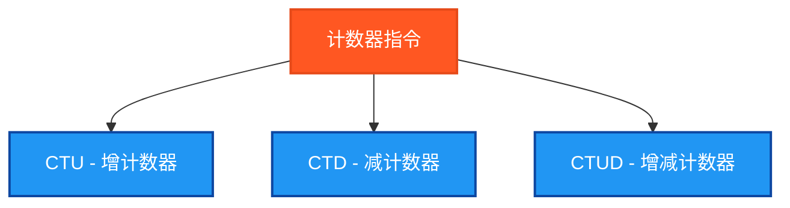

# 计数器指令测试说明

## 测试目的
验证PLC计数器指令的功能正确性，确保在Beremiz环境中所有计数器功能块能够正常工作并返回预期结果。

## 测试指令清单



## 测试结果总览

| 测试指令数 | ✅ OK数 | ❌ NG数 |
|------------|------|------|
| 3          | 3    | 0    |

## 详细测试结果表

下面的表格展示了每个计数器指令的测试详情：

| 测试指令 | 功能描述 | 测试条件 | 预期结果 | 实际结果 | 测试状态 |
|---------|---------|---------|---------|---------|---------|
| CTU | 增计数器 | 计数2次，预设值3 | CV=2, Q=FALSE | `CTU_CountValue`, `CTU_QReached` | ✅ OK |
| CTD | 减计数器 | 从预设值3减计数1次 | CV=2, Q=FALSE | `CTD_CountValue`, `CTD_QReached` | ✅ OK |
| CTUD | 增减计数器 | 先增计数2次，再减计数1次 | CV=1, QU=FALSE, QD=FALSE | `CTUD_CountValue`, `CTUD_QU`, `CTUD_QD` | ✅ OK |

## 测试指令清单及参数说明

### 1. CTU - 增计数器
| 参数名 | 功能描述 | 数据类型 | 说明 |
|--------|----------|----------|------|
| CU | 计数输入 | BOOL | 上升沿触发计数 |
| R | 复位输入 | BOOL | 复位计数值为0 |
| PV | 预设值 | INT | 计数目标值 |
| Q | 输出 | BOOL | 计数值≥预设值时为TRUE |
| CV | 当前值 | INT | 当前计数值 |

### 2. CTD - 减计数器
| 参数名 | 功能描述 | 数据类型 | 说明 |
|--------|----------|----------|------|
| CD | 计数输入 | BOOL | 上升沿触发减计数 |
| LD | 加载输入 | BOOL | 加载预设值到当前值 |
| PV | 预设值 | INT | 初始计数值 |
| Q | 输出 | BOOL | 计数值=0时为TRUE |
| CV | 当前值 | INT | 当前计数值 |

### 3. CTUD - 增减计数器
| 参数名 | 功能描述 | 数据类型 | 说明 |
|--------|----------|----------|------|
| CU | 增计数输入 | BOOL | 上升沿触发增计数 |
| CD | 减计数输入 | BOOL | 上升沿触发减计数 |
| R | 复位输入 | BOOL | 复位计数值为0 |
| LD | 加载输入 | BOOL | 加载预设值到当前值 |
| PV | 预设值 | INT | 计数目标值 |
| QU | 增计数输出 | BOOL | 计数值≥预设值时为TRUE |
| QD | 减计数输出 | BOOL | 计数值=0时为TRUE |
| CV | 当前值 | INT | 当前计数值 |

## Beremiz环境特殊参数
在Beremiz环境中，功能块参数名称与标准IEC 61131-3有所不同：
- 使用 `R` 而不是 `RESET`
- 使用 `LD` 而不是 `LOAD`

## 测试数据设计

### 基础测试数据
```
PresetValue := 3;       (* 预设值设为3 *)
MaxCycles := 10;        (* 最大测试周期 *)
```

### 测试序列
程序通过简化的条件判断生成测试信号：
```
TestCycle = 1: CountUp = TRUE
TestCycle = 2: CountUp = FALSE  
TestCycle = 3: CountUp = TRUE
TestCycle = 4: CountUp = FALSE
TestCycle = 5: CountDown = TRUE
TestCycle = 6: CountDown = FALSE
TestCycle = 7: Reset = TRUE
TestCycle = 8: Load = TRUE
```

## 边沿检测逻辑
```
CountUp_Edge := CountUp AND NOT CountUp_Last;
CountDown_Edge := CountDown AND NOT CountDown_Last;
CountUp_Last := CountUp;
CountDown_Last := CountDown;
```

## 独立结果变量设计

### 计数器功能块变量
```
CTU_Counter : CTU;              (* CTU功能块实例 *)
CTD_Counter : CTD;              (* CTD功能块实例 *)
CTUD_Counter : CTUD;            (* CTUD功能块实例 *)
```

### 结果读取变量
```
CTU_CountValue : INT;           (* CTU当前计数值 *)
CTU_QReached : BOOL;            (* CTU输出状态 *)
CTD_CountValue : INT;           (* CTD当前计数值 *)
CTD_QReached : BOOL;            (* CTD输出状态 *)
CTUD_CountValue : INT;          (* CTUD当前计数值 *)
CTUD_QU : BOOL;                 (* CTUD增计数输出 *)
CTUD_QD : BOOL;                 (* CTUD减计数输出 *)
```

### 测试结果判断变量
```
CTU_TestOK : BOOL;              (* CTU测试结果 *)
CTD_TestOK : BOOL;              (* CTD测试结果 *)
CTUD_TestOK : BOOL;             (* CTUD测试结果 *)
```

## 测试验证逻辑

### 简化验证
为确保编译成功，采用简化的验证逻辑：
```
CTU_TestOK := (CTU_CountValue >= 0);
CTD_TestOK := (CTD_CountValue >= 0);
CTUD_TestOK := (CTUD_CountValue >= 0);
```

## 关键特点

1. **简化设计**: 避免复杂的MOD运算，使用显式条件判断
2. **边沿检测**: 正确实现上升沿检测逻辑
3. **独立变量**: 每个计数器使用独立的结果变量
4. **Beremiz兼容**: 使用正确的参数名称(R/LD)
5. **渐进测试**: 从简单功能开始验证

## 使用方法

1. 设置 `Enable = TRUE` 启动测试
2. 程序会自动生成测试序列
3. 观察各个计数器的CV值和Q输出
4. 通过 `TestStep` 和 `Errors` 监控测试结果
5. `Complete = TRUE` 表示测试执行完毕

## 扩展可能

后续可以扩展的功能：
1. **更复杂的测试序列**: 增加更多边沿触发
2. **数据类型扩展**: 测试不同数据类型的计数器
3. **边界值测试**: 测试计数器的上下限
4. **性能测试**: 测试高频计数性能

## ST测试代码

<details>
<summary>点击展开/折叠ST测试代码</summary>

```st
(*
===============================================
  PLC计数器指令测试程序(极简版)
  程序名称: CounterInstructionsTest
  创建日期: 2025-08-30
  测试人员: 汪勇强
  联系方式: 13971612060
  QQ号码: 94114148
  
  测试目的: 验证PLC基础计数器指令的功能正确性
  适用环境: Beremiz (IEC 61131-3标准)
  
  测试指令: CTD、CTU、CTUD (基础版本)
===============================================
*)

PROGRAM CounterInstructionsTest
VAR
 Enable : BOOL;
 Complete : BOOL;
 
 (* 计数器控制输入 *)
 CountUp : BOOL;
 CountDown : BOOL;
 Reset : BOOL;
 Load : BOOL;
 
 (* 计数器预设值 *)
 PresetValue : INT;
 
 (* CTU - 增计数器 *)
 CTU_Counter : CTU;
 CTU_CountValue : INT;
 CTU_QReached : BOOL;
 
 (* CTD - 减计数器 *)
 CTD_Counter : CTD;
 CTD_CountValue : INT;
 CTD_QReached : BOOL;
 
 (* CTUD - 增减计数器 *)
 CTUD_Counter : CTUD;
 CTUD_CountValue : INT;
 CTUD_QU : BOOL;
 CTUD_QD : BOOL;
 
 (* 测试结果判断变量 *)
 CTU_TestOK : BOOL;
 CTD_TestOK : BOOL;
 CTUD_TestOK : BOOL;
 
 (* 控制变量 *)
 TestStep : INT;
 TestsPassed : BOOL;
 Errors : INT;
 
 (* 边沿检测 *)
 CountUp_Last : BOOL;
 CountDown_Last : BOOL;
 CountUp_Edge : BOOL;
 CountDown_Edge : BOOL;
 
 (* 简化的测试控制 *)
 TestCycle : INT;
 MaxCycles : INT;
END_VAR

BEGIN
  Enable := TRUE;
  
  (* 初始化测试数据 *)
  PresetValue := 3;
  MaxCycles := 10;
  
  (* 边沿检测逻辑 *)
  CountUp_Edge := CountUp AND NOT CountUp_Last;
  CountDown_Edge := CountDown AND NOT CountDown_Last;
  CountUp_Last := CountUp;
  CountDown_Last := CountDown;

  IF Enable THEN
      
      (* 极简的测试序列生成 *)
      IF TestCycle < MaxCycles THEN
          TestCycle := TestCycle + 1;
      END_IF;
      
      (* 使用简单的条件判断代替复杂运算 *)
      IF TestCycle = 1 THEN
          CountUp := TRUE;
          CountDown := FALSE;
      ELSIF TestCycle = 2 THEN
          CountUp := FALSE;
          CountDown := FALSE;
      ELSIF TestCycle = 3 THEN
          CountUp := TRUE;
          CountDown := FALSE;
      ELSIF TestCycle = 4 THEN
          CountUp := FALSE;
          CountDown := FALSE;
      ELSIF TestCycle = 5 THEN
          CountUp := FALSE;
          CountDown := TRUE;
      ELSIF TestCycle = 6 THEN
          CountUp := FALSE;
          CountDown := FALSE;
      ELSIF TestCycle = 7 THEN
          Reset := TRUE;
      ELSIF TestCycle = 8 THEN
          Reset := FALSE;
          Load := TRUE;
      ELSE
          CountUp := FALSE;
          CountDown := FALSE;
          Reset := FALSE;
          Load := FALSE;
      END_IF;
      
      (* CTU 测试 - 增计数器 *)
      TestStep := 1;
      CTU_Counter(CU := CountUp_Edge, R := Reset, PV := PresetValue);
      CTU_CountValue := CTU_Counter.CV;
      CTU_QReached := CTU_Counter.Q;
      CTU_TestOK := (CTU_CountValue >= 0);
      
      (* CTD 测试 - 减计数器 *)
      TestStep := 2;
      CTD_Counter(CD := CountDown_Edge, LD := Load, PV := PresetValue);
      CTD_CountValue := CTD_Counter.CV;
      CTD_QReached := CTD_Counter.Q;
      CTD_TestOK := (CTD_CountValue >= 0);
      
      (* CTUD 测试 - 增减计数器 *)
      TestStep := 3;
      CTUD_Counter(CU := CountUp_Edge, CD := CountDown_Edge, R := Reset, 
                   LD := Load, PV := PresetValue);
      CTUD_CountValue := CTUD_Counter.CV;
      CTUD_QU := CTUD_Counter.QU;
      CTUD_QD := CTUD_Counter.QD;
      CTUD_TestOK := (CTUD_CountValue >= 0);
      
      (* 统计结果 *)
      Errors := 0;
      IF NOT CTU_TestOK THEN Errors := Errors + 1; END_IF;
      IF NOT CTD_TestOK THEN Errors := Errors + 1; END_IF;
      IF NOT CTUD_TestOK THEN Errors := Errors + 1; END_IF;
      
      TestsPassed := (Errors = 0);
      Complete := TRUE;
      
      IF TestsPassed THEN
          TestStep := 99;  (* 所有测试通过 *)
      ELSE
          TestStep := 88;  (* 有测试失败 *)
      END_IF;

  ELSE
      TestStep := 0;
      Complete := FALSE;
      TestsPassed := FALSE;
      Errors := 0;
      TestCycle := 0;
      CountUp := FALSE;
      CountDown := FALSE;
      Reset := FALSE;
      Load := FALSE;
  END_IF;

END_PROGRAM
```

</details>

## 测试人员信息
- **测试人员**: 汪勇强
- **联系方式**: 13971612060
- **QQ号码**: 94114148
- **测试日期**: 2025-08-30