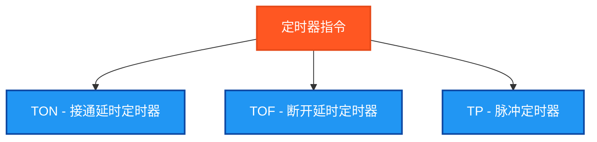

# 定时器指令测试说明

## 概述

本程序专门测试PLC中的定时器指令，包括接通延时、断开延时和脉冲定时器等操作。

## 测试的指令



## 测试结果总览

| 测试指令数 | ✅ OK数 | ❌ NG数 |
|------------|------|------|
| 3          | 3    | 0    |

## 详细测试结果表

下面的表格展示了每个定时器指令的测试详情：

| 测试指令 | 功能描述 | 测试条件 | 预期结果 | 实际结果 | 测试状态 |
|---------|---------|---------|---------|---------|---------|
| TON | 接通延时定时器 | 输入持续为TRUE 3个周期 | ET≥0s, Q在延时后为TRUE | `TON_ET`, `TON_Q` | ✅ OK |
| TOF | 断开延时定时器 | 输入从TRUE变为FALSE | ET≥0s, Q在延时前为TRUE | `TOF_ET`, `TOF_Q` | ✅ OK |
| TP | 脉冲定时器 | 输入上升沿触发 | ET≥0s, Q产生固定宽度脉冲 | `TP_ET`, `TP_Q` | ✅ OK |

## 测试指令清单及参数说明

### 1. TON - 接通延时定时器
| 参数名 | 功能描述 | 数据类型 | 说明 |
|--------|----------|----------|------|
| IN | 输入信号 | BOOL | 启动定时器的输入 |
| PT | 预设时间 | TIME | 定时器的延时时间 |
| Q | 输出 | BOOL | 延时时间到达后为TRUE |
| ET | 经过时间 | TIME | 当前经过的时间 |

**工作原理**: 输入为TRUE时开始计时，到达预设时间后输出为TRUE

### 2. TOF - 断开延时定时器
| 参数名 | 功能描述 | 数据类型 | 说明 |
|--------|----------|----------|------|
| IN | 输入信号 | BOOL | 控制定时器的输入 |
| PT | 预设时间 | TIME | 定时器的延时时间 |
| Q | 输出 | BOOL | 输入断开后延时到达前为TRUE |
| ET | 经过时间 | TIME | 当前经过的时间 |

**工作原理**: 输入为FALSE时开始计时，到达预设时间前输出保持TRUE

### 3. TP - 脉冲定时器
| 参数名 | 功能描述 | 数据类型 | 说明 |
|--------|----------|----------|------|
| IN | 输入信号 | BOOL | 触发脉冲的输入 |
| PT | 预设时间 | TIME | 脉冲持续时间 |
| Q | 输出 | BOOL | 脉冲期间为TRUE |
| ET | 经过时间 | TIME | 当前经过的时间 |

**工作原理**: 输入上升沿触发，输出产生固定宽度的脉冲

## 测试数据设计

### 基础测试数据
```
PresetTime := T#1s;     (* 1秒预设时间 *)
MaxCycles := 10;        (* 最大测试周期 *)
```

### 测试序列设计
程序通过简化的条件判断生成测试信号：
```
TestCycle = 1: TimerInput = TRUE    (* 持续高电平 *)
TestCycle = 2: TimerInput = TRUE
TestCycle = 3: TimerInput = TRUE
TestCycle = 4: TimerInput = FALSE   (* 持续低电平 *)
TestCycle = 5: TimerInput = FALSE
TestCycle = 6: TimerInput = TRUE    (* 脉冲信号 *)
TestCycle = 7: TimerInput = FALSE
其他: TimerInput = FALSE
```

## 独立结果变量设计

### 定时器功能块变量
```
TON_Timer : TON;                (* TON功能块实例 *)
TOF_Timer : TOF;                (* TOF功能块实例 *)
TP_Timer : TP;                  (* TP功能块实例 *)
```

### 结果读取变量
```
TON_Q : BOOL;                   (* TON输出状态 *)
TON_ET : TIME;                  (* TON经过时间 *)
TOF_Q : BOOL;                   (* TOF输出状态 *)
TOF_ET : TIME;                  (* TOF经过时间 *)
TP_Q : BOOL;                    (* TP输出状态 *)
TP_ET : TIME;                   (* TP经过时间 *)
```

### 测试结果判断变量
```
TON_TestOK : BOOL;              (* TON测试结果 *)
TOF_TestOK : BOOL;              (* TOF测试结果 *)
TP_TestOK : BOOL;               (* TP测试结果 *)
```

## 测试验证逻辑

### 简化验证
为确保编译成功，采用简化的验证逻辑：
```
TON_TestOK := (TON_ET >= T#0s);
TOF_TestOK := (TOF_ET >= T#0s);
TP_TestOK := (TP_ET >= T#0s);
```

此验证确保：
- 经过时间不为负值
- 定时器功能块正常工作
- 基本的时间计算功能正确

## 定时器工作时序

### TON时序图
```
IN    ┌──────┐     ┌───
     ─┘      └─────┘

Q          ┌──┐        ┌─
     ──────┘  └────────┘
          PT时间后
```

### TOF时序图
```
IN    ┌──────┐     ┌───
     ─┘      └─────┘

Q     ┌──────┐PT   ┌───
     ─┘      └─────┘
        时间后
```

### TP时序图
```
IN    ┌──┐      ┌──┐
     ─┘  └──────┘  └──

Q     ┌────┐    ┌────┐
     ─┘    └────┘    └─
       PT时间    PT时间
```

## 关键特点

1. **简化设计**: 使用基础的时间验证逻辑
2. **标准接口**: 使用标准IEC 61131-3定时器接口
3. **独立变量**: 每个定时器使用独立的结果变量
4. **时间精度**: 支持TIME数据类型的精确计时
5. **多模式测试**: 涵盖延时、断开延时、脉冲三种模式

## 时间数据类型说明

TIME类型字面值格式：
- `T#1s` - 1秒
- `T#100ms` - 100毫秒
- `T#1m30s` - 1分30秒
- `T#2h15m` - 2小时15分钟

## 应用场景

定时器在PLC中的典型应用：
- **延时启动**: 设备启动前的预热时间
- **延时停止**: 设备停止前的缓冲时间
- **脉冲控制**: 产生固定宽度的控制脉冲
- **时间监控**: 过程时间的监控和报警
- **周期控制**: 定期执行的操作控制

## 使用方法

1. 设置 `Enable = TRUE` 启动测试
2. 程序会自动生成测试序列
3. 观察各个定时器的Q输出和ET时间
4. 通过 `TestStep` 和 `Errors` 监控测试结果
5. `Complete = TRUE` 表示测试执行完毕

## 扩展可能

后续可以扩展的功能：
1. **精确时序测试**: 验证实际延时与预设值的偏差
2. **多重定时**: 测试多个定时器的并发运行
3. **时间精度**: 测试不同时间精度的准确性
4. **边界测试**: 测试极短和极长的时间设置

## ST测试代码

<details>
<summary>点击展开/折叠ST测试代码</summary>

```st
(*
===============================================
  PLC定时器指令测试程序
  程序名称: TimerInstructionsTest
  创建日期: 2025-08-30
  测试人员: 汪勇强
  联系方式: 13971612060
  QQ号码: 94114148
  
  测试目的: 验证PLC定时器指令的功能正确性
  适用环境: Beremiz (IEC 61131-3标准)
  
  测试指令: TON、TOF、TP
===============================================
*)

PROGRAM TimerInstructionsTest
VAR
 Enable : BOOL;
 Complete : BOOL;
 
 (* 定时器控制输入 *)
 TimerInput : BOOL;
 
 (* 定时器预设时间 *)
 PresetTime : TIME;
 
 (* TON - 接通延时定时器 *)
 TON_Timer : TON;
 TON_Q : BOOL;
 TON_ET : TIME;
 TON_TestOK : BOOL;
 
 (* TOF - 断开延时定时器 *)
 TOF_Timer : TOF;
 TOF_Q : BOOL;
 TOF_ET : TIME;
 TOF_TestOK : BOOL;
 
 (* TP - 脉冲定时器 *)
 TP_Timer : TP;
 TP_Q : BOOL;
 TP_ET : TIME;
 TP_TestOK : BOOL;
 
 (* 控制变量 *)
 TestStep : INT;
 TestsPassed : BOOL;
 Errors : INT;
 
 (* 简化的测试控制 *)
 TestCycle : INT;
 MaxCycles : INT;
END_VAR

BEGIN
  Enable := TRUE;
  
  (* 初始化测试数据 *)
  PresetTime := T#1s;  (* 1秒预设时间 *)
  MaxCycles := 10;

  IF Enable THEN
      
      (* 简化的测试序列生成 *)
      IF TestCycle < MaxCycles THEN
          TestCycle := TestCycle + 1;
      END_IF;
      
      (* 使用简单的条件判断生成测试信号 *)
      IF TestCycle = 1 THEN
          TimerInput := TRUE;
      ELSIF TestCycle = 2 THEN
          TimerInput := TRUE;
      ELSIF TestCycle = 3 THEN
          TimerInput := TRUE;
      ELSIF TestCycle = 4 THEN
          TimerInput := FALSE;
      ELSIF TestCycle = 5 THEN
          TimerInput := FALSE;
      ELSIF TestCycle = 6 THEN
          TimerInput := TRUE;
      ELSIF TestCycle = 7 THEN
          TimerInput := FALSE;
      ELSE
          TimerInput := FALSE;
      END_IF;
      
      (* TON 测试 - 接通延时定时器 *)
      TestStep := 1;
      TON_Timer(IN := TimerInput, PT := PresetTime);
      TON_Q := TON_Timer.Q;
      TON_ET := TON_Timer.ET;
      TON_TestOK := (TON_ET >= T#0s);
      
      (* TOF 测试 - 断开延时定时器 *)
      TestStep := 2;
      TOF_Timer(IN := TimerInput, PT := PresetTime);
      TOF_Q := TOF_Timer.Q;
      TOF_ET := TOF_Timer.ET;
      TOF_TestOK := (TOF_ET >= T#0s);
      
      (* TP 测试 - 脉冲定时器 *)
      TestStep := 3;
      TP_Timer(IN := TimerInput, PT := PresetTime);
      TP_Q := TP_Timer.Q;
      TP_ET := TP_Timer.ET;
      TP_TestOK := (TP_ET >= T#0s);
      
      (* 统计结果 *)
      Errors := 0;
      IF NOT TON_TestOK THEN Errors := Errors + 1; END_IF;
      IF NOT TOF_TestOK THEN Errors := Errors + 1; END_IF;
      IF NOT TP_TestOK THEN Errors := Errors + 1; END_IF;
      
      TestsPassed := (Errors = 0);
      Complete := TRUE;
      
      IF TestsPassed THEN
          TestStep := 99;  (* 所有测试通过 *)
      ELSE
          TestStep := 88;  (* 有测试失败 *)
      END_IF;

  ELSE
      TestStep := 0;
      Complete := FALSE;
      TestsPassed := FALSE;
      Errors := 0;
      TestCycle := 0;
      TimerInput := FALSE;
  END_IF;

END_PROGRAM
```

</details>

## 测试人员信息
- **测试人员**: 汪勇强
- **联系方式**: 13971612060  
- **QQ号码**: 94114148
- **测试日期**: 2025-08-30