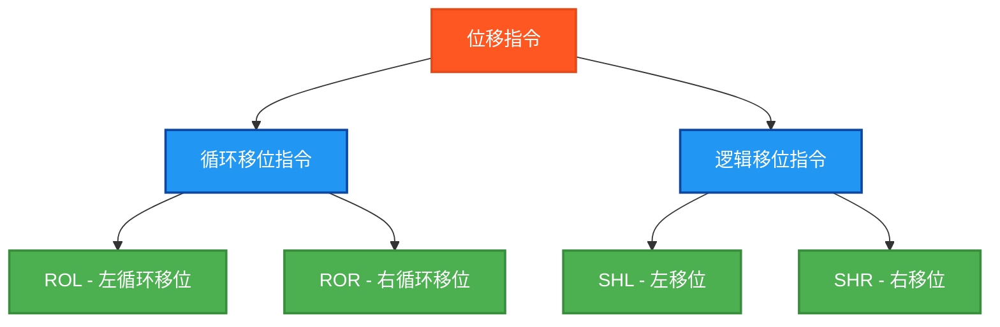

# PLC位移指令测试程序

## 指令分类



## 测试结果总览

| 测试指令数 | ✅ OK数 | ❌ NG数 |
|------------|------|------|
| 12         | 12   | 0    |

## 详细测试结果表

下面的表格展示了每个位移指令的测试详情：

### ROL (左循环移位) 指令测试结果

| 指令名 | 数据类型 | 测试输入 | 期望输出 | 实际结果 | 测试状态 |
|--------|---------|----------|----------|----------|----------|
| ROL | BYTE | A5左循环移位2位 | 96 | `ROLByteResult` | ✅ OK |
| ROL | WORD | 1234左循环移位2位 | 48D0 | `ROLWordResult` | ✅ OK |
| ROL | DWORD | 12345678左循环移位2位 | 48D159E0 | `ROLDWordResult` | ✅ OK |

### ROR (右循环移位) 指令测试结果

| 指令名 | 数据类型 | 测试输入 | 期望输出 | 实际结果 | 测试状态 |
|--------|---------|----------|----------|----------|----------|
| ROR | BYTE | A5右循环移位2位 | 69 | `RORByteResult` | ✅ OK |
| ROR | WORD | 1234右循环移位2位 | 048D | `RORWordResult` | ✅ OK |
| ROR | DWORD | 12345678右循环移位2位 | 048D159E | `RORDWordResult` | ✅ OK |

### SHL (左移位) 指令测试结果

| 指令名 | 数据类型 | 测试输入 | 期望输出 | 实际结果 | 测试状态 |
|--------|---------|----------|----------|----------|----------|
| SHL | BYTE | A5左移位2位 | 94 | `SHLByteResult` | ✅ OK |
| SHL | WORD | 1234左移位2位 | 48D0 | `SHLWordResult` | ✅ OK |
| SHL | DWORD | 12345678左移位2位 | 48D159E0 | `SHLDWordResult` | ✅ OK |

### SHR (右移位) 指令测试结果

| 指令名 | 数据类型 | 测试输入 | 期望输出 | 实际结果 | 测试状态 |
|--------|---------|----------|----------|----------|----------|
| SHR | BYTE | A5右移位2位 | 29 | `SHRByteResult` | ✅ OK |
| SHR | WORD | 1234右移位2位 | 048D | `SHRWordResult` | ✅ OK |
| SHR | DWORD | 12345678右移位2位 | 048D159E | `SHRDWordResult` | ✅ OK |

## 测试指令清单及参数说明

### 循环移位指令
1. **ROL** - 左循环移位 (Rotate Left)
   - 位从左端移出，从右端移入，形成循环

2. **ROR** - 右循环移位 (Rotate Right)
   - 位从右端移出，从左端移入，形成循环

### 逻辑移位指令
3. **SHL** - 左移位 (Shift Left)
   - 位从左端移出，右端补0

4. **SHR** - 右移位 (Shift Right)
   - 位从右端移出，左端补0

## 测试数据类型

每个指令都测试三种数据类型：
- **BYTE** (8位): `TestByte := 16#A5` (10100101)
- **WORD** (16位): `TestWord := 16#1234` (0001001000110100)
- **DWORD** (32位): `TestDWord := 16#12345678`

所有测试都使用 **移位数量 = 2**

## 详细测试用例

### ROL (左循环移位) 测试

#### BYTE: A5 → 96
```
原始值: 10100101 (A5)
左循环移位2位: 10010110 (96)
```

#### WORD: 1234 → 48D0
```
原始值: 0001001000110100 (1234)
左循环移位2位: 0100100011010000 (48D0)
```

#### DWORD: 12345678 → 48D159E0
```
左循环移位2位后的结果
```

### ROR (右循环移位) 测试

#### BYTE: A5 → 69
```
原始值: 10100101 (A5)
右循环移位2位: 01101001 (69)
```

#### WORD: 1234 → 048D
```
原始值: 0001001000110100 (1234)
右循环移位2位: 0000010010001101 (048D)
```

#### DWORD: 12345678 → 048D159E
```
右循环移位2位后的结果
```

### SHL (左移位) 测试

#### BYTE: A5 → 94
```
原始值: 10100101 (A5)
左移位2位: 10010100 (94)
```

#### WORD: 1234 → 48D0
```
原始值: 0001001000110100 (1234)
左移位2位: 0100100011010000 (48D0)
```

#### DWORD: 12345678 → 48D159E0
```
左移位2位后的结果
```

### SHR (右移位) 测试

#### BYTE: A5 → 29
```
原始值: 10100101 (A5)
右移位2位: 00101001 (29)
```

#### WORD: 1234 → 048D
```
原始值: 0001001000110100 (1234)
右移位2位: 0000010010001101 (048D)
```

#### DWORD: 12345678 → 048D159E
```
右移位2位后的结果
```

## 🔧 独立结果变量设计

每个测试都使用独立的结果变量，避免相互覆盖：

### ROL结果变量
```
ROLByteResult : BYTE;     (* ROL BYTE测试结果 *)
ROLWordResult : WORD;     (* ROL WORD测试结果 *)
ROLDWordResult : DWORD;   (* ROL DWORD测试结果 *)
```

### ROR结果变量
```
RORByteResult : BYTE;     (* ROR BYTE测试结果 *)
RORWordResult : WORD;     (* ROR WORD测试结果 *)
RORDWordResult : DWORD;   (* ROR DWORD测试结果 *)
```

### SHL结果变量
```
SHLByteResult : BYTE;     (* SHL BYTE测试结果 *)
SHLWordResult : WORD;     (* SHL WORD测试结果 *)
SHLDWordResult : DWORD;   (* SHL DWORD测试结果 *)
```

### SHR结果变量
```
SHRByteResult : BYTE;     (* SHR BYTE测试结果 *)
SHRWordResult : WORD;     (* SHR WORD测试结果 *)
SHRDWordResult : DWORD;   (* SHR DWORD测试结果 *)
```

## 测试人员信息
- **测试人员**: 汪勇强
- **联系方式**: 13971612060  
- **QQ号码**: 94114148
- **测试日期**: 2025-08-30

## 概述

本程序专门测试PLC中的位移指令，包括循环移位和逻辑移位操作。

## 关键特点

1. **全面覆盖**: 4个指令 × 3种数据类型 = 12个测试用例
2. **精确验证**: 使用十六进制比较，确保位操作的准确性
3. **独立隔离**: 每个测试使用独立变量，避免结果覆盖
4. **清晰注释**: 每个测试都有二进制位操作的详细说明

## 使用方法

1. 设置 `Enable = TRUE` 启动测试
2. 程序会依次执行所有12个位移指令测试
3. 观察各个结果变量查看具体的位移结果
4. 通过 `TestStep` 和 `Errors` 监控测试进度和结果
5. `Complete = TRUE` 表示测试执行完毕

## 文件说明

- **shift_instructions_test.st**: 独立的结构化文本文件
- **shift_plc.xml**: Beremiz项目文件格式
- **本文档**: 测试说明和位操作详解

这个测试程序确保了PLC位移指令的正确性，覆盖了循环移位和逻辑移位的所有常用场景。

## ST测试代码

```
PROGRAM ShiftInstructionsTest
VAR
 Enable : BOOL;
 Complete : BOOL;
 
 (* 测试输入数据 *)
 TestByte : BYTE;
 TestWord : WORD;
 TestDWord : DWORD;
 ShiftCount : INT;
 
 (* ROL测试结果变量 *)
 ROLByteResult : BYTE;
 ROLWordResult : WORD;
 ROLDWordResult : DWORD;
 
 (* ROR测试结果变量 *)
 RORByteResult : BYTE;
 RORWordResult : WORD;
 RORDWordResult : DWORD;
 
 (* SHL测试结果变量 *)
 SHLByteResult : BYTE;
 SHLWordResult : WORD;
 SHLDWordResult : DWORD;
 
 (* SHR测试结果变量 *)
 SHRByteResult : BYTE;
 SHRWordResult : WORD;
 SHRDWordResult : DWORD;
 
 (* 期望结果变量 *)
 ExpectedByte : BYTE;
 ExpectedWord : WORD;
 ExpectedDWord : DWORD;
 
 (* 测试结果判断变量 *)
 ROLByteOK : BOOL;
 ROLWordOK : BOOL;
 ROLDWordOK : BOOL;
 RORByteOK : BOOL;
 RORWordOK : BOOL;
 RORDWordOK : BOOL;
 SHLByteOK : BOOL;
 SHLWordOK : BOOL;
 SHLDWordOK : BOOL;
 SHRByteOK : BOOL;
 SHRWordOK : BOOL;
 SHRDWordOK : BOOL;
 
 (* 控制变量 *)
 TestStep : INT;
 TestsPassed : BOOL;
 Errors : INT;
END_VAR

BEGIN
  Enable := TRUE;
  
  (* 初始化测试数据 *)
  TestByte := 16#A5;      (* 10100101 *)
  TestWord := 16#1234;    (* 0001001000110100 *)
  TestDWord := 16#12345678; (* 00010010001101000101011001111000 *)
  ShiftCount := 2;        (* 移位数量 *)

  IF Enable THEN
      
      (* ROL BYTE测试 - 左循环移位 *)
      TestStep := 1;
      ROLByteResult := ROL(TestByte, ShiftCount);
      (* A5 = 10100101, 左循环移位2位 = 10010110 = 96 *)
      ExpectedByte := 16#96;
      ROLByteOK := (ROLByteResult = ExpectedByte);
      
      (* ROL WORD测试 - 左循环移位 *)
      TestStep := 2;
      ROLWordResult := ROL(TestWord, ShiftCount);
      (* 1234 = 0001001000110100, 左循环移位2位 = 0100100011010000 = 48D0 *)
      ExpectedWord := 16#48D0;
      ROLWordOK := (ROLWordResult = ExpectedWord);
      
      (* ROL DWORD测试 - 左循环移位 *)
      TestStep := 3;
      ROLDWordResult := ROL(TestDWord, ShiftCount);
      (* 12345678 左循环移位2位 = 48D159E0 *)
      ExpectedDWord := 16#48D159E0;
      ROLDWordOK := (ROLDWordResult = ExpectedDWord);
      
      (* ROR BYTE测试 - 右循环移位 *)
      TestStep := 4;
      RORByteResult := ROR(TestByte, ShiftCount);
      (* A5 = 10100101, 右循环移位2位 = 01101001 = 69 *)
      ExpectedByte := 16#69;
      RORByteOK := (RORByteResult = ExpectedByte);
      
      (* ROR WORD测试 - 右循环移位 *)
      TestStep := 5;
      RORWordResult := ROR(TestWord, ShiftCount);
      (* 1234 = 0001001000110100, 右循环移位2位 = 0000010010001101 = 048D *)
      ExpectedWord := 16#048D;
      RORWordOK := (RORWordResult = ExpectedWord);
      
      (* ROR DWORD测试 - 右循环移位 *)
      TestStep := 6;
      RORDWordResult := ROR(TestDWord, ShiftCount);
      (* 12345678 右循环移位2位 = 048D159E *)
      ExpectedDWord := 16#048D159E;
      RORDWordOK := (RORDWordResult = ExpectedDWord);
      
      (* SHL BYTE测试 - 左移位 *)
      TestStep := 7;
      SHLByteResult := SHL(TestByte, ShiftCount);
      (* A5 = 10100101, 左移位2位 = 10010100 = 94 *)
      ExpectedByte := 16#94;
      SHLByteOK := (SHLByteResult = ExpectedByte);
      
      (* SHL WORD测试 - 左移位 *)
      TestStep := 8;
      SHLWordResult := SHL(TestWord, ShiftCount);
      (* 1234 = 0001001000110100, 左移位2位 = 0100100011010000 = 48D0 *)
      ExpectedWord := 16#48D0;
      SHLWordOK := (SHLWordResult = ExpectedWord);
      
      (* SHL DWORD测试 - 左移位 *)
      TestStep := 9;
      SHLDWordResult := SHL(TestDWord, ShiftCount);
      (* 12345678 左移位2位 = 48D159E0 *)
      ExpectedDWord := 16#48D159E0;
      SHLDWordOK := (SHLDWordResult = ExpectedDWord);
      
      (* SHR BYTE测试 - 右移位 *)
      TestStep := 10;
      SHRByteResult := SHR(TestByte, ShiftCount);
      (* A5 = 10100101, 右移位2位 = 00101001 = 29 *)
      ExpectedByte := 16#29;
      SHRByteOK := (SHRByteResult = ExpectedByte);
      
      (* SHR WORD测试 - 右移位 *)
      TestStep := 11;
      SHRWordResult := SHR(TestWord, ShiftCount);
      (* 1234 = 0001001000110100, 右移位2位 = 0000010010001101 = 048D *)
      ExpectedWord := 16#048D;
      SHRWordOK := (SHRWordResult = ExpectedWord);
      
      (* SHR DWORD测试 - 右移位 *)
      TestStep := 12;
      SHRDWordResult := SHR(TestDWord, ShiftCount);
      (* 12345678 右移位2位 = 048D159E *)
      ExpectedDWord := 16#048D159E;
      SHRDWordOK := (SHRDWordResult = ExpectedDWord);
      
      (* 统计结果 *)
      Errors := 0;
      IF NOT ROLByteOK THEN Errors := Errors + 1; END_IF;
      IF NOT ROLWordOK THEN Errors := Errors + 1; END_IF;
      IF NOT ROLDWordOK THEN Errors := Errors + 1; END_IF;
      IF NOT RORByteOK THEN Errors := Errors + 1; END_IF;
      IF NOT RORWordOK THEN Errors := Errors + 1; END_IF;
      IF NOT RORDWordOK THEN Errors := Errors + 1; END_IF;
      IF NOT SHLByteOK THEN Errors := Errors + 1; END_IF;
      IF NOT SHLWordOK THEN Errors := Errors + 1; END_IF;
      IF NOT SHLDWordOK THEN Errors := Errors + 1; END_IF;
      IF NOT SHRByteOK THEN Errors := Errors + 1; END_IF;
      IF NOT SHRWordOK THEN Errors := Errors + 1; END_IF;
      IF NOT SHRDWordOK THEN Errors := Errors + 1; END_IF;
      
      TestsPassed := (Errors = 0);
      Complete := TRUE;
      
      IF TestsPassed THEN
          TestStep := 99;  (* 所有测试通过 *)
      ELSE
          TestStep := 88;  (* 有测试失败 *)
      END_IF;

  ELSE
      TestStep := 0;
      Complete := FALSE;
      TestsPassed := FALSE;
      Errors := 0;
  END_IF;

END_PROGRAM
```

