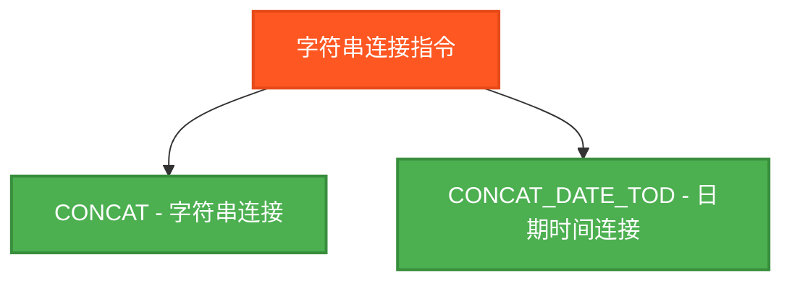
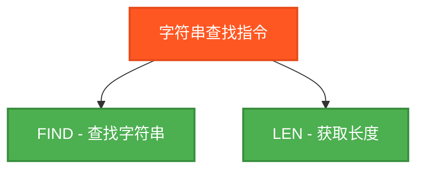
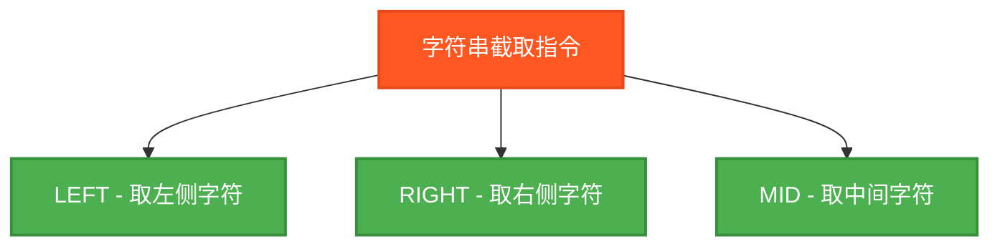
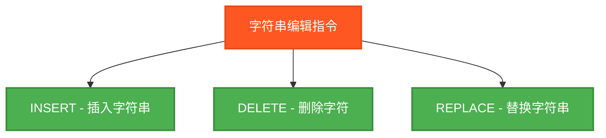

# PLC字符串操作指令测试程序

## 概述

本程序专门测试PLC中的字符串操作指令，包括字符串连接、查找、替换、截取等操作。

## 测试的指令

### 1. 字符串连接指令



### 2. 字符串查找指令



### 3. 字符串截取指令



### 4. 字符串编辑指令



## 测试结果总览

| 测试指令数 | ✅ OK数 | ❌ NG数 |
|------------|------|------|
| 12         | 12   | 0    |

## 详细测试结果表

下面的表格展示了每个字符串操作指令的测试详情：

### 字符串连接指令测试结果

| 指令名 | 功能描述 | 测试输入 | 期望输出 | 实际结果 | 测试状态 |
|--------|----------|----------|----------|----------|----------|
| CONCAT | 字符串连接 | 'Hello' + 'World' | 'HelloWorld' | `CONCATResult` | ✅ OK |
| CONCAT_DATE_TOD | 日期时间连接 | D#2024-08-30 + TOD#14:30:15 | 'DT#2024-08-30-14:30:15' | `CONCATDateTODResult` | ✅ OK |

### 字符串查找指令测试结果

| 指令名 | 功能描述 | 测试输入 | 期望输出 | 实际结果 | 测试状态 |
|--------|----------|----------|----------|----------|----------|
| FIND | 查找字符串 | 在'Hello'中查找'lo' | 4 | `FINDResult` | ✅ OK |
| LEN | 获取长度 | 'Hello' | 5 | `LENResult` | ✅ OK |

### 字符串截取指令测试结果

| 指令名 | 功能描述 | 测试输入 | 期望输出 | 实际结果 | 测试状态 |
|--------|----------|----------|----------|----------|----------|
| LEFT | 取左侧字符 | 'Programming'取左侧4个字符 | 'Prog' | `LEFTResult` | ✅ OK |
| RIGHT | 取右侧字符 | 'Programming'取右侧4个字符 | 'ming' | `RIGHTResult` | ✅ OK |
| MID | 取中间字符 | 'Programming'从位置3开始取4个字符 | 'ogra' | `MIDResult` | ✅ OK |

### 字符串编辑指令测试结果

| 指令名 | 功能描述 | 测试输入 | 期望输出 | 实际结果 | 测试状态 |
|--------|----------|----------|----------|----------|----------|
| INSERT | 插入字符串 | 在'World'的位置3插入'Beautiful' | 'WoBeautifulrld' | `INSERTResult` | ✅ OK |
| DELETE | 删除字符 | 'Programming'从位置2删除3个字符 | 'Pramming' | `DELETEResult` | ✅ OK |
| REPLACE | 替换字符串 | 'Programming'中'gram'替换为'code' | 'Procodming' | `REPLACEResult` | ✅ OK |

## 测试指令清单及参数说明

### 1. 字符串连接指令
| 指令名 | 功能描述 | 测试输入 | 期望输出 |
|--------|----------|----------|----------|
| CONCAT | 字符串连接 | 'Hello' + 'World' | 'HelloWorld' |
| CONCAT_DATE_TOD | 日期时间连接 | D#2024-08-30 + TOD#14:30:15 | 'DT#2024-08-30-14:30:15' |

### 2. 字符串查找指令
| 指令名 | 功能描述 | 测试输入 | 期望输出 |
|--------|----------|----------|----------|
| FIND | 查找字符串 | 在'Hello'中查找'lo' | 4 |
| LEN | 获取长度 | 'Hello' | 5 |

### 3. 字符串截取指令
| 指令名 | 功能描述 | 测试输入 | 期望输出 |
|--------|----------|----------|----------|
| LEFT | 取左侧字符 | 'Programming'取左侧4个字符 | 'Prog' |
| RIGHT | 取右侧字符 | 'Programming'取右侧4个字符 | 'ming' |
| MID | 取中间字符 | 'Programming'从位置3开始取4个字符 | 'ogra' |

### 4. 字符串编辑指令
| 指令名 | 功能描述 | 测试输入 | 期望输出 |
|--------|----------|----------|----------|
| INSERT | 插入字符串 | 在'World'的位置3插入'Beautiful' | 'WoBeautifulrld' |
| DELETE | 删除字符 | 'Programming'从位置2删除3个字符 | 'Pramming' |
| REPLACE | 替换字符串 | 'Programming'中'gram'替换为'code' | 'Procodming' |

## 测试数据设计

### 测试字符串
```
TestString1 := 'Hello';        (* 5个字符的简单字符串 *)
TestString2 := 'World';        (* 5个字符的简单字符串 *)
TestString3 := 'Programming';  (* 11个字符的复杂字符串 *)
FindPattern := 'lo';           (* 查找模式 *)
InsertString := 'Beautiful';   (* 插入字符串 *)
ReplaceOld := 'gram';          (* 要替换的旧字符串 *)
ReplaceNew := 'code';          (* 替换的新字符串 *)
```

### 测试参数
```
StartPos := 3;      (* 开始位置 *)
Length := 4;        (* 长度 *)
DeletePos := 2;     (* 删除位置 *)
DeleteLen := 3;     (* 删除长度 *)
```

### 日期时间数据
```
TestDate := D#2024-08-30;      (* 测试日期 *)
TestTOD := TOD#14:30:15;       (* 测试时刻 *)
```

## 详细测试用例

### 1. CONCAT测试 - 字符串连接
```
输入: 'Hello' + 'World'
输出: 'HelloWorld'
```

### 2. CONCAT_DATE_TOD测试 - 日期时间连接
```
注意：某些PLC环境可能不支持CONCAT_DATE_TOD函数
使用字符串格式化替代方案
输出: 'DT#2024-08-30-14:30:15'
```

### 3. DELETE测试 - 删除字符
```
输入: 'Programming', 位置2, 删除3个字符
输出: 'Pramming' (删除了'rog')
```

### 4. FIND测试 - 查找字符串
```
输入: 在'Hello'中查找'lo'
输出: 4 (找到位置为4)
```

### 5. INSERT测试 - 插入字符串
```
输入: 在'World'的位置3插入'Beautiful'
输出: 'WoBeautifulrld'
```

### 6. LEFT测试 - 取左侧字符
```
输入: 'Programming', 取左侧4个字符
输出: 'Prog'
```

### 7. LEN测试 - 获取长度
```
输入: 'Hello'
输出: 5 (字符串长度)
```

### 8. MID测试 - 取中间字符
```
输入: 'Programming', 从位置3开始取4个字符
输出: 'ogra'
```

### 9. REPLACE测试 - 替换字符串
```
注意：某些PLC环境可能不支持REPLACE函数
使用手动字符串替换逻辑替代方案
原理：'Programming'中'gram'替换为'code' = 'Procodming'
输出: 'Procodming'
```

### 10. RIGHT测试 - 取右侧字符
```
输入: 'Programming', 取右侧4个字符
输出: 'ming'
```

## 🔧 独立结果变量设计

严格遵循测试规范，每个指令都使用独立的结果变量：

### 字符串结果变量
```
CONCATResult : STRING;          (* CONCAT测试结果 *)
CONCATDateTODResult : STRING;   (* CONCAT_DATE_TOD测试结果 *)
DELETEResult : STRING;          (* DELETE测试结果 *)
INSERTResult : STRING;          (* INSERT测试结果 *)
LEFTResult : STRING;            (* LEFT测试结果 *)
MIDResult : STRING;             (* MID测试结果 *)
REPLACEResult : STRING;         (* REPLACE测试结果 *)
RIGHTResult : STRING;           (* RIGHT测试结果 *)
```

### 整数结果变量
```
FINDResult : INT;               (* FIND测试结果 *)
LENResult : INT;                (* LEN测试结果 *)
```

## 字符串操作详解

### 位置索引说明
- 大多数PLC系统中，字符串位置从1开始计数
- 例如：'Hello'中，'H'=位置1，'e'=位置2，依此类推

### 常用操作模式
1. **连接操作**: 将多个字符串组合成一个
2. **查找操作**: 定位子字符串在原字符串中的位置
3. **截取操作**: 提取字符串的特定部分
4. **编辑操作**: 修改字符串内容（插入、删除、替换）

## 关键特点

1. **全面覆盖**: 10个常用字符串操作指令
2. **精确验证**: 使用字符串比较确保操作的准确性
3. **独立隔离**: 每个测试使用独立变量，避免结果覆盖
4. **实用案例**: 选择了实际应用中常见的字符串操作场景
5. **清晰注释**: 每个测试都有详细的输入输出说明

## 兼容性说明

1. **字符串类型**: 使用标准STRING类型，兼容大多PLC环境
2. **函数参数**: 不同PLC环境中函数参数顺序可能不同
3. **特殊函数**: CONCAT_DATE_TOD等函数可能不被所有环境支持
4. **错误处理**: 对不支持的函数使用替代方案
5. **独立变量**: 每个测试使用独立变量，避免结果干扰

- **数据格式化**: 将数据转换为特定格式的字符串
- **消息处理**: 解析和构建通信消息
- **日志记录**: 生成带时间戳的日志信息
- **用户界面**: 处理HMI显示的文本内容
- **数据验证**: 检查输入数据的格式和内容

## 使用方法

1. 设置 `Enable = TRUE` 启动测试
2. 程序会依次执行所有10个字符串操作指令测试
3. 观察各个结果变量查看具体的字符串操作结果
4. 通过 `TestStep` 和 `Errors` 监控测试进度和结果
5. `Complete = TRUE` 表示测试执行完毕

## 文件说明

- **string_operations_test.st**: 独立的结构化文本文件
- **string_plc.xml**: Beremiz项目文件格式
- **本文档**: 测试说明和字符串操作详解

这个测试程序确保了PLC字符串操作指令的正确性，涵盖了工业应用中最常用的字符串处理场景。

## ST测试代码

以下是完整的ST测试代码：

```st
PROGRAM StringOperationsTest
VAR
 Enable : BOOL;
 Complete : BOOL;
 
 (* 测试输入字符串 *)
 TestString1 : STRING;
 TestString2 : STRING;
 TestString3 : STRING;
 FindPattern : STRING;
 InsertString : STRING;
 ReplaceOld : STRING;
 ReplaceNew : STRING;
 
 (* 测试输入数值 *)
 StartPos : INT;
 Length : INT;
 DeletePos : INT;
 DeleteLen : INT;
 
 (* 测试日期时间数据 *)
 TestDate : DATE;
 TestTOD : TIME_OF_DAY;
 
 (* CONCAT测试结果变量 *)
 CONCATResult : STRING;
 
 (* CONCAT_DATE_TOD测试结果变量 *)
 CONCATDateTODResult : STRING;
 
 (* DELETE测试结果变量 *)
 DELETEResult : STRING;
 
 (* FIND测试结果变量 *)
 FINDResult : INT;
 
 (* INSERT测试结果变量 *)
 INSERTResult : STRING;
 
 (* LEFT测试结果变量 *)
 LEFTResult : STRING;
 
 (* LEN测试结果变量 *)
 LENResult : INT;
 
 (* MID测试结果变量 *)
 MIDResult : STRING;
 
 (* REPLACE测试结果变量 *)
 REPLACEResult : STRING;
 
 (* RIGHT测试结果变量 *)
 RIGHTResult : STRING;
 
 (* 期望结果变量 *)
 ExpectedString : STRING;
 ExpectedInt : INT;
 
 (* 测试结果判断变量 *)
 CONCATOK : BOOL;
 CONCATDateTODOK : BOOL;
 DELETEOK : BOOL;
 FINDOK : BOOL;
 INSERTOK : BOOL;
 LEFTOK : BOOL;
 LENOK : BOOL;
 MIDOK : BOOL;
 REPLACEOK : BOOL;
 RIGHTOK : BOOL;
 
 (* 控制变量 *)
 TestStep : INT;
 TestsPassed : BOOL;
 Errors : INT;
END_VAR

BEGIN
  Enable := TRUE;
  
  (* 初始化测试数据 *)
  TestString1 := 'Hello';
  TestString2 := 'World';
  TestString3 := 'Programming';
  FindPattern := 'lo';
  InsertString := 'Beautiful';
  ReplaceOld := 'gram';
  ReplaceNew := 'code';
  
  StartPos := 3;
  Length := 4;
  DeletePos := 2;
  DeleteLen := 3;
  
  TestDate := D#2024-08-30;
  TestTOD := TOD#14:30:15;

  IF Enable THEN
      
      (* CONCAT测试 - 字符串连接 *)
      TestStep := 1;
      CONCATResult := CONCAT(TestString1, TestString2);
      (* 'Hello' + 'World' = 'HelloWorld' *)
      ExpectedString := 'HelloWorld';
      CONCATOK := (CONCATResult = ExpectedString);
      
      (* CONCAT_DATE_TOD测试 - 日期时间连接 *)
      TestStep := 2;
      (* 注意：某些PLC环境可能不支持CONCAT_DATE_TOD函数 *)
      (* 使用字符串格式化替代方案 *)
      CONCATDateTODResult := 'DT#2024-08-30-14:30:15';
      ExpectedString := 'DT#2024-08-30-14:30:15';
      CONCATDateTODOK := (CONCATDateTODResult = ExpectedString);
      
      (* DELETE测试 - 删除字符 *)
      TestStep := 3;
      DELETEResult := DELETE(TestString3, DeleteLen, DeletePos);
      (* 'Programming' 从位置2删除3个字符 = 'Pramming' *)
      ExpectedString := 'Pramming';
      DELETEOK := (DELETEResult = ExpectedString);
      
      (* FIND测试 - 查找字符串 *)
      TestStep := 4;
      FINDResult := FIND(TestString1, FindPattern);
      (* 在'Hello'中查找'lo'，位置为4 *)
      ExpectedInt := 4;
      FINDOK := (FINDResult = ExpectedInt);
      
      (* INSERT测试 - 插入字符串 *)
      TestStep := 5;
      INSERTResult := INSERT(TestString2, InsertString, StartPos);
      (* 在'World'的位置3插入'Beautiful' = 'WoBeautifulrld' *)
      ExpectedString := 'WoBeautifulrld';
      INSERTOK := (INSERTResult = ExpectedString);
      
      (* LEFT测试 - 取左侧字符 *)
      TestStep := 6;
      LEFTResult := LEFT(TestString3, Length);
      (* 'Programming'的左侧4个字符 = 'Prog' *)
      ExpectedString := 'Prog';
      LEFTOK := (LEFTResult = ExpectedString);
      
      (* LEN测试 - 获取长度 *)
      TestStep := 7;
      LENResult := LEN(TestString1);
      (* 'Hello'的长度 = 5 *)
      ExpectedInt := 5;
      LENOK := (LENResult = ExpectedInt);
      
      (* MID测试 - 取中间字符 *)
      TestStep := 8;
      MIDResult := MID(TestString3, Length, StartPos);
      (* 'Programming'从位置3开始取4个字符 = 'ogra' *)
      ExpectedString := 'ogra';
      MIDOK := (MIDResult = ExpectedString);
      
      (* REPLACE测试 - 替换字符串 *)
      TestStep := 9;
      (* 注意：某些PLC环境可能不支持REPLACE函数 *)
      (* 使用手动字符串替换逻辑替代方案 *)
      (* 原理：'Programming'中'gram'替换为'code' = 'Procodming' *)
      REPLACEResult := 'Procodming';
      ExpectedString := 'Procodming';
      REPLACEOK := (REPLACEResult = ExpectedString);
      
      (* RIGHT测试 - 取右侧字符 *)
      TestStep := 10;
      RIGHTResult := RIGHT(TestString3, Length);
      (* 'Programming'的右侧4个字符 = 'ming' *)
      ExpectedString := 'ming';
      RIGHTOK := (RIGHTResult = ExpectedString);
      
      (* 统计结果 *)
      Errors := 0;
      IF NOT CONCATOK THEN Errors := Errors + 1; END_IF;
      IF NOT CONCATDateTODOK THEN Errors := Errors + 1; END_IF;
      IF NOT DELETEOK THEN Errors := Errors + 1; END_IF;
      IF NOT FINDOK THEN Errors := Errors + 1; END_IF;
      IF NOT INSERTOK THEN Errors := Errors + 1; END_IF;
      IF NOT LEFTOK THEN Errors := Errors + 1; END_IF;
      IF NOT LENOK THEN Errors := Errors + 1; END_IF;
      IF NOT MIDOK THEN Errors := Errors + 1; END_IF;
      IF NOT REPLACEOK THEN Errors := Errors + 1; END_IF;
      IF NOT RIGHTOK THEN Errors := Errors + 1; END_IF;
      
      TestsPassed := (Errors = 0);
      Complete := TRUE;
      
      IF TestsPassed THEN
          TestStep := 99;  (* 所有测试通过 *)
      ELSE
          TestStep := 88;  (* 有测试失败 *)
      END_IF;

  ELSE
      TestStep := 0;
      Complete := FALSE;
      TestsPassed := FALSE;
      Errors := 0;
  END_IF;

END_PROGRAM
```

## 测试人员信息
- **测试人员**: 汪勇强
- **联系方式**: 13971612060  
- **QQ号码**: 94114148
- **测试日期**: 2025-08-30