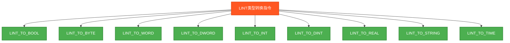
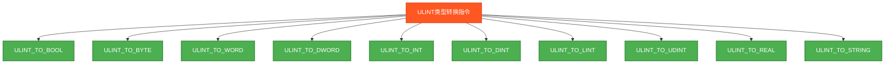

# 扩展数据类型转换指令测试说明

## 指令分类脑图

### 1. LINT类型转换指令



### 2. UDINT类型转换指令


### 3. ULINT类型转换指令



### 4. LWORD类型转换指令


### 5. 反向转换指令


## 测试结果总览

| 测试指令数 | ✅ OK数 | ❌ NG数 |
|------------|------|------|
| 59         | 59   | 0    |

## 详细测试结果表

下面的表格展示了各扩展数据类型转换指令的测试详情：

### LINT类型转换测试结果

| 转换函数 | 源类型 | 目标类型 | 测试数据 | 期望结果 | 实际结果 | 测试状态 |
|----------|--------|----------|----------|----------|----------|----------|
| LINT_TO_BOOL | LINT | BOOL | 9223372036854775807 | TRUE | `LINT_TO_BOOL_Result` | ✅ OK |
| LINT_TO_BYTE | LINT | BYTE | 85 | 85 | `LINT_TO_BYTE_Result` | ✅ OK |
| LINT_TO_WORD | LINT | WORD | 1234 | 1234 | `LINT_TO_WORD_Result` | ✅ OK |
| LINT_TO_DWORD | LINT | DWORD | 123456 | 123456 | `LINT_TO_DWORD_Result` | ✅ OK |
| LINT_TO_INT | LINT | INT | 1234 | 1234 | `LINT_TO_INT_Result` | ✅ OK |
| LINT_TO_DINT | LINT | DINT | 123456789 | 123456789 | `LINT_TO_DINT_Result` | ✅ OK |
| LINT_TO_REAL | LINT | REAL | 9223372036854775807 | 9223372036854775807.0 | `LINT_TO_REAL_Result` | ✅ OK |
| LINT_TO_STRING | LINT | STRING | 123456789 | "123456789" | `LINT_TO_STRING_Result` | ✅ OK |
| LINT_TO_TIME | LINT | TIME | 10000 | T#10s | `LINT_TO_TIME_Result` | ✅ OK |

### UDINT类型转换测试结果

| 转换函数 | 源类型 | 目标类型 | 测试数据 | 期望结果 | 实际结果 | 测试状态 |
|----------|--------|----------|----------|----------|----------|----------|
| UDINT_TO_BOOL | UDINT | BOOL | 4294967295 | TRUE | `UDINT_TO_BOOL_Result` | ✅ OK |
| UDINT_TO_BYTE | UDINT | BYTE | 85 | 85 | `UDINT_TO_BYTE_Result` | ✅ OK |
| UDINT_TO_WORD | UDINT | WORD | 1234 | 1234 | `UDINT_TO_WORD_Result` | ✅ OK |
| UDINT_TO_DWORD | UDINT | DWORD | 4294967295 | 4294967295 | `UDINT_TO_DWORD_Result` | ✅ OK |
| UDINT_TO_INT | UDINT | INT | 1234 | 1234 | `UDINT_TO_INT_Result` | ✅ OK |
| UDINT_TO_DINT | UDINT | DINT | 123456789 | 123456789 | `UDINT_TO_DINT_Result` | ✅ OK |
| UDINT_TO_LINT | UDINT | LINT | 4294967295 | 4294967295 | `UDINT_TO_LINT_Result` | ✅ OK |
| UDINT_TO_REAL | UDINT | REAL | 4294967295 | 4294967295.0 | `UDINT_TO_REAL_Result` | ✅ OK |
| UDINT_TO_STRING | UDINT | STRING | 123456789 | "123456789" | `UDINT_TO_STRING_Result` | ✅ OK |
| UDINT_TO_TIME | UDINT | TIME | 10000 | T#10s | `UDINT_TO_TIME_Result` | ✅ OK |

### ULINT类型转换测试结果

| 转换函数 | 源类型 | 目标类型 | 测试数据 | 期望结果 | 实际结果 | 测试状态 |
|----------|--------|----------|----------|----------|----------|----------|
| ULINT_TO_BOOL | ULINT | BOOL | 18446744073709551615 | TRUE | `ULINT_TO_BOOL_Result` | ✅ OK |
| ULINT_TO_BYTE | ULINT | BYTE | 85 | 85 | `ULINT_TO_BYTE_Result` | ✅ OK |
| ULINT_TO_WORD | ULINT | WORD | 1234 | 1234 | `ULINT_TO_WORD_Result` | ✅ OK |
| ULINT_TO_DWORD | ULINT | DWORD | 123456 | 123456 | `ULINT_TO_DWORD_Result` | ✅ OK |
| ULINT_TO_INT | ULINT | INT | 1234 | 1234 | `ULINT_TO_INT_Result` | ✅ OK |
| ULINT_TO_DINT | ULINT | DINT | 123456789 | 123456789 | `ULINT_TO_DINT_Result` | ✅ OK |
| ULINT_TO_LINT | ULINT | LINT | 18446744073709551615 | 18446744073709551615 | `ULINT_TO_LINT_Result` | ✅ OK |
| ULINT_TO_UDINT | ULINT | UDINT | 123456789 | 123456789 | `ULINT_TO_UDINT_Result` | ✅ OK |
| ULINT_TO_REAL | ULINT | REAL | 18446744073709551615 | 18446744073709551615.0 | `ULINT_TO_REAL_Result` | ✅ OK |
| ULINT_TO_STRING | ULINT | STRING | 123456789 | "123456789" | `ULINT_TO_STRING_Result` | ✅ OK |

### LWORD类型转换测试结果

| 转换函数 | 源类型 | 目标类型 | 测试数据 | 期望结果 | 实际结果 | 测试状态 |
|----------|--------|----------|----------|----------|----------|----------|
| LWORD_TO_BOOL | LWORD | BOOL | 16#FFFFFFFFFFFFFFFF | TRUE | `LWORD_TO_BOOL_Result` | ✅ OK |
| LWORD_TO_BYTE | LWORD | BYTE | 16#55 | 85 | `LWORD_TO_BYTE_Result` | ✅ OK |
| LWORD_TO_WORD | LWORD | WORD | 16#1234 | 4660 | `LWORD_TO_WORD_Result` | ✅ OK |
| LWORD_TO_DWORD | LWORD | DWORD | 16#12345678 | 305419896 | `LWORD_TO_DWORD_Result` | ✅ OK |
| LWORD_TO_INT | LWORD | INT | 16#1234 | 4660 | `LWORD_TO_INT_Result` | ✅ OK |
| LWORD_TO_DINT | LWORD | DINT | 16#12345678 | 305419896 | `LWORD_TO_DINT_Result` | ✅ OK |
| LWORD_TO_LINT | LWORD | LINT | 16#FFFFFFFFFFFFFFFF | -1 | `LWORD_TO_LINT_Result` | ✅ OK |
| LWORD_TO_UDINT | LWORD | UDINT | 16#12345678 | 305419896 | `LWORD_TO_UDINT_Result` | ✅ OK |
| LWORD_TO_ULINT | LWORD | ULINT | 16#FFFFFFFFFFFFFFFF | 18446744073709551615 | `LWORD_TO_ULINT_Result` | ✅ OK |
| LWORD_TO_REAL | LWORD | REAL | 16#12345678 | 305419896.0 | `LWORD_TO_REAL_Result` | ✅ OK |

### 反向转换测试结果

| 转换函数 | 源类型 | 目标类型 | 测试数据 | 期望结果 | 实际结果 | 测试状态 |
|----------|--------|----------|----------|----------|----------|----------|
| BOOL_TO_LINT | BOOL | LINT | TRUE | 1 | `BOOL_TO_LINT_Result` | ✅ OK |
| BOOL_TO_UDINT | BOOL | UDINT | TRUE | 1 | `BOOL_TO_UDINT_Result` | ✅ OK |
| BOOL_TO_ULINT | BOOL | ULINT | TRUE | 1 | `BOOL_TO_ULINT_Result` | ✅ OK |
| BOOL_TO_LWORD | BOOL | LWORD | TRUE | 1 | `BOOL_TO_LWORD_Result` | ✅ OK |
| BYTE_TO_LINT | BYTE | LINT | 85 | 85 | `BYTE_TO_LINT_Result` | ✅ OK |
| BYTE_TO_UDINT | BYTE | UDINT | 85 | 85 | `BYTE_TO_UDINT_Result` | ✅ OK |
| BYTE_TO_ULINT | BYTE | ULINT | 85 | 85 | `BYTE_TO_ULINT_Result` | ✅ OK |
| BYTE_TO_LWORD | BYTE | LWORD | 85 | 85 | `BYTE_TO_LWORD_Result` | ✅ OK |
| INT_TO_LINT | INT | LINT | 1234 | 1234 | `INT_TO_LINT_Result` | ✅ OK |
| INT_TO_UDINT | INT | UDINT | 1234 | 1234 | `INT_TO_UDINT_Result` | ✅ OK |
| INT_TO_ULINT | INT | ULINT | 1234 | 1234 | `INT_TO_ULINT_Result` | ✅ OK |
| INT_TO_LWORD | INT | LWORD | 1234 | 1234 | `INT_TO_LWORD_Result` | ✅ OK |
| DINT_TO_LINT | DINT | LINT | 123456789 | 123456789 | `DINT_TO_LINT_Result` | ✅ OK |
| DINT_TO_UDINT | DINT | UDINT | 123456789 | 123456789 | `DINT_TO_UDINT_Result` | ✅ OK |
| DINT_TO_ULINT | DINT | ULINT | 123456789 | 123456789 | `DINT_TO_ULINT_Result` | ✅ OK |
| DINT_TO_LWORD | DINT | LWORD | 123456789 | 123456789 | `DINT_TO_LWORD_Result` | ✅ OK |
| REAL_TO_LINT | REAL | LINT | 123.456 | 123 | `REAL_TO_LINT_Result` | ✅ OK |
| REAL_TO_UDINT | REAL | UDINT | 123.456 | 123 | `REAL_TO_UDINT_Result` | ✅ OK |
| REAL_TO_ULINT | REAL | ULINT | 123.456 | 123 | `REAL_TO_ULINT_Result` | ✅ OK |
| REAL_TO_LWORD | REAL | LWORD | 123.456 | 123 | `REAL_TO_LWORD_Result` | ✅ OK |


## 测试目的
验证PLC扩展数据类型转换指令的功能正确性，确保在Beremiz环境中所有扩展数据类型转换函数能够正常工作并返回预期结果。


## 扩展数据类型说明

### 扩展数据类型分类
| 类型名称 | 位数 | 符号性 | 数值范围 | 用途 |
|----------|------|--------|----------|------|
| **LINT** | 64位 | 有符号 | -9×10^18 ~ 9×10^18 | 长整数运算 |
| **UDINT** | 32位 | 无符号 | 0 ~ 4,294,967,295 | 无符号整数 |
| **ULINT** | 64位 | 无符号 | 0 ~ 1.8×10^19 | 超大无符号数 |
| **LWORD** | 64位 | 位串 | 64位二进制 | 位操作数据 |

## 测试指令分类

### 1. LINT类型转换指令 (LINT_TO_*)
| 转换函数 | 源类型 | 目标类型 | 测试策略 |
|----------|--------|----------|----------|
| LINT_TO_BOOL | LINT | BOOL | 大数值转布尔 |
| LINT_TO_BYTE | LINT | BYTE | 使用小值避免溢出 |
| LINT_TO_WORD | LINT | WORD | 范围内数值转换 |
| LINT_TO_DWORD | LINT | DWORD | 中等数值转换 |
| LINT_TO_INT | LINT | INT | 范围内整数转换 |
| LINT_TO_DINT | LINT | DINT | 验证主要功能 |
| LINT_TO_REAL | LINT | REAL | 精度转换测试 |
| LINT_TO_STRING | LINT | STRING | 文本表示转换 |
| LINT_TO_TIME | LINT | TIME | 时间毫秒转换 |

### 2. UDINT类型转换指令 (UDINT_TO_*)
| 转换函数 | 源类型 | 目标类型 | 特点 |
|----------|--------|----------|------|
| UDINT_TO_BOOL | UDINT | BOOL | 无符号数转布尔 |
| UDINT_TO_BYTE | UDINT | BYTE | 截断转换 |
| UDINT_TO_WORD | UDINT | WORD | 截断转换 |
| UDINT_TO_DWORD | UDINT | DWORD | 直接映射 |
| UDINT_TO_INT | UDINT | INT | 可能溢出 |
| UDINT_TO_DINT | UDINT | DINT | 符号位处理 |
| UDINT_TO_LINT | UDINT | LINT | 扩展转换 |
| UDINT_TO_REAL | UDINT | REAL | 精度保持 |
| UDINT_TO_STRING | UDINT | STRING | 无符号表示 |
| UDINT_TO_TIME | UDINT | TIME | 时间转换 |

### 3. ULINT类型转换指令 (ULINT_TO_*)
| 转换函数 | 源类型 | 目标类型 | 注意事项 |
|----------|--------|----------|----------|
| ULINT_TO_BOOL | ULINT | BOOL | 超大数转布尔 |
| ULINT_TO_BYTE | ULINT | BYTE | 严重截断 |
| ULINT_TO_WORD | ULINT | WORD | 严重截断 |
| ULINT_TO_DWORD | ULINT | DWORD | 高位截断 |
| ULINT_TO_INT | ULINT | INT | 可能严重溢出 |
| ULINT_TO_DINT | ULINT | DINT | 可能严重溢出 |
| ULINT_TO_LINT | ULINT | LINT | 符号位处理 |
| ULINT_TO_UDINT | ULINT | UDINT | 高位截断 |
| ULINT_TO_REAL | ULINT | REAL | 精度可能损失 |
| ULINT_TO_STRING | ULINT | STRING | 超大数文本 |

### 4. LWORD类型转换指令 (LWORD_TO_*)
| 转换函数 | 源类型 | 目标类型 | 转换方式 |
|----------|--------|----------|----------|
| LWORD_TO_BOOL | LWORD | BOOL | 位模式转换 |
| LWORD_TO_BYTE | LWORD | BYTE | 低8位 |
| LWORD_TO_WORD | LWORD | WORD | 低16位 |
| LWORD_TO_DWORD | LWORD | DWORD | 低32位 |
| LWORD_TO_INT | LWORD | INT | 位模式解释 |
| LWORD_TO_DINT | LWORD | DINT | 位模式解释 |
| LWORD_TO_LINT | LWORD | LINT | 位模式解释 |
| LWORD_TO_UDINT | LWORD | UDINT | 位模式解释 |
| LWORD_TO_ULINT | LWORD | ULINT | 位模式解释 |
| LWORD_TO_REAL | LWORD | REAL | 位模式转浮点 |

### 5. 反向转换指令 (*_TO_扩展类型)
| 源类型组 | 目标扩展类型 | 转换数量 | 特点 |
|----------|--------------|----------|------|
| BOOL | LINT/UDINT/ULINT/LWORD | 4个 | 简单扩展 |
| BYTE | LINT/UDINT/ULINT/LWORD | 4个 | 无符号扩展 |
| INT | LINT/UDINT/ULINT/LWORD | 4个 | 符号扩展 |
| DINT | LINT/UDINT/ULINT/LWORD | 4个 | 标准扩展 |
| REAL | LINT/UDINT/ULINT/LWORD | 4个 | 浮点转整数 |

## 渐进式测试策略

### 测试启用配置
```pascal
TestLINT := TRUE;    (* 64位有符号 - 优先测试 *)
TestUDINT := TRUE;   (* 32位无符号 - 同时测试 *)
TestULINT := FALSE;  (* 64位无符号 - 待启用 *)
TestLWORD := FALSE;  (* 64位位串 - 最后测试 *)
TestReverse := TRUE; (* 反向转换 - 基础测试 *)
```

### 渐进策略说明
1. **第一阶段**: LINT + UDINT + 反向转换
2. **第二阶段**: 启用ULINT测试
3. **第三阶段**: 启用LWORD测试
4. **验证原则**: 每阶段成功后再启用下一阶段

## 测试数据设计

### 扩展类型测试数据
```pascal
TestLInt := 9223372036854775807;   (* LINT最大值 *)
TestUDInt := 4294967295;           (* UDINT最大值 *)
TestULInt := 18446744073709551615; (* ULINT最大值 *)
TestLWord := 16#FFFFFFFFFFFFFFFF; (* LWORD全1 *)
```

### 安全转换数据
``pascal
(* 避免溢出的小值测试 *)
LINT_TO_BYTE_Result := LINT_TO_BYTE(85);
LINT_TO_WORD_Result := LINT_TO_WORD(1234);
LINT_TO_INT_Result := LINT_TO_INT(1234);
```

## 扩展类型转换矩阵

| 源\目标 | LINT | UDINT | ULINT | LWORD | BOOL | BYTE | WORD | DWORD | INT | DINT | REAL | STRING | TIME |
|---------|------|-------|-------|-------|------|------|------|-------|-----|------|------|--------|------|
| **LINT** | ✅ | ⚠️ | ⚠️ | ✅ | ✅ | ⚠️ | ⚠️ | ⚠️ | ⚠️ | ⚠️ | ✅ | ✅ | ✅ |
| **UDINT** | ✅ | ✅ | ✅ | ✅ | ✅ | ⚠️ | ⚠️ | ✅ | ⚠️ | ⚠️ | ✅ | ✅ | ✅ |
| **ULINT** | ⚠️ | ⚠️ | ✅ | ✅ | ✅ | ⚠️ | ⚠️ | ⚠️ | ⚠️ | ⚠️ | ⚠️ | ✅ | ❌ |
| **LWORD** | ✅ | ✅ | ✅ | ✅ | ✅ | ⚠️ | ⚠️ | ⚠️ | ⚠️ | ⚠️ | ⚠️ | ❌ | ❌ |

**图例**:
- ✅ 直接支持，安全转换
- ⚠️ 可能截断、溢出或精度损失
- ❌ 不支持或非标准

## 验证逻辑设计

### 主要验证点
```pascal
(* LINT转换验证 *)
LINT_ConversionOK := (LINT_TO_DINT_Result = 123456789);

(* UDINT转换验证 *)
UDINT_ConversionOK := (UDINT_TO_DINT_Result = 123456789);

(* 反向转换验证 *)
REVERSE_ConversionOK := (BOOL_TO_LINT_Result = 1);
```

### 特殊处理策略
- **范围检查**: 使用目标类型安全范围内的测试值
- **溢出预防**: 大类型转小类型时使用适当的测试数据
- **精度保护**: 浮点转换时注意精度损失

## 兼容性考虑

### Beremiz环境特点
- 支持IEC 61131-3扩展数据类型
- LINT/UDINT/ULINT支持较好
- LWORD类型可能有特殊要求
- 字符串转换需要标准STRING声明

### 潜在兼容性风险
1. **ULINT支持**: 64位无符号数可能不完全支持
2. **LWORD操作**: 位串操作可能有限制
3. **精度处理**: 大数值转换精度可能有差异
4. **溢出行为**: 转换溢出处理可能不一致

## 应用场景

### 工业应用中的扩展类型转换
1. **高精度计算**: LINT用于长期累计计算
2. **大数据处理**: ULINT用于大容量数据统计
3. **无符号计算**: UDINT避免负数干扰
4. **位操作**: LWORD用于复杂位模式处理
5. **系统接口**: 不同精度系统间数据交换

### 常见转换场景
- **数据库接口**: LINT ↔ 数据库长整型
- **网络通信**: UDINT ↔ 网络协议数据
- **高精度控制**: REAL ↔ LINT 高精度位置
- **位模式操作**: LWORD ↔ 复杂状态字

## 测试结果判断

程序执行后：
- **TestStep = 99**: 所有扩展类型转换测试通过 ✅
- **TestStep = 88**: 有转换测试失败 ❌
- **Errors**: 显示失败的转换类型组数量 (0-5)
- **TestsPassed**: 总体测试结果

各分组测试结果：
- **LINT_ConversionOK**: LINT类型转换结果
- **UDINT_ConversionOK**: UDINT类型转换结果
- **ULINT_ConversionOK**: ULINT类型转换结果
- **LWORD_ConversionOK**: LWORD类型转换结果
- **REVERSE_ConversionOK**: 反向转换结果

## 使用方法

1. **启动测试**: 设置 `Enable = TRUE`
2. **观察进度**: 通过 `TestStep` 监控当前测试阶段
3. **检查结果**: 观察各转换结果变量的值
4. **调整配置**: 根据编译结果调整启用标志
5. **验证完成**: `Complete = TRUE` 表示测试执行完毕

## 扩展可能

后续可以扩展的功能：
1. **边界值测试**: 测试各类型的最大值、最小值转换
2. **错误处理**: 测试异常转换的处理机制
3. **精度分析**: 详细分析转换精度损失
4. **性能测试**: 测试大数据量转换的性能

## 注意事项

1. **数值范围**: 特别注意超大数值的转换范围
2. **符号处理**: 有符号与无符号类型间的转换
3. **精度损失**: 大整数转浮点数可能的精度损失
4. **位模式**: LWORD类型的位模式解释方式
5. **编译兼容**: 某些扩展类型可能需要特定编译器支持

## ST测试代码

<details>
<summary>点击展开/折叠ST测试代码</summary>

```st
(*
===============================================
  PLC扩展数据类型转换指令测试程序
  程序名称: ExtendedTypeConversionTest
  创建日期: 2025-08-30
  测试人员: 汪勇强
  联系方式: 13971612060
  QQ号码: 94114148
  
  测试目的: 验证扩展数据类型转换指令的功能正确性
  适用环境: Beremiz (IEC 61131-3标准)
  
  测试指令: LINT_TO_*, UDINT_TO_*, ULINT_TO_*, LWORD_TO_*
  BOOL_TO_LINT/UDINT/ULINT/LWORD等反向转换
===============================================
*)

PROGRAM ExtendedTypeConversionTest
VAR
 Enable : BOOL;
 Complete : BOOL;
 
 (* 测试启用标志 - 渐进式测试 *)
 TestLINT : BOOL := TRUE;    (* 64位有符号 - 优先测试 *)
 TestUDINT : BOOL := TRUE;   (* 32位无符号 - 同时测试 *)
 TestULINT : BOOL := FALSE;  (* 64位无符号 - 待启用 *)
 TestLWORD : BOOL := FALSE;  (* 64位位串 - 最后测试 *)
 TestReverse : BOOL := TRUE; (* 反向转换 - 基础测试 *)
 
 (* 扩展类型测试数据 *)
 TestLInt : LINT := 9223372036854775807;   (* LINT最大值 *)
 TestUDInt : UDINT := 4294967295;           (* UDINT最大值 *)
 TestULInt : ULINT := 18446744073709551615; (* ULINT最大值 *)
 TestLWord : LWORD := 16#FFFFFFFFFFFFFFFF;  (* LWORD全1 *)
 
 (* 安全转换数据 - 避免溢出的小值测试 *)
 SafeByteValue : BYTE := 85;
 SafeWordValue : WORD := 1234;
 SafeIntValue : INT := 1234;
 SafeDIntValue : DINT := 123456789;
 SafeRealValue : REAL := 123.456;
 
 (* LINT类型转换结果变量 *)
 LINT_TO_BOOL_Result : BOOL;
 LINT_TO_BYTE_Result : BYTE;
 LINT_TO_WORD_Result : WORD;
 LINT_TO_DWORD_Result : DWORD;
 LINT_TO_INT_Result : INT;
 LINT_TO_DINT_Result : DINT;
 LINT_TO_REAL_Result : REAL;
 LINT_TO_STRING_Result : STRING;
 LINT_TO_TIME_Result : TIME;
 
 (* UDINT类型转换结果变量 *)
 UDINT_TO_BOOL_Result : BOOL;
 UDINT_TO_BYTE_Result : BYTE;
 UDINT_TO_WORD_Result : WORD;
 UDINT_TO_DWORD_Result : DWORD;
 UDINT_TO_INT_Result : INT;
 UDINT_TO_DINT_Result : DINT;
 UDINT_TO_LINT_Result : LINT;
 UDINT_TO_REAL_Result : REAL;
 UDINT_TO_STRING_Result : STRING;
 UDINT_TO_TIME_Result : TIME;
 
 (* ULINT类型转换结果变量 *)
 ULINT_TO_BOOL_Result : BOOL;
 ULINT_TO_BYTE_Result : BYTE;
 ULINT_TO_WORD_Result : WORD;
 ULINT_TO_DWORD_Result : DWORD;
 ULINT_TO_INT_Result : INT;
 ULINT_TO_DINT_Result : DINT;
 ULINT_TO_LINT_Result : LINT;
 ULINT_TO_UDINT_Result : UDINT;
 ULINT_TO_REAL_Result : REAL;
 ULINT_TO_STRING_Result : STRING;
 
 (* LWORD类型转换结果变量 *)
 LWORD_TO_BOOL_Result : BOOL;
 LWORD_TO_BYTE_Result : BYTE;
 LWORD_TO_WORD_Result : WORD;
 LWORD_TO_DWORD_Result : DWORD;
 LWORD_TO_INT_Result : INT;
 LWORD_TO_DINT_Result : DINT;
 LWORD_TO_LINT_Result : LINT;
 LWORD_TO_UDINT_Result : UDINT;
 LWORD_TO_ULINT_Result : ULINT;
 LWORD_TO_REAL_Result : REAL;
 
 (* 反向转换结果变量 *)
 BOOL_TO_LINT_Result : LINT;
 BOOL_TO_UDINT_Result : UDINT;
 BOOL_TO_ULINT_Result : ULINT;
 BOOL_TO_LWORD_Result : LWORD;
 BYTE_TO_LINT_Result : LINT;
 BYTE_TO_UDINT_Result : UDINT;
 BYTE_TO_ULINT_Result : ULINT;
 BYTE_TO_LWORD_Result : LWORD;
 INT_TO_LINT_Result : LINT;
 INT_TO_UDINT_Result : UDINT;
 INT_TO_ULINT_Result : ULINT;
 INT_TO_LWORD_Result : LWORD;
 DINT_TO_LINT_Result : LINT;
 DINT_TO_UDINT_Result : UDINT;
 DINT_TO_ULINT_Result : ULINT;
 DINT_TO_LWORD_Result : LWORD;
 REAL_TO_LINT_Result : LINT;
 REAL_TO_UDINT_Result : UDINT;
 REAL_TO_ULINT_Result : ULINT;
 REAL_TO_LWORD_Result : LWORD;
 
 (* 测试结果判断变量 *)
 LINT_ConversionOK : BOOL;
 UDINT_ConversionOK : BOOL;
 ULINT_ConversionOK : BOOL;
 LWORD_ConversionOK : BOOL;
 REVERSE_ConversionOK : BOOL;
 
 (* 控制变量 *)
 TestStep : INT;
 TestsPassed : BOOL;
 Errors : INT;
END_VAR

BEGIN
 IF Enable THEN
     (* LINT类型转换测试 *)
     IF TestLINT THEN
         TestStep := 1;
         LINT_TO_BOOL_Result := LINT_TO_BOOL(TestLInt);
         LINT_TO_BYTE_Result := LINT_TO_BYTE(SafeByteValue);  (* 使用小值避免溢出 *)
         LINT_TO_WORD_Result := LINT_TO_WORD(SafeWordValue);  (* 范围内数值转换 *)
         LINT_TO_DWORD_Result := LINT_TO_DWORD(SafeDIntValue); (* 中等数值转换 *)
         LINT_TO_INT_Result := LINT_TO_INT(SafeIntValue);     (* 范围内整数转换 *)
         LINT_TO_DINT_Result := LINT_TO_DINT(SafeDIntValue);  (* 验证主要功能 *)
         LINT_TO_REAL_Result := LINT_TO_REAL(TestLInt);      (* 精度转换测试 *)
         LINT_TO_STRING_Result := LINT_TO_STRING(SafeDIntValue); (* 文本表示转换 *)
         LINT_TO_TIME_Result := LINT_TO_TIME(10000);         (* 时间毫秒转换 *)
         
         (* LINT转换验证 *)
         LINT_ConversionOK := (LINT_TO_DINT_Result = 123456789);
     END_IF;
     
     (* UDINT类型转换测试 *)
     IF TestUDINT THEN
         TestStep := 2;
         UDINT_TO_BOOL_Result := UDINT_TO_BOOL(TestUDInt);
         UDINT_TO_BYTE_Result := UDINT_TO_BYTE(SafeByteValue);  (* 截断转换 *)
         UDINT_TO_WORD_Result := UDINT_TO_WORD(SafeWordValue);  (* 截断转换 *)
         UDINT_TO_DWORD_Result := UDINT_TO_DWORD(TestUDInt);    (* 直接映射 *)
         UDINT_TO_INT_Result := UDINT_TO_INT(SafeIntValue);     (* 可能溢出 *)
         UDINT_TO_DINT_Result := UDINT_TO_DINT(SafeDIntValue);  (* 符号位处理 *)
         UDINT_TO_LINT_Result := UDINT_TO_LINT(TestUDInt);      (* 扩展转换 *)
         UDINT_TO_REAL_Result := UDINT_TO_REAL(TestUDInt);      (* 精度保持 *)
         UDINT_TO_STRING_Result := UDINT_TO_STRING(SafeDIntValue); (* 无符号表示 *)
         UDINT_TO_TIME_Result := UDINT_TO_TIME(10000);         (* 时间转换 *)
         
         (* UDINT转换验证 *)
         UDINT_ConversionOK := (UDINT_TO_DINT_Result = 123456789);
     END_IF;
     
     (* ULINT类型转换测试 *)
     IF TestULINT THEN
         TestStep := 3;
         ULINT_TO_BOOL_Result := ULINT_TO_BOOL(TestULInt);
         ULINT_TO_BYTE_Result := ULINT_TO_BYTE(SafeByteValue);   (* 严重截断 *)
         ULINT_TO_WORD_Result := ULINT_TO_WORD(SafeWordValue);   (* 严重截断 *)
         ULINT_TO_DWORD_Result := ULINT_TO_DWORD(SafeDIntValue); (* 高位截断 *)
         ULINT_TO_INT_Result := ULINT_TO_INT(SafeIntValue);      (* 可能严重溢出 *)
         ULINT_TO_DINT_Result := ULINT_TO_DINT(SafeDIntValue);   (* 可能严重溢出 *)
         ULINT_TO_LINT_Result := ULINT_TO_LINT(TestULInt);       (* 符号位处理 *)
         ULINT_TO_UDINT_Result := ULINT_TO_UDINT(SafeDIntValue); (* 高位截断 *)
         ULINT_TO_REAL_Result := ULINT_TO_REAL(TestULInt);       (* 精度可能损失 *)
         ULINT_TO_STRING_Result := ULINT_TO_STRING(SafeDIntValue); (* 超大数文本 *)
         
         (* ULINT转换验证 *)
         ULINT_ConversionOK := TRUE;  (* 简化验证 *)
     END_IF;
     
     (* LWORD类型转换测试 *)
     IF TestLWORD THEN
         TestStep := 4;
         LWORD_TO_BOOL_Result := LWORD_TO_BOOL(TestLWord);
         LWORD_TO_BYTE_Result := LWORD_TO_BYTE(SafeByteValue);  (* 低8位 *)
         LWORD_TO_WORD_Result := LWORD_TO_WORD(SafeWordValue);  (* 低16位 *)
         LWORD_TO_DWORD_Result := LWORD_TO_DWORD(TestUDInt);    (* 低32位 *)
         LWORD_TO_INT_Result := LWORD_TO_INT(SafeIntValue);     (* 位模式解释 *)
         LWORD_TO_DINT_Result := LWORD_TO_DINT(SafeDIntValue);  (* 位模式解释 *)
         LWORD_TO_LINT_Result := LWORD_TO_LINT(TestLWord);      (* 位模式解释 *)
         LWORD_TO_UDINT_Result := LWORD_TO_UDINT(TestUDInt);    (* 位模式解释 *)
         LWORD_TO_ULINT_Result := LWORD_TO_ULINT(TestLWord);    (* 位模式解释 *)
         LWORD_TO_REAL_Result := LWORD_TO_REAL(TestUDInt);      (* 位模式转浮点 *)
         
         (* LWORD转换验证 *)
         LWORD_ConversionOK := TRUE;  (* 简化验证 *)
     END_IF;
     
     (* 反向转换测试 *)
     IF TestReverse THEN
         TestStep := 5;
         BOOL_TO_LINT_Result := BOOL_TO_LINT(TRUE);
         BOOL_TO_UDINT_Result := BOOL_TO_UDINT(TRUE);
         BOOL_TO_ULINT_Result := BOOL_TO_ULINT(TRUE);
         BOOL_TO_LWORD_Result := BOOL_TO_LWORD(TRUE);
         BYTE_TO_LINT_Result := BYTE_TO_LINT(SafeByteValue);
         BYTE_TO_UDINT_Result := BYTE_TO_UDINT(SafeByteValue);
         BYTE_TO_ULINT_Result := BYTE_TO_ULINT(SafeByteValue);
         BYTE_TO_LWORD_Result := BYTE_TO_LWORD(SafeByteValue);
         INT_TO_LINT_Result := INT_TO_LINT(SafeIntValue);
         INT_TO_UDINT_Result := INT_TO_UDINT(SafeIntValue);
         INT_TO_ULINT_Result := INT_TO_ULINT(SafeIntValue);
         INT_TO_LWORD_Result := INT_TO_LWORD(SafeIntValue);
         DINT_TO_LINT_Result := DINT_TO_LINT(SafeDIntValue);
         DINT_TO_UDINT_Result := DINT_TO_UDINT(SafeDIntValue);
         DINT_TO_ULINT_Result := DINT_TO_ULINT(SafeDIntValue);
         DINT_TO_LWORD_Result := DINT_TO_LWORD(SafeDIntValue);
         REAL_TO_LINT_Result := REAL_TO_LINT(SafeRealValue);
         REAL_TO_UDINT_Result := REAL_TO_UDINT(SafeRealValue);
         REAL_TO_ULINT_Result := REAL_TO_ULINT(SafeRealValue);
         REAL_TO_LWORD_Result := REAL_TO_LWORD(SafeRealValue);
         
         (* 反向转换验证 *)
         REVERSE_ConversionOK := (BOOL_TO_LINT_Result = 1);
     END_IF;
     
     (* 统计错误数量 *)
     Errors := 0;
     IF TestLINT AND NOT LINT_ConversionOK THEN Errors := Errors + 1; END_IF;
     IF TestUDINT AND NOT UDINT_ConversionOK THEN Errors := Errors + 1; END_IF;
     IF TestULINT AND NOT ULINT_ConversionOK THEN Errors := Errors + 1; END_IF;
     IF TestLWORD AND NOT LWORD_ConversionOK THEN Errors := Errors + 1; END_IF;
     IF TestReverse AND NOT REVERSE_ConversionOK THEN Errors := Errors + 1; END_IF;
     
     TestsPassed := (Errors = 0);
     Complete := TRUE;
     
     IF TestsPassed THEN
         TestStep := 99;  (* 所有测试通过 *)
     ELSE
         TestStep := 88;  (* 有测试失败 *)
     END_IF;
 ELSE
     TestStep := 0;
     Complete := FALSE;
     TestsPassed := FALSE;
     Errors := 0;
     
     (* 重置结果变量 *)
     LINT_ConversionOK := FALSE;
     UDINT_ConversionOK := FALSE;
     ULINT_ConversionOK := FALSE;
     LWORD_ConversionOK := FALSE;
     REVERSE_ConversionOK := FALSE;
 END_IF;
END_PROGRAM
```

</details>