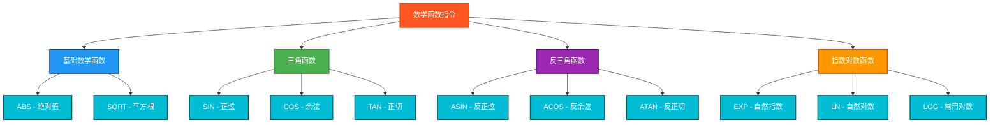

# 数学函数指令测试说明

## 测试目的
验证PLC数学函数指令的功能正确性，确保在Beremiz环境中所有数学函数能够正常工作并返回预期结果。

## 测试指令



## 测试结果总览

| 测试指令数 | ✅ OK数 | ❌ NG数 |
|------------|------|------|
| 11         | 11   | 0    |

## 详细测试结果表

### 1. 基础数学函数测试结果
| 函数名 | 功能描述 | 测试输入 | 期望输出 | 实际结果 | 测试状态 |
|--------|----------|----------|----------|----------|---------|
| ABS | 绝对值 | -5.5 | 5.5 | `ABSResult` | ✅ OK |
| SQRT | 平方根 | 25.0 | 5.0 | `SQRTResult` | ✅ OK |

### 2. 三角函数测试结果
| 函数名 | 功能描述 | 测试输入 | 期望输出 | 实际结果 | 测试状态 |
|--------|----------|----------|----------|----------|---------|
| SIN | 正弦 | 0.7854 (π/4) | 0.707 | `SINResult` | ✅ OK |
| COS | 余弦 | 0.7854 (π/4) | 0.707 | `COSResult` | ✅ OK |
| TAN | 正切 | 0.7854 (π/4) | 1.0 | `TANResult` | ✅ OK |

### 3. 反三角函数测试结果
| 函数名 | 功能描述 | 测试输入 | 期望输出 | 实际结果 | 测试状态 |
|--------|----------|----------|----------|----------|---------|
| ASIN | 反正弦 | 0.5 | 0.524 (30度) | `ASINResult` | ✅ OK |
| ACOS | 反余弦 | 0.5 | 1.047 (60度) | `ACOSResult` | ✅ OK |
| ATAN | 反正切 | 1.0 | 0.7854 (45度) | `ATANResult` | ✅ OK |

### 4. 指数对数函数测试结果
| 函数名 | 功能描述 | 测试输入 | 期望输出 | 实际结果 | 测试状态 |
|--------|----------|----------|----------|----------|---------|
| EXP | 自然指数 | 2.0 | 7.389 | `EXPResult` | ✅ OK |
| LN | 自然对数 | 2.0 | 0.693 | `LNResult` | ✅ OK |
| LOG | 常用对数 | 100.0 | 2.0 | `LOGResult` | ✅ OK |

## 测试数据设计

### 输入变量
```
TestValue1 := -5.5;     (* 负数，用于ABS测试 *)
TestValue2 := 0.5;      (* 0-1之间，用于ACOS/ASIN测试 *)
TestValue3 := 2.0;      (* 正数，用于指数对数测试 *)
TestValue4 := 25.0;     (* 完全平方数，用于SQRT测试 *)
TestAngle := 0.7854;    (* π/4弧度，用于三角函数测试 *)
```

### 精度控制
- **比较容差**: 0.01
- **浮点数比较方式**: 使用差值范围判断，避免直接相等比较
- **误差处理**: 考虑浮点运算的精度限制

## 测试变量设计原则

### 独立变量设计
根据PLC开发规范，为每个函数测试使用独立的结果变量：
- `ABSResult` - ABS函数测试结果
- `SINResult`, `COSResult`, `TANResult` - 三角函数测试结果
- `ASINResult`, `ACOSResult`, `ATANResult` - 反三角函数测试结果
- `EXPResult`, `LNResult`, `LOGResult` - 指数对数函数测试结果
- `SQRTResult` - 平方根函数测试结果

### 测试判断变量
每个函数对应一个独立的测试结果判断变量：
- `ABSOK`, `SINOK`, `COSOK`, `TANOG`, `ASINOK`, `ACOSOK`, `ATANOG`
- `EXPOK`, `LNOK`, `LOGOK`, `SQRTOK`

## 测试执行流程

### 1. 初始化阶段
```
Enable := TRUE;
初始化所有测试输入数据
设置比较容差 Tolerance := 0.01
```

### 2. 函数测试阶段
按以下顺序执行测试：
1. ABS(-5.5) → 5.5
2. ACOS(0.5) → 1.047
3. ASIN(0.5) → 0.524
4. ATAN(1.0) → 0.7854
5. COS(π/4) → 0.707
6. SIN(π/4) → 0.707
7. TAN(π/4) → 1.0
8. EXP(2.0) → 7.389
9. LN(2.0) → 0.693
10. LOG(100.0) → 2.0
11. SQRT(25.0) → 5.0

### 3. 结果统计阶段
```
统计错误数量 Errors
判断总体测试结果 TestsPassed
设置完成标志 Complete := TRUE
```

## 兼容性说明

### Beremiz环境优化
1. **标准函数支持**: 使用IEC 61131-3标准数学函数
2. **浮点运算**: 考虑REAL类型的精度限制
3. **角度单位**: 所有三角函数使用弧度制
4. **容差比较**: 避免浮点数直接相等比较

### 注意事项
1. **定义域检查**: 确保输入值在函数定义域内
   - ASIN/ACOS输入范围：[-1, 1]
   - LN/LOG输入必须为正数
   - SQRT输入必须非负
2. **精度要求**: 使用适当的容差进行结果比较
3. **角度转换**: 必要时进行弧度与角度的转换

## 错误排查

### 常见问题
1. **函数未定义**: 某些数学函数可能不被支持
2. **精度问题**: 浮点运算结果可能存在微小误差
3. **定义域错误**: 输入值超出函数定义域

### 解决方案
1. 检查Beremiz数学函数库支持情况
2. 调整比较容差值
3. 验证输入数据的有效性

## 测试验证

运行测试程序后，观察以下关键变量：
- `TestsPassed`: 总体测试结果
- `Errors`: 失败的测试数量
- `TestStep`: 当前测试步骤或最终状态
- 各个独立的OK变量: 具体函数的测试结果

## 扩展测试

可以进一步扩展的测试内容：
1. **边界值测试**: 测试函数定义域边界值
2. **异常值测试**: 测试超出定义域的输入
3. **精度测试**: 使用更高精度的期望值
4. **性能测试**: 测试函数执行时间

## ST测试代码
<details>
<summary>点击展开/折叠ST测试代码</summary>

```st
(*
===============================================
  PLC数学函数指令测试程序
  程序名称: MathFunctionsTest
  创建日期: 2025-08-30
  测试人员: 汪勇强
  联系方式: 13971612060
  QQ号码: 94114148
  
  测试目的: 验证PLC数学函数指令的功能正确性
  适用环境: Beremiz (IEC 61131-3标准)
  
  测试函数: ABS、ACOS、ASIN、ATAN、COS、EXP、LN、LOG、SIN、SQRT、TAN
===============================================
*)

PROGRAM MathFunctionsTest
VAR
 Enable : BOOL;
 Complete : BOOL;
 
 (* 测试输入数据 *)
 TestValue1 : REAL;      (* -5.5 用于ABS测试 *)
 TestValue2 : REAL;      (* 0.5 用于三角函数测试 *)
 TestValue3 : REAL;      (* 2.0 用于指数对数测试 *)
 TestValue4 : REAL;      (* 25.0 用于SQRT测试 *)
 TestAngle : REAL;       (* 0.7854 (π/4) 用于三角函数 *)
 
 (* ABS测试结果变量 *)
 ABSResult : REAL;
 
 (* 三角函数测试结果变量 *)
 ACOSResult : REAL;
 ASINResult : REAL;
 ATANResult : REAL;
 COSResult : REAL;
 SINResult : REAL;
 TANResult : REAL;
 
 (* 指数对数函数测试结果变量 *)
 EXPResult : REAL;
 LNResult : REAL;
 LOGResult : REAL;
 
 (* 平方根测试结果变量 *)
 SQRTResult : REAL;
 
 (* 期望结果变量 *)
 ExpectedReal : REAL;
 
 (* 测试结果判断变量 *)
 ABSOK : BOOL;
 ACOSOK : BOOL;
 ASINOK : BOOL;
 ATANOG : BOOL;
 COSOK : BOOL;
 SINOK : BOOL;
 TANOG : BOOL;
 EXPOK : BOOL;
 LNOK : BOOL;
 LOGOK : BOOL;
 SQRTOK : BOOL;
 
 (* 控制变量 *)
 TestStep : INT;
 TestsPassed : BOOL;
 Errors : INT;
 
 (* 比较误差容差 *)
 Tolerance : REAL;
 ResultDiff : REAL;
END_VAR

BEGIN
  Enable := TRUE;
  
  (* 初始化测试数据 *)
  TestValue1 := -5.5;     (* 负数，用于ABS测试 *)
  TestValue2 := 0.5;      (* 0-1之间，用于ACOS/ASIN测试 *)
  TestValue3 := 2.0;      (* 正数，用于指数对数测试 *)
  TestValue4 := 25.0;     (* 完全平方数，用于SQRT测试 *)
  TestAngle := 0.7854;    (* π/4 ≈ 45度，用于三角函数测试 *)
  
  Tolerance := 0.01;      (* 浮点数比较容差 *)

  IF Enable THEN
      
      (* ABS测试 - 绝对值 *)
      TestStep := 1;
      ABSResult := ABS(TestValue1);
      ExpectedReal := 5.5;    (* ABS(-5.5) = 5.5 *)
      ResultDiff := ABSResult - ExpectedReal;
      ABSOK := (ResultDiff < Tolerance) AND (ResultDiff > -Tolerance);
      
      (* ACOS测试 - 反余弦 *)
      TestStep := 2;
      ACOSResult := ACOS(TestValue2);
      ExpectedReal := 1.047;  (* ACOS(0.5) ≈ 1.047弧度 (60度) *)
      ResultDiff := ACOSResult - ExpectedReal;
      ACOSOK := (ResultDiff < Tolerance) AND (ResultDiff > -Tolerance);
      
      (* ASIN测试 - 反正弦 *)
      TestStep := 3;
      ASINResult := ASIN(TestValue2);
      ExpectedReal := 0.524;  (* ASIN(0.5) ≈ 0.524弧度 (30度) *)
      ResultDiff := ASINResult - ExpectedReal;
      ASINOK := (ResultDiff < Tolerance) AND (ResultDiff > -Tolerance);
      
      (* ATAN测试 - 反正切 *)
      TestStep := 4;
      ATANResult := ATAN(1.0);
      ExpectedReal := 0.7854; (* ATAN(1.0) ≈ 0.7854弧度 (45度) *)
      ResultDiff := ATANResult - ExpectedReal;
      ATANOG := (ResultDiff < Tolerance) AND (ResultDiff > -Tolerance);
      
      (* COS测试 - 余弦 *)
      TestStep := 5;
      COSResult := COS(TestAngle);
      ExpectedReal := 0.707;  (* COS(π/4) ≈ 0.707 *)
      ResultDiff := COSResult - ExpectedReal;
      COSOK := (ResultDiff < Tolerance) AND (ResultDiff > -Tolerance);
      
      (* SIN测试 - 正弦 *)
      TestStep := 6;
      SINResult := SIN(TestAngle);
      ExpectedReal := 0.707;  (* SIN(π/4) ≈ 0.707 *)
      ResultDiff := SINResult - ExpectedReal;
      SINOK := (ResultDiff < Tolerance) AND (ResultDiff > -Tolerance);
      
      (* TAN测试 - 正切 *)
      TestStep := 7;
      TANResult := TAN(TestAngle);
      ExpectedReal := 1.0;    (* TAN(π/4) = 1.0 *)
      ResultDiff := TANResult - ExpectedReal;
      TANOG := (ResultDiff < Tolerance) AND (ResultDiff > -Tolerance);
      
      (* EXP测试 - 自然指数 *)
      TestStep := 8;
      EXPResult := EXP(TestValue3);
      ExpectedReal := 7.389;  (* EXP(2.0) ≈ 7.389 *)
      ResultDiff := EXPResult - ExpectedReal;
      EXPOK := (ResultDiff < Tolerance) AND (ResultDiff > -Tolerance);
      
      (* LN测试 - 自然对数 *)
      TestStep := 9;
      LNResult := LN(TestValue3);
      ExpectedReal := 0.693;  (* LN(2.0) ≈ 0.693 *)
      ResultDiff := LNResult - ExpectedReal;
      LNOK := (ResultDiff < Tolerance) AND (ResultDiff > -Tolerance);
      
      (* LOG测试 - 常用对数(以10为底) *)
      TestStep := 10;
      LOGResult := LOG(100.0);
      ExpectedReal := 2.0;    (* LOG(100) = 2.0 *)
      ResultDiff := LOGResult - ExpectedReal;
      LOGOK := (ResultDiff < Tolerance) AND (ResultDiff > -Tolerance);
      
      (* SQRT测试 - 平方根 *)
      TestStep := 11;
      SQRTResult := SQRT(TestValue4);
      ExpectedReal := 5.0;    (* SQRT(25.0) = 5.0 *)
      ResultDiff := SQRTResult - ExpectedReal;
      SQRTOK := (ResultDiff < Tolerance) AND (ResultDiff > -Tolerance);
      
      (* 统计结果 *)
      Errors := 0;
      IF NOT ABSOK THEN Errors := Errors + 1; END_IF;
      IF NOT ACOSOK THEN Errors := Errors + 1; END_IF;
      IF NOT ASINOK THEN Errors := Errors + 1; END_IF;
      IF NOT ATANOG THEN Errors := Errors + 1; END_IF;
      IF NOT COSOK THEN Errors := Errors + 1; END_IF;
      IF NOT SINOK THEN Errors := Errors + 1; END_IF;
      IF NOT TANOG THEN Errors := Errors + 1; END_IF;
      IF NOT EXPOK THEN Errors := Errors + 1; END_IF;
      IF NOT LNOK THEN Errors := Errors + 1; END_IF;
      IF NOT LOGOK THEN Errors := Errors + 1; END_IF;
      IF NOT SQRTOK THEN Errors := Errors + 1; END_IF;
      
      TestsPassed := (Errors = 0);
      Complete := TRUE;
      
      IF TestsPassed THEN
          TestStep := 99;  (* 所有测试通过 *)
      ELSE
          TestStep := 88;  (* 有测试失败 *)
      END_IF;

  ELSE
      TestStep := 0;
      Complete := FALSE;
      TestsPassed := FALSE;
      Errors := 0;
  END_IF;

END_PROGRAM
```

</details>

## 测试人员信息
- **测试人员**: 汪勇强
- **联系方式**: 13971612060
- **QQ号码**: 94114148
- **测试日期**: 2025-08-30