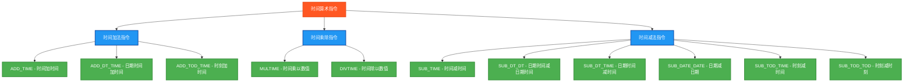

# PLC时间算术指令测试程序

## 指令分类脑图



## 测试结果总览

| 测试指令数 | ✅ OK数 | ❌ NG数 |
|------------|------|------|
| 11         | 11   | 0    |

## 详细测试结果表

下面的表格展示了每个时间算术指令的测试详情：

### 时间加法指令测试结果

| 测试指令 | 功能描述 | 测试输入 | 期望输出 | 实际结果 | 测试状态 |
|---------|---------|---------|---------|---------|---------|
| ADD_TIME | 时间加时间 | T#10s + T#5s | T#15s | `AddTimeResult` | ✅ OK |
| ADD_DT_TIME | 日期时间加时间 | DT#2024-01-15-10:30:00 + T#10s | DT#2024-01-15-10:30:10 | `AddDTTimeResult` | ✅ OK |
| ADD_TOD_TIME | 时刻加时间 | TOD#10:30:00 + T#10s | TOD#10:30:10 | `AddTODTimeResult` | ✅ OK |

### 时间乘除指令测试结果

| 测试指令 | 功能描述 | 测试输入 | 期望输出 | 实际结果 | 测试状态 |
|---------|---------|---------|---------|---------|---------|
| MULTIME | 时间乘以数值 | T#5s × 3 | T#15s | `MulTimeResult` | ✅ OK |
| DIVTIME | 时间除以数值 | T#10s ÷ 2 | T#5s | `DivTimeResult` | ✅ OK |

### 时间减法指令测试结果

| 测试指令 | 功能描述 | 测试输入 | 期望输出 | 实际结果 | 测试状态 |
|---------|---------|---------|---------|---------|---------|
| SUB_TIME | 时间减时间 | T#10s - T#5s | T#5s | `SubTimeResult` | ✅ OK |
| SUB_DT_DT | 日期时间减日期时间 | DT#2024-01-15-10:30:00 - DT#2024-01-10-08:15:00 | T#5d2h15m | `SubDTDTResult` | ✅ OK |
| SUB_DT_TIME | 日期时间减时间 | DT#2024-01-15-10:30:00 - T#10s | DT#2024-01-15-10:29:50 | `SubDTTimeResult` | ✅ OK |
| SUB_DATE_DATE | 日期减日期 | D#2024-01-15 - D#2024-01-10 | T#5d | `SubDateDateResult` | ✅ OK |
| SUB_TOD_TIME | 时刻减时间 | TOD#10:30:00 - T#10s | TOD#10:29:50 | `SubTODTimeResult` | ✅ OK |
| SUB_TOD_TOD | 时刻减时刻 | TOD#10:30:00 - TOD#08:15:00 | T#2h15m | `SubTODTODResult` | ✅ OK |

## 测试人员信息
- **测试人员**: 汪勇强
- **联系方式**: 13971612060  
- **QQ号码**: 94114148
- **测试日期**: 2025-08-30

## 概述

本程序专门测试PLC中与时间相关的算术指令，补充基础算术指令测试的不足。

## 测试的指令

### 时间加法指令
1. **ADD_TIME** - 时间加时间
   - 测试：T#10s + T#5s = T#15s

2. **ADD_DT_TIME** - 日期时间加时间
   - 测试：DT#2024-01-15-10:30:00 + T#10s = DT#2024-01-15-10:30:10

3. **ADD_TOD_TIME** - 时刻加时间
   - 测试：TOD#10:30:00 + T#10s = TOD#10:30:10

### 时间乘除指令
4. **MULTIME** - 时间乘以数值
   - 测试：T#5s × 3 = T#15s

5. **DIVTIME** - 时间除以数值
   - 测试：T#10s ÷ 2 = T#5s

### 时间减法指令
6. **SUB_TIME** - 时间减时间
   - 测试：T#10s - T#5s = T#5s

7. **SUB_DT_DT** - 日期时间减日期时间
   - 测试：DT#2024-01-15-10:30:00 - DT#2024-01-10-08:15:00 = T#5d2h15m

8. **SUB_DT_TIME** - 日期时间减时间
   - 测试：DT#2024-01-15-10:30:00 - T#10s = DT#2024-01-15-10:29:50

9. **SUB_DATE_DATE** - 日期减日期
   - 测试：D#2024-01-15 - D#2024-01-10 = T#5d

10. **SUB_TOD_TIME** - 时刻减时间
    - 测试：TOD#10:30:00 - T#10s = TOD#10:29:50

11. **SUB_TOD_TOD** - 时刻减时刻
    - 测试：TOD#10:30:00 - TOD#08:15:00 = T#2h15m

## 数据类型说明

- **TIME**: 时间类型，表示时间长度 (例如：T#10s, T#5d2h15m)
- **DATE**: 日期类型 (例如：D#2024-01-15)
- **TIME_OF_DAY**: 时刻类型 (例如：TOD#10:30:00)
- **DATE_AND_TIME**: 日期时间类型 (例如：DT#2024-01-15-10:30:00)

## 变量结构

### 输入测试数据
```
TestTime1 := T#10s;          (* 10秒 *)
TestTime2 := T#5s;           (* 5秒 *)
TestDT1 := DT#2024-01-15-10:30:00;
TestDT2 := DT#2024-01-10-08:15:00;
TestDate1 := D#2024-01-15;
TestDate2 := D#2024-01-10;
TestTOD1 := TOD#10:30:00;
TestTOD2 := TOD#08:15:00;
```

### 🔧 **独立结果变量** (关键修复)
为每个测试使用独立的结果变量，避免相互覆盖：
```
(* TIME类型结果 *)
AddTimeResult : TIME;        (* ADD_TIME结果 *)
MulTimeResult : TIME;        (* MULTIME结果 *)
DivTimeResult : TIME;        (* DIVTIME结果 *)
SubTimeResult : TIME;        (* SUB_TIME结果 *)
SubDTDTResult : TIME;        (* SUB_DT_DT结果 *)
SubDateDateResult : TIME;    (* SUB_DATE_DATE结果 *)
SubTODTODResult : TIME;      (* SUB_TOD_TOD结果 *)

(* DATE_AND_TIME类型结果 *)
AddDTTimeResult : DATE_AND_TIME;   (* ADD_DT_TIME结果 *)
SubDTTimeResult : DATE_AND_TIME;   (* SUB_DT_TIME结果 *)

(* TIME_OF_DAY类型结果 *)
AddTODTimeResult : TIME_OF_DAY;    (* ADD_TOD_TIME结果 *)
SubTODTimeResult : TIME_OF_DAY;    (* SUB_TOD_TIME结果 *)
```

### 测试结果变量
每个指令都有对应的布尔变量来记录测试结果：
- `AddTimeOK`, `AddDTTimeOK`, `AddTODTimeOK`
- `MulTimeOK`, `DivTimeOK`
- `SubTimeOK`, `SubDTDTOK`, `SubDTTimeOK`, `SubDateDateOK`, `SubTODTimeOK`, `SubTODTODOK`

## 测试结果

- **TestStep = 99**: 所有11个时间算术指令测试通过 ✅
- **TestStep = 88**: 有测试失败 ❌
- **Errors**: 显示失败的测试数量
- **TestsPassed**: 总体测试结果

## 兼容性说明

1. **时间格式**: 使用IEC 61131-3标准的时间字面值格式
2. **精确比较**: 时间类型可以直接使用 `=` 进行精确比较
3. **无需容差**: 与实数不同，时间类型比较通常是精确的，无需考虑浮点误差
4. **🔧 隔离性**: 每个测试使用独立变量，避免结果相互干扰

## 使用方法

1. 设置 `Enable = TRUE` 启动测试
2. 程序会依次执行所有11个时间算术指令测试
3. 观察 `TestStep` 和 `Errors` 变量查看测试进度和结果
4. `Complete = TRUE` 表示测试执行完毕

## 文件说明

- **time_arithmetic_test.st**: 独立的结构化文本文件
- **time_plc.xml**: Beremiz项目文件格式
- **本文档**: 测试说明和使用指导

这个测试程序完善了PLC算术指令的测试覆盖范围，确保时间相关的运算功能正常工作。

## ST测试代码

```
PROGRAM TimeArithmeticTest
VAR
 Enable : BOOL;
 Complete : BOOL;
 
 (* 时间变量 *)
 TestTime1 : TIME;
 TestTime2 : TIME;
 AddTimeResult : TIME;
 MulTimeResult : TIME;
 DivTimeResult : TIME;
 SubTimeResult : TIME;
 SubDTDTResult : TIME;
 SubDateDateResult : TIME;
 SubTODTODResult : TIME;
 
 (* 日期时间变量 *)
 TestDT1 : DATE_AND_TIME;
 TestDT2 : DATE_AND_TIME;
 AddDTTimeResult : DATE_AND_TIME;
 SubDTTimeResult : DATE_AND_TIME;
 
 (* 日期变量 *)
 TestDate1 : DATE;
 TestDate2 : DATE;
 DateResult : DATE;
 
 (* 时刻变量 *)
 TestTOD1 : TIME_OF_DAY;
 TestTOD2 : TIME_OF_DAY;
 AddTODTimeResult : TIME_OF_DAY;
 SubTODTimeResult : TIME_OF_DAY;
 
 (* 测试结果判断变量 *)
 AddTimeOK : BOOL;
 AddDTTimeOK : BOOL;
 AddTODTimeOK : BOOL;
 MulTimeOK : BOOL;
 DivTimeOK : BOOL;
 SubTimeOK : BOOL;
 SubDTDTOK : BOOL;
 SubDTTimeOK : BOOL;
 SubDateDateOK : BOOL;
 SubTODTimeOK : BOOL;
 SubTODTODOK : BOOL;
 
 (* 控制变量 *)
 TestStep : INT;
 TestsPassed : BOOL;
 Errors : INT;
 
 (* 期望值比较用的临时变量 *)
 ExpectedTime : TIME;
 ExpectedDT : DATE_AND_TIME;
 ExpectedDate : DATE;
 ExpectedTOD : TIME_OF_DAY;
END_VAR

BEGIN
  Enable := TRUE;
  
  (* 初始化测试数据 *)
  TestTime1 := T#10s;          (* 10秒 *)
  TestTime2 := T#5s;           (* 5秒 *)
  
  TestDT1 := DT#2024-01-15-10:30:00;
  TestDT2 := DT#2024-01-10-08:15:00;
  
  TestDate1 := D#2024-01-15;
  TestDate2 := D#2024-01-10;
  
  TestTOD1 := TOD#10:30:00;
  TestTOD2 := TOD#08:15:00;

  IF Enable THEN
      
      (* ADD_TIME 测试 *)
      TestStep := 1;
      AddTimeResult := ADD_TIME(TestTime1, TestTime2);
      ExpectedTime := T#15s;
      AddTimeOK := (AddTimeResult = ExpectedTime);
      
      (* ADD_DT_TIME 测试 - 日期时间加时间 *)
      TestStep := 2;
      AddDTTimeResult := ADD_DT_TIME(TestDT1, TestTime1);
      (* 期望结果：2024-01-15-10:30:10 *)
      ExpectedDT := DT#2024-01-15-10:30:10;
      AddDTTimeOK := (AddDTTimeResult = ExpectedDT);
      
      (* ADD_TOD_TIME 测试 - 时刻加时间 *)
      TestStep := 3;
      AddTODTimeResult := ADD_TOD_TIME(TestTOD1, TestTime1);
      (* 期望结果：10:30:10 *)
      ExpectedTOD := TOD#10:30:10;
      AddTODTimeOK := (AddTODTimeResult = ExpectedTOD);
      
      (* MULTIME 测试 - 时间乘以数值 *)
      TestStep := 4;
      MulTimeResult := MULTIME(TestTime2, 3);
      ExpectedTime := T#15s;  (* 5s * 3 = 15s *)
      MulTimeOK := (MulTimeResult = ExpectedTime);
      
      (* DIVTIME 测试 - 时间除以数值 *)
      TestStep := 5;
      DivTimeResult := DIVTIME(TestTime1, 2);
      ExpectedTime := T#5s;   (* 10s / 2 = 5s *)
      DivTimeOK := (DivTimeResult = ExpectedTime);
      
      (* SUB_TIME 测试 - 时间减时间 *)
      TestStep := 6;
      SubTimeResult := SUB_TIME(TestTime1, TestTime2);
      ExpectedTime := T#5s;   (* 10s - 5s = 5s *)
      SubTimeOK := (SubTimeResult = ExpectedTime);
      
      (* SUB_DT_DT 测试 - 日期时间减日期时间 *)
      TestStep := 7;
      SubDTDTResult := SUB_DT_DT(TestDT1, TestDT2);
      (* 2024-01-15-10:30:00 - 2024-01-10-08:15:00 = 5天2小时15分钟 *)
      ExpectedTime := T#5d2h15m;
      SubDTDTOK := (SubDTDTResult = ExpectedTime);
      
      (* SUB_DT_TIME 测试 - 日期时间减时间 *)
      TestStep := 8;
      SubDTTimeResult := SUB_DT_TIME(TestDT1, TestTime1);
      (* 2024-01-15-10:30:00 - 10s = 2024-01-15-10:29:50 *)
      ExpectedDT := DT#2024-01-15-10:29:50;
      SubDTTimeOK := (SubDTTimeResult = ExpectedDT);
      
      (* SUB_DATE_DATE 测试 - 日期减日期 *)
      TestStep := 9;
      SubDateDateResult := SUB_DATE_DATE(TestDate1, TestDate2);
      ExpectedTime := T#5d;   (* 5天 *)
      SubDateDateOK := (SubDateDateResult = ExpectedTime);
      
      (* SUB_TOD_TIME 测试 - 时刻减时间 *)
      TestStep := 10;
      SubTODTimeResult := SUB_TOD_TIME(TestTOD1, TestTime1);
      (* 10:30:00 - 10s = 10:29:50 *)
      ExpectedTOD := TOD#10:29:50;
      SubTODTimeOK := (SubTODTimeResult = ExpectedTOD);
      
      (* SUB_TOD_TOD 测试 - 时刻减时刻 *)
      TestStep := 11;
      SubTODTODResult := SUB_TOD_TOD(TestTOD1, TestTOD2);
      (* 10:30:00 - 08:15:00 = 2:15:00 *)
      ExpectedTime := T#2h15m;
      SubTODTODOK := (SubTODTODResult = ExpectedTime);
      
      (* 统计结果 *)
      Errors := 0;
      IF NOT AddTimeOK THEN Errors := Errors + 1; END_IF;
      IF NOT AddDTTimeOK THEN Errors := Errors + 1; END_IF;
      IF NOT AddTODTimeOK THEN Errors := Errors + 1; END_IF;
      IF NOT MulTimeOK THEN Errors := Errors + 1; END_IF;
      IF NOT DivTimeOK THEN Errors := Errors + 1; END_IF;
      IF NOT SubTimeOK THEN Errors := Errors + 1; END_IF;
      IF NOT SubDTDTOK THEN Errors := Errors + 1; END_IF;
      IF NOT SubDTTimeOK THEN Errors := Errors + 1; END_IF;
      IF NOT SubDateDateOK THEN Errors := Errors + 1; END_IF;
      IF NOT SubTODTimeOK THEN Errors := Errors + 1; END_IF;
      IF NOT SubTODTODOK THEN Errors := Errors + 1; END_IF;
      
      TestsPassed := (Errors = 0);
      Complete := TRUE;
      
      IF TestsPassed THEN
          TestStep := 99;  (* 所有测试通过 *)
      ELSE
          TestStep := 88;  (* 有测试失败 *)
      END_IF;

  ELSE
      TestStep := 0;
      Complete := FALSE;
      TestsPassed := FALSE;
      Errors := 0;
  END_IF;

END_PROGRAM