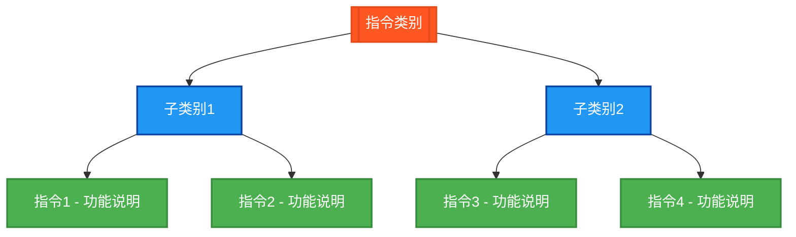

# [指令类别]指令测试程序

## 概述

[在此处添加指令类别的概述，说明该类指令的主要功能和用途]

## 测试的指令



## 测试结果总览

| 测试指令数 | OK数 | NG数 |
|------------|------|------|
| [指令总数]  | [OK数] | [NG数] |

## 详细测试结果表

下面的表格展示了每个[指令类别]指令的测试详情：

### [子类别1]指令测试结果

| 测试指令 | 数据类型 | 操作数/参数 | 预期结果 | 实际结果 | 测试状态 |
|---------|---------|------------|---------|---------|---------|
| [指令名] | [数据类型] | [操作数] | [预期结果] | `[结果变量]` | ✅ OK |

### [子类别2]指令测试结果

| 测试指令 | 数据类型 | 操作数/参数 | 预期结果 | 实际结果 | 测试状态 |
|---------|---------|------------|---------|---------|---------|
| [指令名] | [数据类型] | [操作数] | [预期结果] | `[结果变量]` | ✅ OK |

## 测试指令清单及参数说明

### 1. [指令名] - [功能说明]
| 参数名 | 功能描述 | 数据类型 | 说明 |
|--------|----------|----------|------|
| [参数名] | [功能描述] | [数据类型] | [说明] |

## 测试数据类型

[说明该类指令测试涉及的数据类型]

## 测试数据设计

[提供测试数据的具体设计和值]

## 详细测试用例

### 1. [指令名]测试 - [功能说明]
```
[具体的测试用例和计算过程]
```

## ST测试代码

<details>
<summary>点击展开/折叠ST测试代码</summary>

```st
[在此处添加ST测试代码]
```

</details>

## 测试人员信息
- **测试人员**: [姓名]
- **联系方式**: [电话]
- **QQ号码**: [QQ号]
- **测试日期**: [日期]